# EAI Suite -- Step‑by‑Step Installation & Usage Guide

> **AMD Official Use Only -- AMD Internal Distribution Only**\
> Beginner-friendly walkthrough for installing and using the EAI Suite
> on AMD Developer Cloud.

------------------------------------------------------------------------

## Overview

This guide walks complete beginners through installing, configuring, and using the **AMD Enterprise AI Suite** on AMD Developer Cloud.

### Target Audience

- AMD Business Development
- Field Engineers
- Future end users

### Prerequisites

- Basic Linux command-line knowledge
- Familiarity with SSH
- AMD Developer Cloud access

------------------------------------------------------------------------

# 1. Installation of EAI Suite

## DigitalOcean Installation (AMD Developer Cloud)

### Step 1 — Create a GPU droplet

1. Navigate to [AMD Developer Cloud GPU Droplets](https://amd.digitalocean.com/gpus/).
2. Create an **MI300X GPU Droplet**.

> ⚠️ If selecting 8x GPUs, cost = `8 × $1.99/hour`

------------------------------------------------------------------------

### Step 2 — Download Cluster Bloom

SSH into the droplet or click the Web Console button.

Paste in terminal the following commands
```bash
wget https://github.com/silogen/cluster-bloom/releases/latest/download/bloom
chmod +x bloom
```

------------------------------------------------------------------------

### Step 3 — Get Droplet IP

Copy the Public IPv4 droplet IP address from AMD Developer Cloud.

------------------------------------------------------------------------
### Step 4 — Create the Bloom Configuration File - Option 1 via GUI

In terminal type :
```bash
./bloom
```

This opens the Cluster Bloom configuration UI. Select the **Medium t-shirt size** (recommended for a single 8-way node), then proceed with the installation. Select and input other corresponding parameters.
### Step 4 — Create the Bloom Configuration File

Create and open a configuration file called `bloom.yaml`:

```bash
nano bloom.yaml
```

Paste the following configuration, replacing `<your-ip-address>` with your droplet's IP address:

```yaml
DOMAIN: <droplet-ip-addr>.nip.io
FIRST_NODE: true
GPU_NODE: true
CLUSTER_DISKS: /dev/vdc1
CERT_OPTION: generate
```

------------------------------------------------------------------------

### Step 5 — Start the Installation

Run the following command to begin the installation:

```bash
sudo ./bloom cli bloom.yaml
```

Upon completion, it will provide two URLs for you to access via Keycloak authentication. (See Step 7)

------------------------------------------------------------------------

### Step 6 — Reload the shell

Once the installation completes, either exit and re-login to your SSH session, or run:

```bash
source ~/.bashrc
```

------------------------------------------------------------------------

### Step 7 — Authenticate via Keycloak

Visit:

    https://kc.<your-ip-address>.nip.io

Then open:

    https://airmui.<your-ip-address>.nip.io

#### Default Credentials

| Field    | Value                                      |
|----------|--------------------------------------------|
| Username | `devuser@<your-ip-address>.nip.io`         |
| Password | `password`                                 |

You should now see the **AMD Resource Manager Dashboard**.

------------------------------------------------------------------------

## Installing AMD Enterprise AI Suite On Premises

This guide walks you through installing [AMD Enterprise AI Suite](https://enterprise-ai.docs.amd.com/en/latest/platform-infrastructure/on-premises-installation.html) on a single node. The installation uses a tool called **Cluster Bloom**, which sets up a Kubernetes cluster and installs the platform for you.

*For the full installation reference, including TLS certificate options, and backup and restoration, see the [official documentation](https://enterprise-ai.docs.amd.com/en/latest/platform-infrastructure/on-premises-installation.html).*

### Prerequisites

Before you begin, ensure your environment meets the prerequisites defined on the [documentation page](https://enterprise-ai.docs.amd.com/en/latest/platform-infrastructure/on-premises-installation.html#prerequisites).

### Installation

#### Step 1 — Download Cluster Bloom

SSH into your node as root and run the following command to download the Cluster Bloom installation tool:

```bash
wget https://github.com/silogen/cluster-bloom/releases/latest/download/bloom
```

Make the installation script executable:

```bash
chmod +x bloom
```

------------------------------------------------------------------------

#### Step 2 — Create the Bloom Configuration File

Create and open a configuration file called `bloom.yaml`:

```bash
vi bloom.yaml
```

For the standard installation, you should use the default values provided in the documentation, the only exception is the DOMAIN and OIDC_URL values which should match your specific domain name. In this example we are using a `nip.ip` domain -> Replace `<your-ip-address>` with your server's IP address in the `DOMAIN` and `OIDC_URL` fields:

```yaml
DOMAIN: <your-ip-address>.nip.io
CERT_OPTION: generate
FIRST_NODE: true
GPU_NODE: true
USE_CERT_MANAGER: false
CLUSTER_DISKS: /dev/vdc1
OIDC_URL: https://kc.<your-ip-address>.nip.io/realms/airm
```

If you do not have a DNS-enabled domain, you can use a `.nip.io` domain, which automatically resolves to your server's IP address. A `.nip.io` domain is created for you as part of the installation process. For more details on domain configuration, see the [official documentation](https://enterprise-ai.docs.amd.com/en/latest/platform-infrastructure/on-premises-installation.html#domain-names).

------------------------------------------------------------------------

#### Step 3 — Start the Installation

Run the following command to start the installation:

```bash
sudo ./bloom --config bloom.yaml
```

This launches the Cluster Bloom wizard web interface. Follow the on-screen instructions for access:

1. If you are accessing the server remotely, create an SSH tunnel. The required command is displayed at the bottom of the terminal output.
2. Once the tunnel is established, copy and paste the provided URL into your web browser. This opens the Cluster Bloom configuration wizard.
3. Review your configuration in the wizard. You can modify the domain name, storage settings, TLS certificates, and other advanced options such as the OIDC provider.
4. Once you are happy with the configuration, you can click on the installation button.

You can monitor the progress in the web interface.

**Note:** You can also run the installation with CLI confirmation instead of the wizard:

 ```bash
 sudo ./bloom cli --config bloom.yaml
 ```

------------------------------------------------------------------------

#### Step 4 — Monitor the Installation

The Kubernetes installation is finished when the UI shows that all steps are 100% complete, and the terminal confirms that the “Installation completed successfully”. Once the cluster is operational, the application installation begins automatically.

View the installation in Kubernetes by reloading the shell environment:

```bash
source ~/.bashrc
```

Then launch k9s:

```bash
k9s
```

------------------------------------------------------------------------

#### Step 5 — Log in

Verify the installation by logging in to the AMD Enterprise Suite web interface:

- Access the login URL for your domain:
  - For a `.nip.io` domain: `https://airmui.<master-node-ip-address>.nip.io`
  - For a registered domain: `https://airmui.<your-domain>`
- Log in with the username `devuser@domain` and the default password `password`. You will be prompted to change the password on first login.

You should now see the **AMD Resource Manager Dashboard**.

------------------------------------------------------------------------

#### Step 6 — Add your Hugging Face token 

A Hugging Face token is required to download gated models. You can add it directly through the AMD AI Workbench UI when deploying or fine-tuning a model — the token is stored securely as a Kubernetes secret.

------------------------------------------------------------------------

# 2. AMD Resource Manager

## Overview

AMD Resource Manager provides platform administrators with tools to oversee and control the platform's computational resources and user access. Key capabilities include cluster management, monitoring, and maintaining teams' access to computational resources.

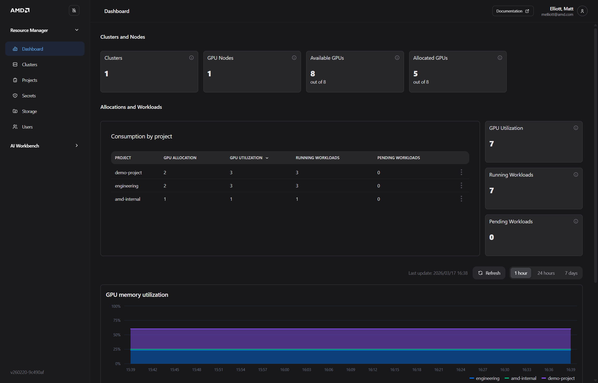

### Core Concepts

- **Dashboard**: High-level overview of your clusters, resource allocations, and basic utilization statistics
- **Projects**: Create and manage projects, which organize and isolate work within your system. Project settings include user membership, secrets, storage, and quotas
- **Quota**: Guaranteed resource quota for a project to ensure fair resource allocation
- **Storage**: Configurations providing credentials and connectivity information for storage (e.g., S3)
- **Secrets**: Secure information such as API keys or credentials assigned to projects
- **Users**: Manage users, their roles, and their project membership

------------------------------------------------------------------------

## Setting Up a Project

### Step 1 — Navigate to Resource Manager

1. From the **Dashboard**, click **Projects** in the left sidebar
2. Click the **Create project** button
3. Enter a project name, an optional description, and select your cluster
4. Click **Create project**

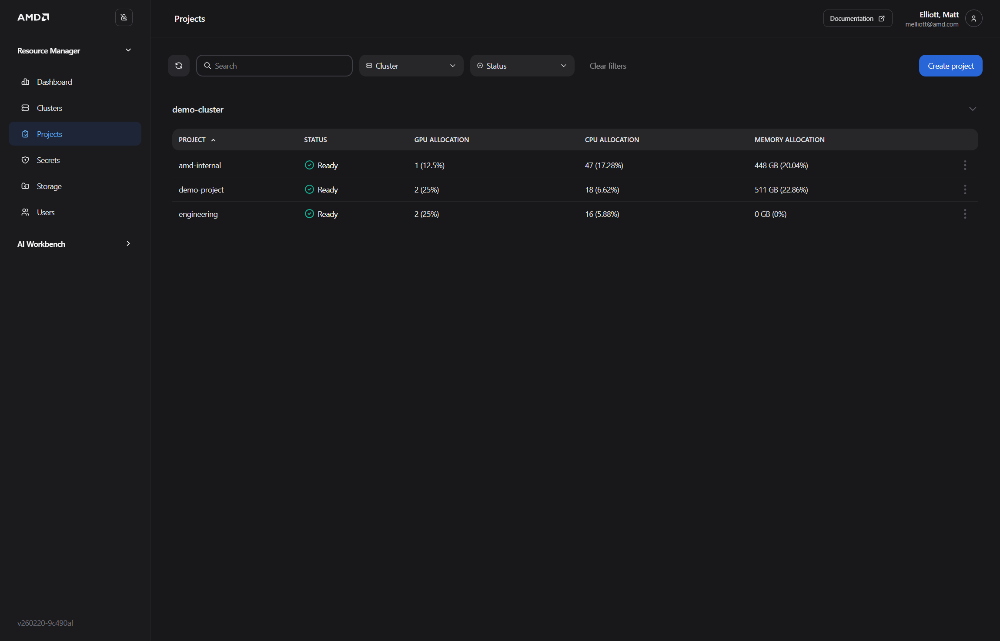

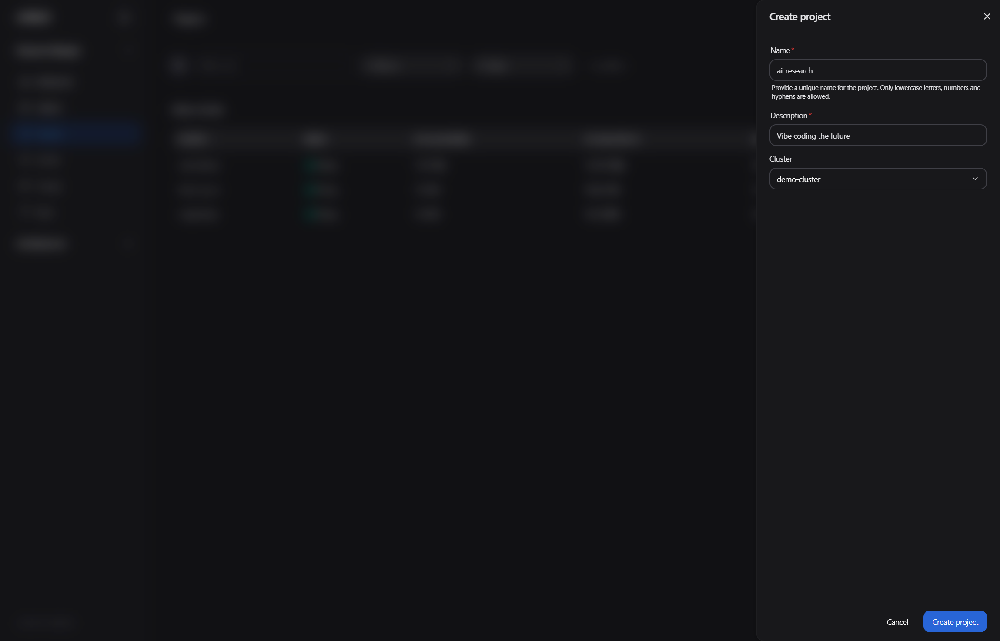

> **Expected outcome:** You are redirected to the **Project settings** page for your new project.

------------------------------------------------------------------------

### Step 2 — Adjusting Quota

You should now be on the **Project settings** page with the **Quota** tab active. Quotas ensure fair and shared resource allocation across projects.

Set the resource allocation for your project:

1. **GPUs** — Number of GPU devices
2. **CPU Cores** — Number of CPU cores
3. **System Memory** — Memory allocation in GiB
4. **Ephemeral Disk** — Temporary disk space for workloads
5. Click **Save changes**

<!-- TODO: Add recommended quota values for this HOL exercise, e.g., "For this lab, set GPUs = 1, CPU Cores = 8, Memory = 32 GiB" -->

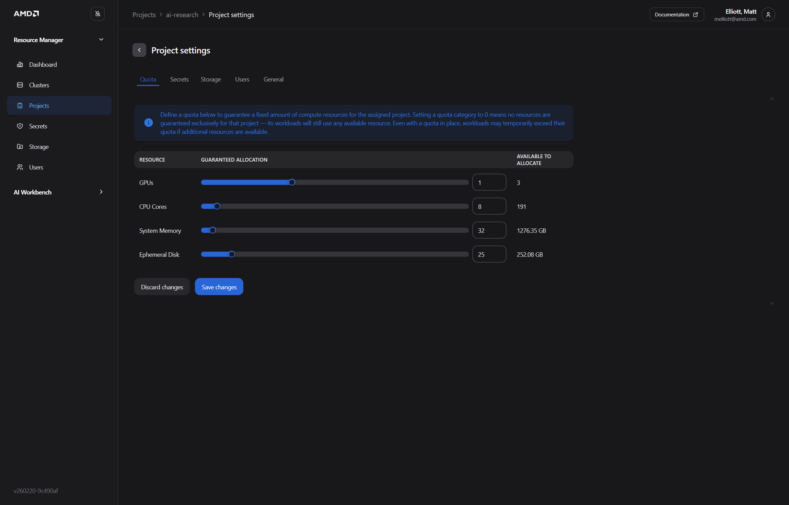

> **Expected outcome:** A confirmation message appears and your quota settings are saved.

------------------------------------------------------------------------

### Step 3 — Attaching Storage & Setting Secrets

Each project requires a storage configuration to download models and run workloads. During installation, a `minio-credentials-fetcher` secret and a default storage configuration are created automatically. You will assign these to your project now.

1. Click the **Secrets** tab
2. Click **Add project secret** and select **Assign existing secret**
3. Select **minio-credentials-fetcher** from the **Secret** drop-down menu
4. Click **Assign secret**
5. Click **Add project secret** again and select **Create new secret**
6. Enter a secret name such as `hugging-face-token`
7. Add a key/value pair (for example, key: `HF_TOKEN`, value: your Hugging Face access token)
8. Click **Create secret**

> **Why this is needed:** The Hugging Face token is required for accessing gated models and some finetuning workflows in AMD AI Workbench.

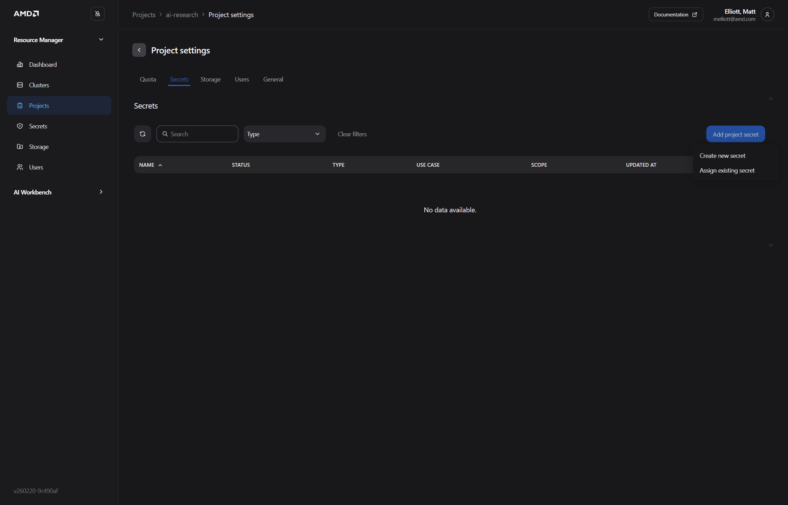

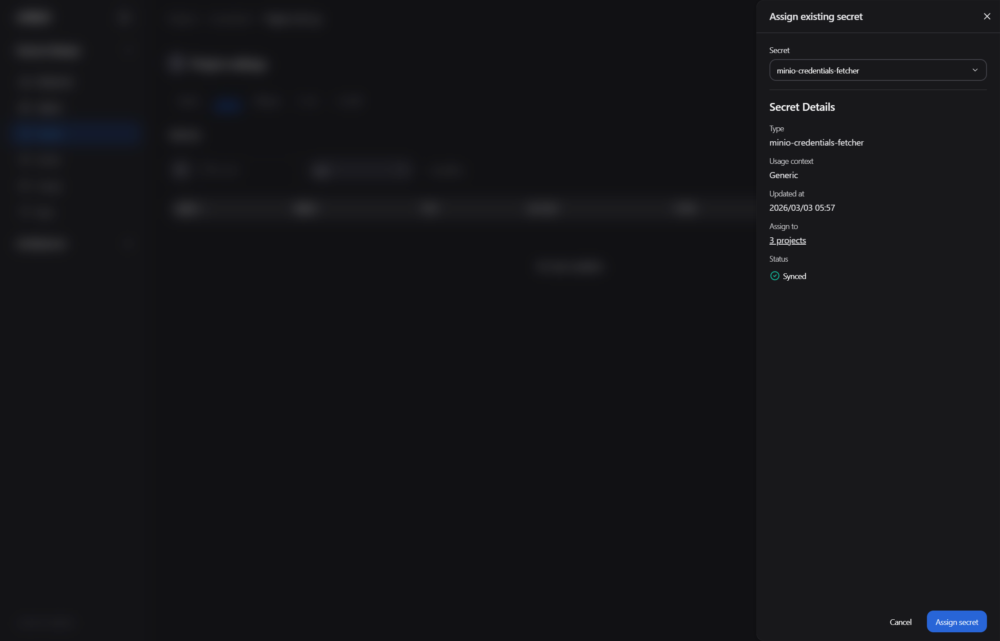

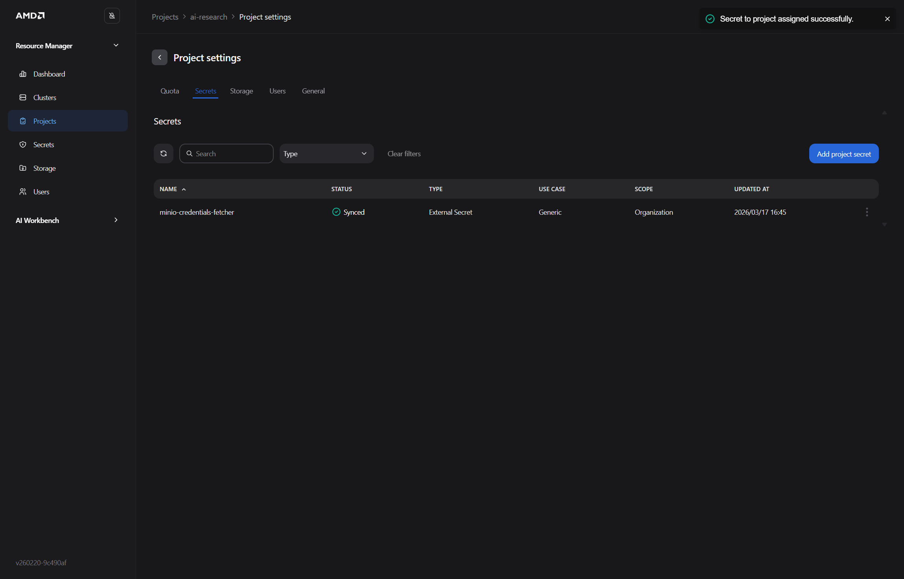

> **Expected outcome:** Both `minio-credentials-fetcher` and your Hugging Face token secret appear in the project's secrets list.

> **Troubleshooting:** If `minio-credentials-fetcher` does not appear in the drop-down, the platform installation may not have completed successfully. See the [Troubleshooting](./06-5-troubleshooting.md) section.

------------------------------------------------------------------------

### Step 4 — Adding Users to the Project

Users must be added to projects to be able to access the project and the computational resources.

1. Click the **Users** tab
2. Click the **Add Member** button
3. Select yourself (and any other desired users) from the **Users** drop-down menu
4. Click **Add to project**

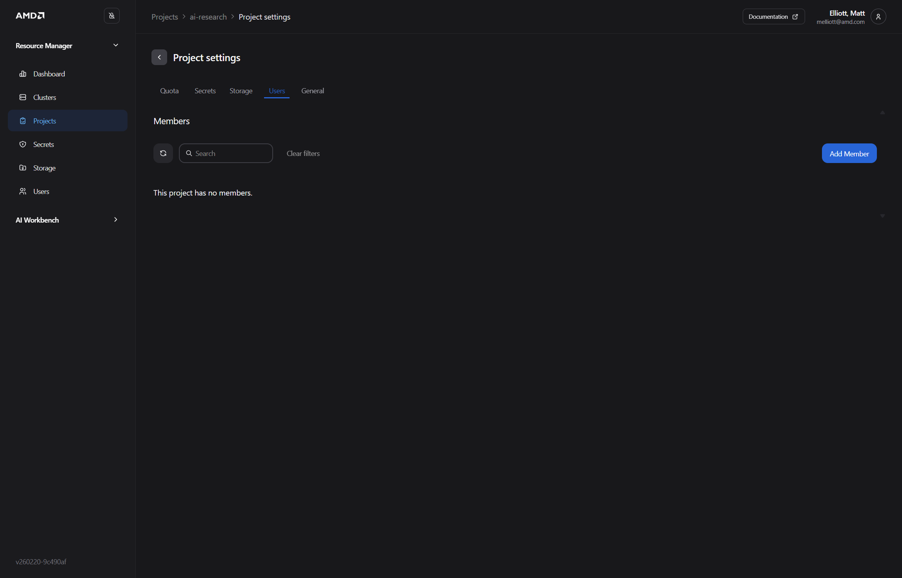

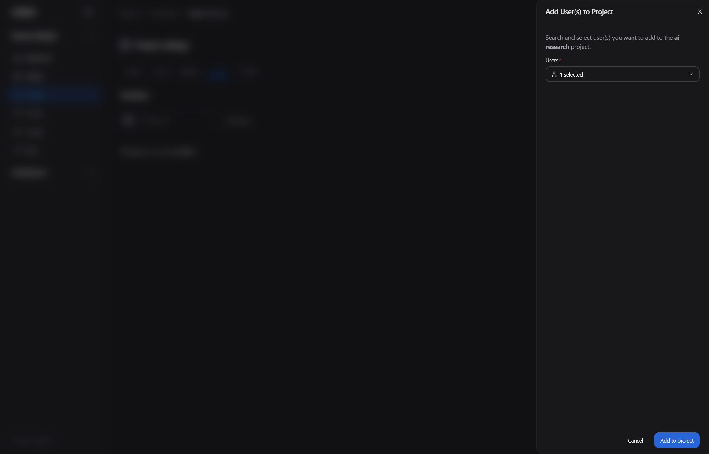

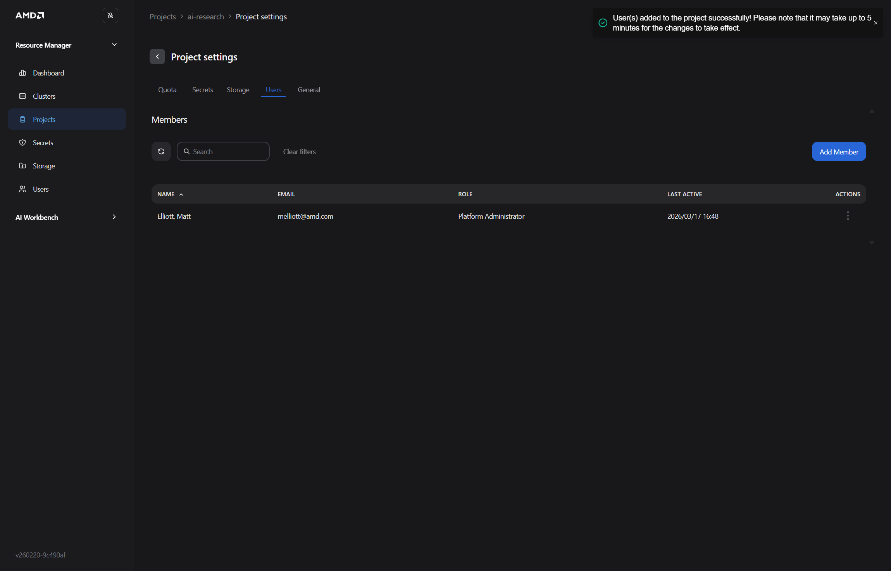

> **Expected outcome:** The selected user(s) appear in the project's member list. Your project is now configured and ready to use.

------------------------------------------------------------------------

# 3. AMD Workbench

AMD AI Workbench is the end-user interface for deploying and interacting with AI models. It is accessed separately from the Resource Manager — navigate to the url exposed after installation:

For a .nip.io domain (default if installation via Digital Ocean): https://kc.<master-node-ip-address>.nip.io
For a registered domain: https://airmui.<your-domain>

Log in with the same credentials used for the Resource Manager. Ensure you are working within the project you created in the previous section.

<!-- SCREENSHOT: AMD AI Workbench landing page after login, showing the main navigation -->

------------------------------------------------------------------------

## Finetuning


Finetuning allows you to adapt a base model to domain-specific data.

### Typical Workflow

1. **Add Hugging Face token** — Required for accessing gated models and datasets


2. **Navigate to Datasets and upload training data** — In **AI Workbench**, open **Datasets** from the left navigation and click **Upload**.

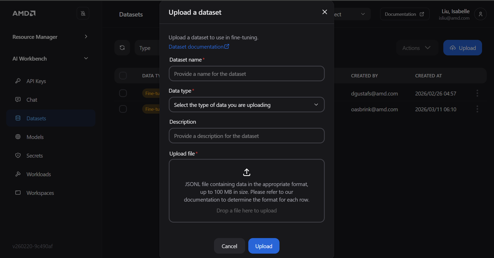

3. **Create the dataset entry** — Enter a dataset name, choose the correct data type, optionally add a description, then upload your `.jsonl` file and click **Upload**.
4. **Go to Custom Models** — Open **Models** and switch to the **Custom Models** tab.

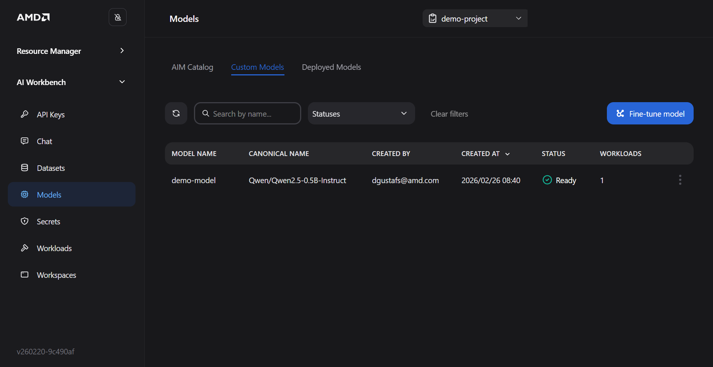

5. **Start fine-tuning** — Click **Fine-tune model**, select the base model and uploaded dataset, configure training parameters, then click **Start training**.

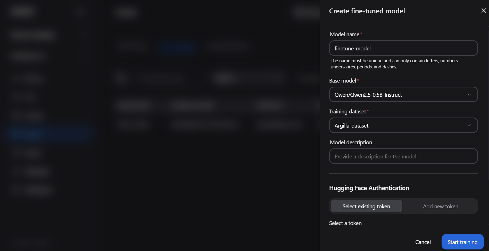

<!-- SCREENSHOT: Finetuning section of the UI (once steps are documented) -->

------------------------------------------------------------------------

## Deploy an AI Model (AIM)

> **Note:** You are in the **AMD AI Workbench** interface for this section. Ensure you have selected the correct project before proceeding.


1. Navigate to the **Models** tab to access the AIM catalog
2. Locate the model you want to deploy and click the **three-dot menu (⋮)** in the bottom-right corner of the model card
3. Select **Deploy**


4. Configure the **Deployment Settings**:

   - **Performance metric** — Select the optimization target from the dropdown:

     | Option | When to use |
     |--------|-------------|
     | **Latency** | When minimizing response time per request is the priority |
     | **Throughput** | When maximizing sustained requests/second is the priority |

   - **Unoptimized deployment** — Toggle **Allow** only when deploying to hardware the AIM is not specifically optimized for. Leave this off for standard deployments.

   <!-- TODO: Specify which performance metric to select for this HOL exercise -->

<!-- SCREENSHOT: Deployment config panel showing Performance metric dropdown open with Latency and Throughput options -->

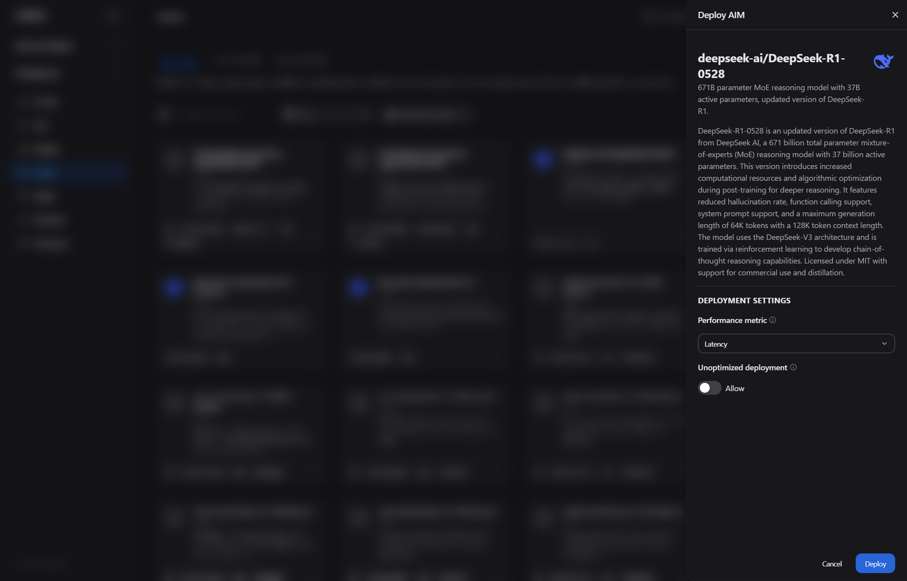

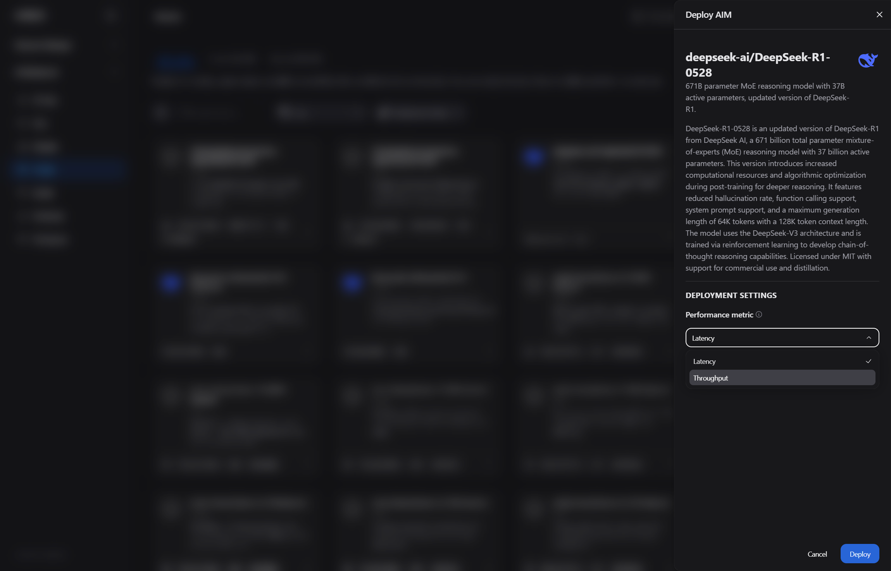

5. If the model is gated (indicated by a lock icon — e.g., Llama family models), a **Hugging Face authentication** section appears in the panel. Either click **Select existing token** to reuse a previously stored token, or click **Add new token** and enter a name and token value directly.

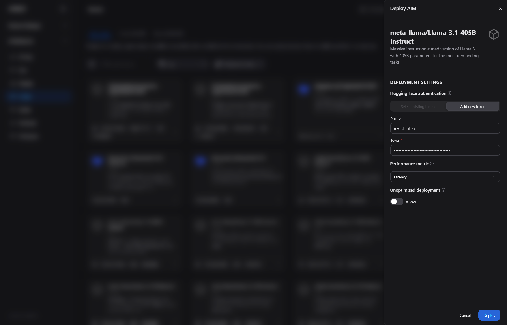

6. Click **Deploy**. A confirmation message will appear indicating the workload has started.

<!-- SCREENSHOT: Deployment confirmation notification or toast message -->

7. **Wait for the model to become ready.** Navigate to **Workloads** to monitor deployment status. The model is ready when its status shows **Running**.

   > Deployment typically takes <!-- TODO: fill in approximate time, e.g., "3–5 minutes" --> depending on model size and cluster load.

<!-- SCREENSHOT: Workloads list view showing the deployed model with "Running" status -->

------------------------------------------------------------------------

## VSCode Workspace (vLLM Benchmarking)

This section demonstrates how to use the built-in Visual Studio Code workspace to benchmark a deployed model using the `vllm bench` tool.

### Launch the VSCode Workspace

1. Navigate to **Workspaces** in the left sidebar
2. Click **View and deploy** next to the Visual Studio Code workspace entry
3. Once deployed, click the **Launch** button to open VSCode in your browser

<!-- SCREENSHOT: Workspaces page — showing the "View and deploy" and "Launch" buttons -->
<!-- SCREENSHOT: VSCode workspace open in the browser -->

### Get the Model Endpoint

Before running the benchmark, retrieve the internal endpoint of your deployed model:

1. Navigate to the **Models** tab
2. On the deployed model card, click the **three-dot menu (⋮)** and select **Connect**
3. Copy the **Internal URL** — this is the endpoint used within the cluster

   > If accessing from outside the cluster (e.g., from your local machine), use the **External URL** together with an API key instead.

<!-- SCREENSHOT: Connect dialog showing Internal URL and External URL fields -->

### Run the Benchmark

Open a terminal in the VSCode workspace and run the following setup commands:

```bash
python --version          # Verify Python is available

python -m venv venv       # Create a virtual environment
source venv/bin/activate  # Activate it

pip install vllm          # Install the vllm benchmarking tool
```

Then configure and run the benchmark. Replace the placeholder values with those for your deployment:

```bash
NUM_PROMPTS=<number-of-prompts>
CONC=$((NUM_PROMPTS * 10))   # Sets concurrency to 10x the prompt count — adjust as needed
INPUT_LEN=<input-token-length>
OUTPUT_LEN=<output-token-length>
BASE_URL="<your-internal-url>"
ENDPOINT="/v1/chat/completions"
MODEL="<your-model-name>"

vllm bench serve \
  --ignore-eos \
  --backend openai-chat \
  --base-url "${BASE_URL}" \
  --endpoint "${ENDPOINT}" \
  --model "${MODEL}" \
  --dataset-name random \
  --random-input-len ${INPUT_LEN} \
  --random-output-len ${OUTPUT_LEN} \
  --num-prompts ${NUM_PROMPTS} \
  --max-concurrency ${CONC} \
  --trust-remote-code
```

<!-- TODO: Provide recommended values for this HOL, e.g.:
     NUM_PROMPTS=100, INPUT_LEN=512, OUTPUT_LEN=128, MODEL="<name of model deployed above>"
     Optionally, provide this as a pre-written bash script participants can copy. -->

<!-- SCREENSHOT: VSCode terminal showing benchmark output -->

### Understanding Benchmark Output

| Metric | Meaning |
|--------|---------|
| **Throughput** | Total tokens processed per second across all concurrent requests |
| **TTFT** | Time to First Token — how quickly the model starts responding |
| **Latency** | End-to-end time per request |
| **Tokens/sec** | Per-request token generation rate |

------------------------------------------------------------------------

## ComfyUI

ComfyUI provides a visual node-based interface for building and running AI pipelines, including image generation workflows.

1. Navigate to **Workspaces** in AI Workbench and locate the **ComfyUI Text-to-Image** workspace.

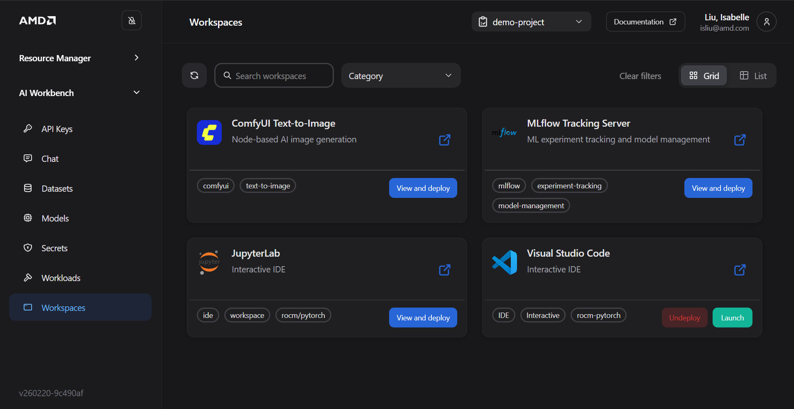

2. Click **View and deploy**, then allocate the appropriate number of GPUs based on workload demand.
3. After deployment is ready, click **Launch**.
4. In ComfyUI, select one of the available text-to-image templates.
5. Enter a text prompt and run the workflow to generate images.

<!-- SCREENSHOT: ComfyUI interface showing the node graph editor -->

------------------------------------------------------------------------

**Next:** Proceed to [Blueprints](./05-4-blueprints.md) to deploy a solution blueprint.

------------------------------------------------------------------------

# 4. Blueprints

Solution Blueprints are reference applications built with AIMs (AI Models). They offer an easy way to explore AIMs in the context of a complete microservice solution. For developers, Solution Blueprints serve as starting points and example implementations, making it fast and easy to solve real-world problems with ROCm software.

Full documentation: [Solution Blueprints Overview](https://enterprise-ai.docs.amd.com/en/latest/solution-blueprints/overview.html)

------------------------------------------------------------------------

## Prerequisites for This Section

Blueprints are deployed via **Helm**, a package manager for Kubernetes. Before proceeding:

- **Helm** must be installed on your terminal environment. Verify with:

  ```bash
  helm version
  ```

- You must have access to the Kubernetes cluster via `kubectl`. If you have not set up cluster access yet, follow the [Accessing the Cluster guide](https://enterprise-ai.docs.amd.com/en/latest/resource-manager/workloads/accessing-the-cluster.html#constructing-the-kubeconfig-file) to obtain and configure your `kubeconfig` file before continuing.

  Verify cluster access with:

  ```bash
  kubectl get nodes
  ```

  <!-- SCREENSHOT: Terminal showing successful `kubectl get nodes` output -->

> **What is Helm?** Helm is a tool that packages Kubernetes application configurations into reusable "charts." Instead of writing and managing many individual Kubernetes YAML files, you deploy a chart with a single command. AMD Solution Blueprints are distributed as Helm charts via a container registry.

------------------------------------------------------------------------

## Deploying a Blueprint

Solution Blueprints are provided as Helm charts. The recommended approach is to render the chart with `helm template` and pipe the output directly to `kubectl apply`. This avoids Helm managing release state, which simplifies cleanup. We don’t recommend helm install, which by default uses a Secret to keep track of the related resources. Ensure you have access to the cluster trough the terminal. Access guide can be found [here](https://enterprise-ai.docs.amd.com/en/latest/resource-manager/workloads/accessing-the-cluster.html#constructing-the-kubeconfig-file).


Replace the placeholder values before running:

- `name` — a unique name for this deployment (e.g., `my-deployment`)
- `namespace` — the Kubernetes namespace for your project (e.g., `my-namespace`)
- `chart` — the name of the blueprint chart to deploy

| Folder | Chart Name |
| --- | --- |
| agentic-testing | aimsb-agentic-testing |
| agentic-translation | aimsb-agentic-translation |
| autogen-studio | aimsb-autogenstudio |
| code-docs-builder | aimsb-codedocs |
| continuedev-assistant | aimsb-continuedev-assistant |
| document-summarization | aimsb-docsum |
| fsi | aimsb-fsi |
| llm-chat | aimsb-llm-chat |
| llm-router | aimsb-llm-router |
| pdf-to-podcast | aimsb-pdf-to-podcast |
| report-generation-engine | aimsb-report-generation-engine |
| talk-to-your-documents | aimsb-talk-to-your-documents |

A full list of available charts can be found at:
     https://enterprise-ai.docs.amd.com/en/latest/solution-blueprints/overview.html 

```bash
name="my-deployment"
namespace="my-namespace"
chart="aimsb-my-chart"   # TODO: Replace with the actual chart name for this HOL

helm template $name oci://registry-1.docker.io/amdenterpriseai/$chart \
  | kubectl apply -f - -n $namespace
```

<!-- SCREENSHOT: Terminal showing the helm template | kubectl apply command and its output -->

After deploying, verify that the blueprint pods are running:

```bash
kubectl get pods -n $namespace
```

<!-- SCREENSHOT: Terminal showing kubectl get pods output with blueprint pods in "Running" state -->

> **Expected outcome:** All pods for the blueprint show a `Running` status. This may take a few minutes as container images are pulled.

------------------------------------------------------------------------

## Reusing an Existing Model Deployment

By default, the Helm chart deploys its own AI model instance. If you already have a compatible AIM deployed from the [Workbench section](./04-3-amd-workbench.md), you can reuse that deployment to save resources.

To point the blueprint at an existing model, set the `existingService` value to the Kubernetes service name of your running AIM. Use the service name alone if it is in the same namespace, or the full DNS form `<SERVICENAME>.<NAMESPACE>.svc.cluster.local:<PORT>` if it is in a different namespace.

```bash
name="my-deployment"
namespace="my-namespace"
chart="aimsb-my-chart"             # TODO: Replace with actual chart name
servicename="aim-llm-my-model-123456"  # TODO: Replace with your deployed model's service name

helm template $name oci://registry-1.docker.io/amdenterpriseai/$chart \
  --set llm.existingService=$servicename \
  | kubectl apply -f - -n $namespace
```

> **Finding your service name:** Run `kubectl get svc -n $namespace` and look for the service associated with your deployed model.

------------------------------------------------------------------------
## Undeploying a Blueprint

Run the following in the terminal:

```bash
helm template $name oci://registry-1.docker.io/amdenterpriseai/$chart | kubectl delete -f - -n $namespace
```

Alternatively, if you saved the manifest earlier, delete it directly:

```bash
helm template delete -f demo-blueprint.yaml -n $namespace
```


**Next:** Proceed to the [Troubleshooting](./06-5-troubleshooting.md) guide if you encounter any issues, or the [Appendix](./07-appendix.md) for reference commands and cleanup steps.

------------------------------------------------------------------------

# 5. Troubleshooting

## DigitalOcean Installation Issues

Common causes: 

------------------------------------------------------------------------

## Cluster Bloom Issues

### Configuration Failed or Timed Out

Try rerunning Bloom:

``` bash
sudo ./bloom cli --config bloom.yaml
```

If issue persists: - Verify disk mapping (`/dev/vdc1`) - Ensure droplet
has sufficient resources - Confirm network access

------------------------------------------------------------------------

# Appendix

### Useful Commands

``` bash
kubectl get pods -A
kubectl get svc -A
kubectl describe pod <pod-name>
```

------------------------------------------------------------------------

------------------------------------------------------------------------

**Maintained by AMD -- Internal Documentation**
