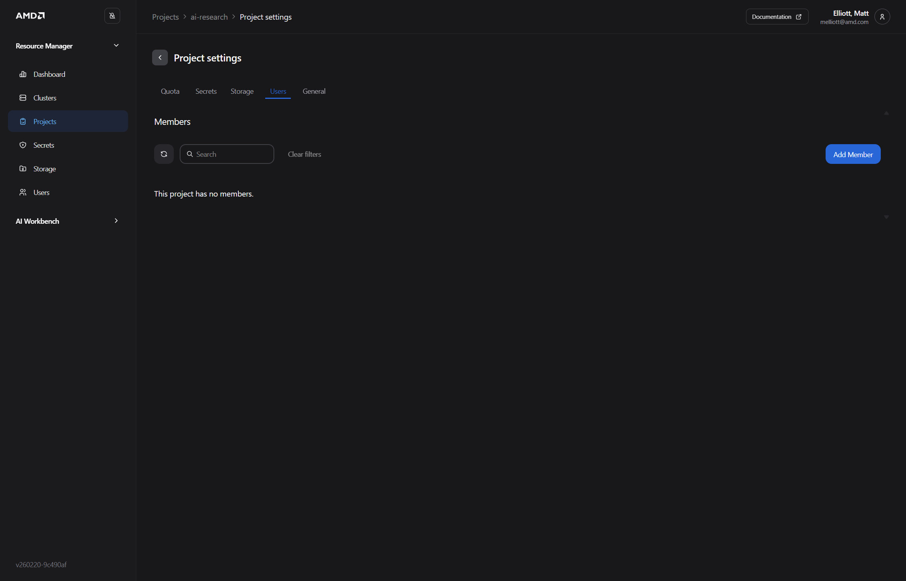
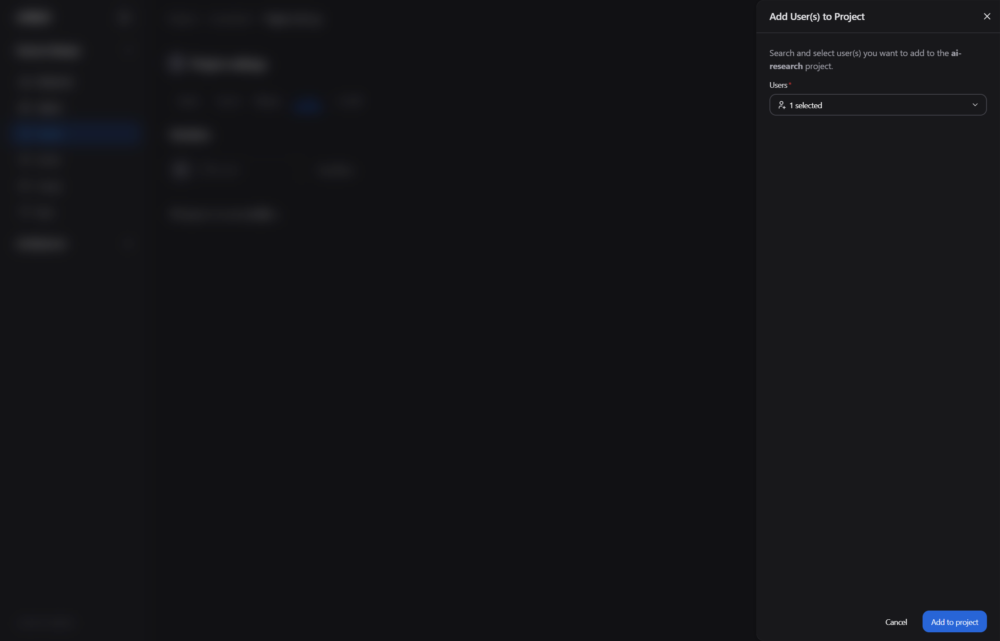
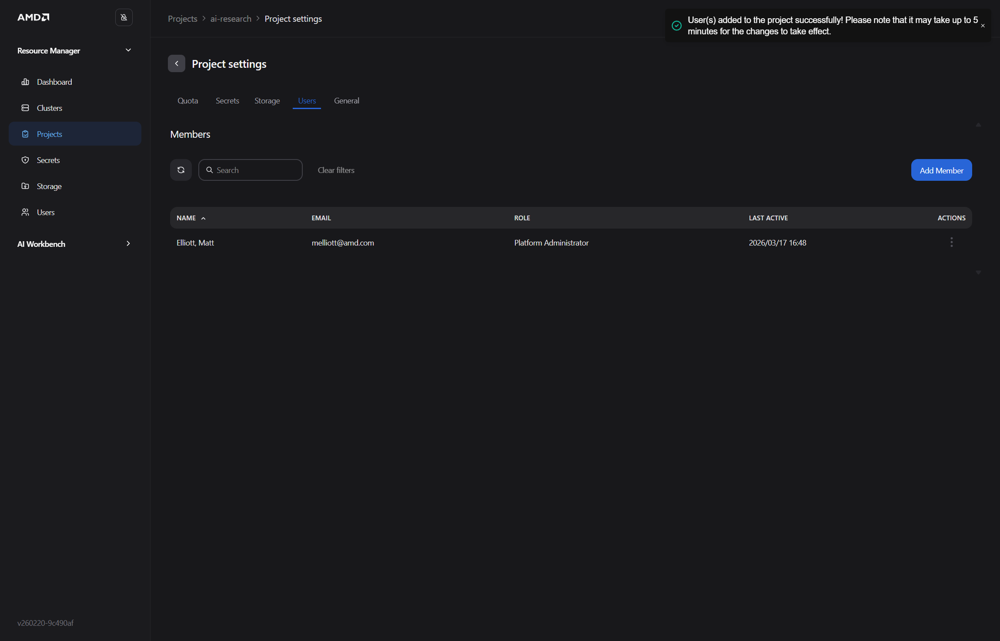
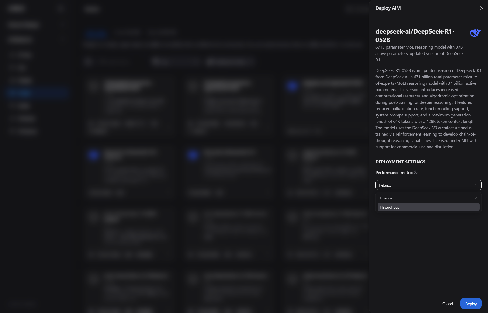
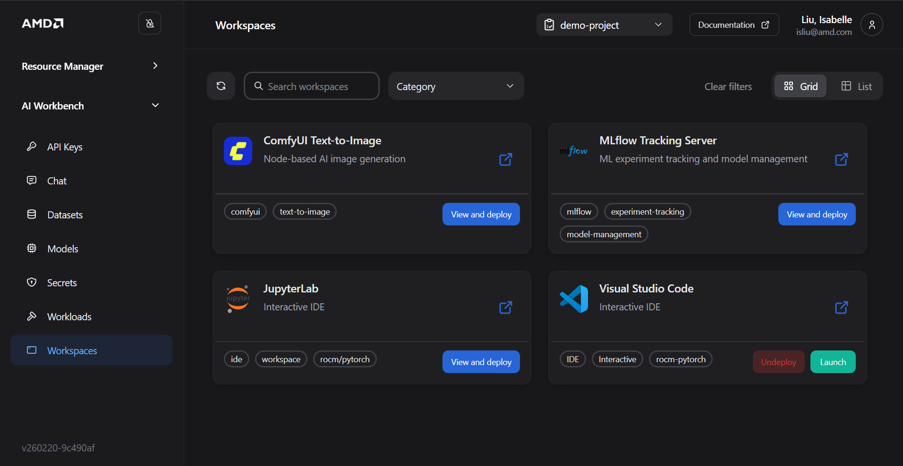
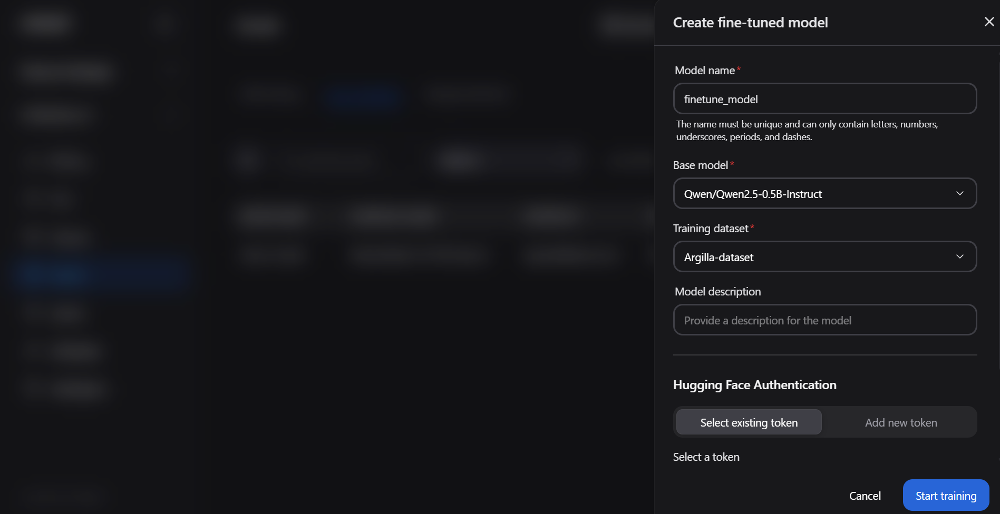

# Advancing AI Day Workshop
### AMD Enterprise AI Software Stack — Workbench & Resource Manager Deep Dive (45 Minutes)

**Audience:** Enterprise IT administrators, platform engineers, and team leads evaluating the AMD AI platform  
**Prerequisites:** A browser, the workshop credentials provided by your facilitator  
**Time:** 45 minutes total  
**No terminal required** — this workshop is entirely GUI-driven

---

## What You Will Learn Today

This workshop takes you deep into the administrative and operational capabilities of the AMD Enterprise AI Software Stack through its two main management interfaces.

You will:
1. **Explore AMD Resource Manager** — create a project, configure quotas, manage secrets and storage, and add team members
2. **Deploy and manage AI models** through AMD AI Workbench — observe live inference metrics, configure autoscaling, and chat with a running model
3. **Launch a VSCode workspace** inside the platform and run a benchmark against your deployed model using `vllm bench serve`
4. **Fine-tune a model on your own data** — upload a training dataset and start a supervised fine-tuning job through the Workbench UI
5. **(Bonus)** Tour the ComfyUI workspace for AI image generation

No Kubernetes, terminal, or ML engineering experience required.

---

## Platform Overview

| Component | What It Does | Who Uses It |
|---|---|---|
| **AMD Resource Manager** | Admin UI for clusters, projects, quotas, users, secrets, and storage | IT admins and platform operators |
| **AMD AI Workbench** | Self-service UI for deploying models, running workspaces, and fine-tuning | Data scientists, developers, and engineers |
| **AIMs** (AI Inference Microservices) | Pre-packaged AMD-optimized model servers | Deployed and managed through both UIs |
| **Workspaces** | JupyterLab, VSCode, or ComfyUI environments that run inside the cluster | End users running experiments or tools |

---

# Part 1: AMD Resource Manager — Platform Administration (15 minutes)

## Why Resource Manager?

In enterprise environments, AI infrastructure is shared. Multiple teams — data science, engineering, product — all want access to GPUs. Without governance, one team can accidentally consume all cluster resources, leaving others blocked.

**AMD Resource Manager** is the administrative control plane. It lets IT administrators:
- Create isolated **projects** for each team or use case
- Set **resource quotas** (GPU hours, memory, storage) per project
- Manage **user access** and assign roles
- Store and distribute **secrets** (API keys, model tokens) securely
- Attach **persistent storage** for datasets and model artifacts

In this section you will go through the full administrator workflow.

---

## Step 1A: Log In to Resource Manager

Open a browser and navigate to the Resource Manager URL provided by your facilitator:

- Format: `https://airm.<your-domain>` or the IP-based URL on your workshop sheet

Use the **admin credentials** your facilitator provided.


The dashboard shows:
- **Cluster-level resource utilization** — total GPU capacity, current usage, and available headroom
- **Active projects** and their quota consumption
- **System alerts** and recent events

Click **View Config** (top right) to see cluster-level details such as node count, GPU type, and software versions.


---

## Step 1B: Create a Project

Projects are the primary isolation boundary. Each team or use case gets its own project with its own quota, users, secrets, and storage.

Click **Projects** in the left sidebar, then click **Create Project**.


In the **Create Project** dialog:


Fill in:
- **Project Name** — use your first name or team name (e.g., `workshop-yourname`)
- **Description** — optional, but useful for multi-team environments


Click **Create**. The new project appears in the list and is immediately ready for quota configuration.

---

## Step 1C: Configure Resource Quotas

Quotas prevent any single project from monopolizing cluster resources.

Click your new project to open its detail view, then click the **Quota** tab.


Set limits appropriate for a team of 3–5 data scientists:

| Resource | Example Value | Notes |
|---|---|---|
| **GPU Limit** | 4 | Maximum GPUs that can run simultaneously in this project |
| **CPU Request** | 16 | Minimum CPU cores reserved |
| **Memory Limit** | 64Gi | Maximum RAM |
| **Storage** | 500Gi | Total PVC storage available |

> **Why does this matter?** Quotas are what make shared GPU clusters viable. Without them, a single fine-tuning job can occupy the entire cluster. Resource Manager enforces these limits automatically — jobs that exceed the quota queue instead of failing.

Click **Save Quotas** to apply.

---

## Step 1D: Add a Secret

Secrets allow you to securely distribute credentials — like a Hugging Face API token for downloading gated models — to all workloads in a project, without users ever seeing the raw token value.

Click the **Secrets** tab inside your project, then click the **Add** dropdown.


Select **Hugging Face Token**. In the dialog that appears:


- **Secret name** — a memorable label (e.g., `hf-token`)
- **Token** — paste the Hugging Face token your facilitator provided

Click **Create**. The secret is stored in the cluster's secret store — it will appear in Workbench's deployment panel whenever a gated model requires authentication.


> **Security note:** Once saved, the token value is never shown again in the UI. Users in the project can _use_ the secret (it is injected as an environment variable into model containers) but cannot read the raw value.

You can also add **MinIO/S3-compatible storage** secrets for teams that need to access shared dataset buckets:


---

## Step 1E: Add a Team Member

Click the **Members** tab inside your project, then click **Add Member**.



In the **Add Member** dialog:



- Search for a user by name or email
- Assign a **role**: `Viewer`, `Editor`, or `Admin`

Click **Add**. The user now appears in the project's member list and can log into Workbench using their own credentials.



> **Role summary:** Viewers can see deployments and metrics. Editors can deploy models and launch workspaces. Admins can manage quotas and add members. The platform enforces these roles automatically — no manual kubeconfig management needed.

---

# Part 2: AMD AI Workbench — Model Deployment and Autoscaling (20 minutes)

## Why Workbench?

Once IT has set up projects and quotas in Resource Manager, data scientists and developers use **AMD AI Workbench** to actually run their AI workloads — without needing to know Kubernetes or infrastructure management.

---

## Step 2A: Log In to Workbench and Select Your Project

Open a new browser tab and navigate to the AI Workbench URL:

- Format: `https://airmui.<your-domain>` or the IP-based URL on your workshop sheet

Use the **user credentials** your facilitator provided. After login, confirm you are in the correct project by checking the project name in the top navigation bar.


---

## Step 2B: Deploy an AI Model

### Browse the Model Catalog

Click **Models** in the left sidebar. You will see a catalog of available AIMs — AMD-packaged model servers for a wide range of model families (Llama, Mistral, Phi, Whisper, and more).


Each card shows the model name, size, and family. AMD has pre-configured the serving stack, hardware tuning, and memory layout for each — you do not configure any of this manually.

### Deploy Your Model

1. Find the model your facilitator recommends (e.g., **Llama 3.1 8B**)
2. Click the **three-dot menu (⋮)** on the model card
3. Select **Deploy**


### Configure the Deployment

In the deployment panel:


- **Performance metric** — Select **Latency** for this workshop



- If the model shows a lock icon (gated model), a Hugging Face token field appears. Click **Select existing token** to use the pre-configured secret from Resource Manager.


Click **Deploy**.

---

## Step 2C: Monitor Your Model — Live Inference Metrics

### Watch the Deployment Start

Click **Workloads** in the left sidebar. Your model will show **Pending** or **Starting** while the platform schedules it on a GPU node and initializes the serving process. This typically takes 3–5 minutes.

> **What is happening under the hood?** The platform is creating a Kubernetes pod on an AMD GPU node, pulling the AIM container image, and starting the vLLM serving process. GPU memory allocation and model weight loading happen during this initialization window.

Wait for the status to change to **Running**.

### Explore Live Metrics

Once running, click the model name or **Open Details** to see the real-time metrics dashboard:

| Metric | What It Tells You |
|---|---|
| **Requests/second** | Current inference load on the model |
| **Time to First Token (TTFT)** | Latency from request submission to first token generated |
| **Throughput (tokens/sec)** | Total generation rate across all concurrent requests |
| **SLO Compliance** | Whether the model is meeting its Service Level Objective targets |
| **GPU Utilization** | Hardware utilization — helps right-size the deployment |

> **Why do SLOs matter?** Enterprise applications commit to response time guarantees. A customer-facing AI assistant might require TTFT < 500ms. The SLO compliance indicator tells you, at a glance, whether the current deployment is meeting that target — before any users complain.

### Chat with Your Model

From the model details page, click **Chat**. Ask a question and observe:
- The response latency (TTFT)
- The quality of the response
- How the metrics dashboard updates in real time as you generate traffic

---

## Step 2D: Configure Autoscaling

Autoscaling allows the platform to automatically increase the number of model replicas under high load, and scale back down when traffic drops — ensuring performance without wasting idle GPU resources.

From the model details page, click **Autoscale** (or navigate to **Settings** on the deployment).

Configure the autoscaling policy:

| Setting | Recommended Value | Notes |
|---|---|---|
| **Min replicas** | 1 | Always keep at least one replica running |
| **Max replicas** | 3 | Upper bound — constrained by your project's GPU quota |
| **Scale-up trigger** | TTFT > 500ms for 60s | Adds a replica when latency degrades |
| **Scale-down trigger** | Requests/s < 1 for 300s | Removes idle replicas after 5 minutes of low traffic |

> **How autoscaling interacts with quotas:** If your project has a GPU quota of 4 and your model needs 1 GPU per replica, autoscaling can create up to 4 replicas. Requests for additional replicas beyond the quota will queue rather than fail.

Save the autoscaling configuration. You can validate it later using the `vllm bench serve` load test in Part 3.

---

## Step 2E: Explore Workspaces

Workspaces are interactive compute environments — JupyterLab, VSCode, or ComfyUI — that run inside the cluster alongside your models. They give users a secure, pre-configured development environment without needing their own GPU hardware.

Click **Workspaces** in the left sidebar.



You will see available workspace types. For this workshop, you need the **VSCode** workspace.

### Launch a VSCode Workspace

Click on the VSCode workspace card (or **Create Workspace** → VSCode).

In the workspace configuration panel:


- **Name** — e.g., `bench-workspace`
- **CPU/Memory** — leave defaults for the workshop
- **GPU** — set to `0` for the benchmarking workspace (the benchmark sends HTTP requests; it does not need a GPU itself)
- **Storage** — the workspace comes with a persistent home directory

Click **Create**. The workspace status will show **Starting** — typically 1–2 minutes.

Once **Running**, click **Open** to launch VSCode in your browser.

> **What makes this different from a local VSCode?** The workspace runs inside the same Kubernetes cluster as your models. You can reach model services directly by their internal cluster hostname — no port-forwarding or VPN required. Your work is also persistent: files saved in the workspace home directory survive workspace restarts.

---

# Part 3: Benchmarking with vLLM Bench Serve in VSCode (10 minutes)

## Why Benchmark?

Deploying a model is only the first step. Before committing to a production configuration, you need to understand how the model performs under realistic load:

- What is the maximum throughput?
- Does latency stay within SLO at 10 concurrent users? 50? 100?
- At what load does autoscaling kick in, and how quickly?

**`vllm bench serve`** is the standard benchmarking tool for OpenAI-compatible endpoints. It simulates concurrent users, measures throughput and latency percentiles, and produces a summary you can use to validate your SLO targets.

---

## Step 3A: Find Your Model's Internal Endpoint

You need the cluster-internal service URL for the model you deployed in Part 2.

In AMD AI Workbench:
1. Click **Models** → click your running model
2. Click **Connect** on the model details page
3. Copy the **Internal URL** — it looks like `http://aim-llm-<model-name>-<id>.<namespace>.svc.cluster.local`

Keep this URL — you will use it in the next step.

---

## Step 3B: Open a Terminal in Your VSCode Workspace

Switch to the VSCode workspace tab you opened in Step 2E.

In VSCode, open a terminal: **Terminal → New Terminal** (or `` Ctrl+` ``).

You are now inside the cluster. The model's internal service is reachable directly from here.

---

## Step 3C: Run vllm bench serve

The `vllm bench serve` tool is pre-installed in the workspace. Run the following command, substituting your model's internal URL and name:

```bash
# Set your model endpoint and name
MODEL_URL="http://aim-llm-<model-name>-<id>.<namespace>.svc.cluster.local"
MODEL_NAME="meta-llama/Meta-Llama-3-8B-Instruct"   # match the model ID exactly

# Run a benchmark — 100 prompts, 10 concurrent users
python -m vllm.entrypoints.openai.run_bench \
  --backend openai-chat \
  --base-url $MODEL_URL \
  --model $MODEL_NAME \
  --num-prompts 100 \
  --max-concurrency 10 \
  --input-len 256 \
  --output-len 128
```

> **What do these parameters mean?**
> - `--num-prompts 100` — total number of requests to send
> - `--max-concurrency 10` — simulates 10 simultaneous users
> - `--input-len 256 / --output-len 128` — average prompt and response length in tokens

You can also run the benchmark using the simplified `vllm bench serve` alias if it is available in your workspace:

```bash
vllm bench serve \
  --host $MODEL_URL \
  --model $MODEL_NAME \
  --num-prompts 100 \
  --concurrency 10
```


---

## Step 3D: Interpret the Benchmark Output

When the benchmark completes, you will see a summary like:

```
============ Serving Benchmark Result ============
Successful requests:                100
Benchmark duration (s):             47.23
Total input tokens:                 25,600
Total generated tokens:             12,800
Request throughput (req/s):         2.12
Output token throughput (tok/s):    271.0
Total token throughput (tok/s):     813.0

Time to First Token (ms):
  Mean:   143.2
  Median: 138.5
  P99:    312.8

Inter-Token Latency (ms):
  Mean:   18.4
  Median: 17.1
  P99:    41.3
==================================================
```

| Metric | What to Look For |
|---|---|
| **Request throughput** | Requests/second the model handled sustainably |
| **TTFT Mean / P99** | P99 TTFT tells you the worst-case latency for 99% of users — compare against your SLO target |
| **Output token throughput** | Overall generation rate — useful for capacity planning |
| **Inter-token latency** | Streaming response smoothness — high values cause choppy output in chat interfaces |

> **Exercise:** Increase `--max-concurrency` to 25, re-run the benchmark, and observe how TTFT and throughput change. If autoscaling is configured, switch to the Workbench Workloads tab and watch for a new replica to appear.

---

# Part 4: Fine-Tune a Model on Your Own Data (Bonus — if time allows)

Fine-tuning adapts a general-purpose model to your domain — your terminology, your writing style, your proprietary data. This turns a capable but generic model into one that understands your organization's context and produces outputs that match your standards.

**AMD AI Workbench makes fine-tuning a UI workflow** — no Python, no training scripts, no GPU configuration required. You upload a dataset, select a base model, and the platform handles the rest.

---

## Step 4A: Upload Training Data

Your training data needs to be in **JSONL format** — one JSON object per line, where each object contains a prompt/response pair. A sample dataset is provided by your facilitator at:

```
https://github.com/isab8liu-alum/eai-suite-guides/blob/main/dataset/sft-demo-data.jsonl
```

In AMD AI Workbench:

1. Click **Datasets** in the left sidebar
2. Click **Upload**


3. Fill in:
   - **Dataset name** — e.g., `workshop-demo-data`
   - **Data type** — `.jsonl` / instruction fine-tuning format
   - **Description** — optional
4. Select your file and click **Upload**

> **What is in the dataset?** The sample dataset contains instruction-response pairs in the standard SFT (Supervised Fine-Tuning) format. Each entry looks like:
> ```json
> {"messages": [{"role": "user", "content": "..."}, {"role": "assistant", "content": "..."}]}
> ```
> Your production dataset would contain examples of the exact responses you want the model to learn — clinical notes, customer service replies, domain-specific Q&A, and so on.

---

## Step 4B: Start a Fine-Tuning Job

1. Click **Models** in the left sidebar → switch to the **Custom Models** tab


2. Click **Fine-tune model**



3. Configure the fine-tuning job:

| Setting | Value | Notes |
|---|---|---|
| **Base model** | Select the model you deployed in Part 2 | The starting point — your dataset teaches it new behavior |
| **Dataset** | `workshop-demo-data` | The training data you uploaded in Step 4A |
| **Method** | LoRA (Low-Rank Adaptation) | Efficient fine-tuning — adapts the model without retraining all weights |
| **Epochs** | 3 | Number of passes through the training data — leave default for the workshop |
| **Learning rate** | 2e-4 | Leave default for the workshop |

4. Click **Start training**

The fine-tuning job appears in **Workloads** with a **Training** status badge. You can monitor its progress — loss curves and training metrics stream in as it runs.

> **How long does it take?** With a small dataset on 1 GPU, a 3-epoch job typically finishes in 5–15 minutes. Larger datasets or more epochs take proportionally longer. Resource Manager quotas apply — the training job consumes GPU resources from your project's quota while running.

---

## Step 4C: Deploy and Test Your Fine-Tuned Model

Once training completes, the custom model appears in the **Custom Models** tab.

1. Click **Deploy** on your fine-tuned model — it deploys exactly like any other AIM
2. Wait for status to show **Running**
3. Click **Chat** and ask it questions from the training domain

Compare the fine-tuned model's responses against the base model from Part 2. The fine-tuned model should show noticeably better alignment with the style and content of your training data.

> **Re-use in Blueprints:** Any deployed fine-tuned model can be connected to a Blueprint using the same `llm.existingService` pattern from Workshop 1. A Blueprint application can instantly switch to a domain-specialized model with no code changes.

---

# Bonus: ComfyUI Workspace — AI Image Generation (if time allows)

AMD AI Workbench also supports **ComfyUI** workspaces — a node-based visual interface for running AI image generation workflows with Stable Diffusion and other models.

## Launch a ComfyUI Workspace

1. Click **Workspaces** in the left sidebar
2. Select **ComfyUI** from the workspace type list
3. Configure resource allocation — ComfyUI benefits from GPU access (set to `1`)
4. Click **Create**

Once running, click **Open** to launch ComfyUI in your browser. You will see the standard ComfyUI node graph editor. A default Stable Diffusion workflow is pre-loaded — click **Queue Prompt** to generate your first image.

> **What is ComfyUI good for?** Image generation workflows for marketing assets, product visualization, or creative exploration. Because it runs inside the platform, it uses AMD GPUs, benefits from the same quota enforcement and user access controls as your language model deployments, and stores outputs in the persistent workspace storage.

---

# Wrap-Up

## What You Accomplished

In 45 minutes you:

- **Configured a project in Resource Manager** — with quotas, secrets, and team members — demonstrating how IT governs AI resources at enterprise scale
- **Deployed a live AI model** through Workbench — with a real-time metrics dashboard showing TTFT, throughput, and SLO compliance
- **Configured autoscaling** — so the model adjusts capacity automatically to match traffic
- **Launched a VSCode workspace** — an integrated development environment inside the cluster
- **Ran a benchmark** with `vllm bench serve` — validating whether your deployment meets SLO targets under realistic concurrent load
- **Interpreted benchmark output** — connecting raw numbers to production readiness decisions
- **Fine-tuned a model on custom data** — uploaded a training dataset and ran a supervised fine-tuning job entirely through the Workbench UI (bonus)

## Key Concepts to Carry Forward

**Projects and quotas** are the governance layer. Every model deployment, workspace, and fine-tuning job runs within a project — meaning IT has full visibility and control over resource consumption without blocking team productivity.

**Secrets in Resource Manager propagate automatically.** A Hugging Face token added by an admin is available to every model deployment in that project — users never handle credentials directly.

**Autoscaling requires both a policy and a quota ceiling.** Set realistic max-replica limits based on your cluster capacity and cost targets, not just on peak demand estimates.

**The VSCode workspace and your models share the same network.** This means you can call model APIs directly from notebook code, benchmark scripts, or application prototypes without any routing complexity.

**Fine-tuned models are first-class AIMs.** Once training completes, a fine-tuned model deploys identically to any base AIM — it gets the same metrics dashboard, autoscaling, and chat interface. It can also be pointed to by any Blueprint using `llm.existingService`.

## Quick Reference

| Task | Where |
|---|---|
| Create/manage projects | Resource Manager → Projects |
| Set resource quotas | Resource Manager → Project → Quota tab |
| Add secrets (HF token, storage) | Resource Manager → Project → Secrets tab |
| Add team members | Resource Manager → Project → Members tab |
| Deploy an AI model | Workbench → Models → Deploy |
| View live inference metrics | Workbench → Workloads → Open Details |
| Configure autoscaling | Workbench → Model Details → Autoscale |
| Launch VSCode / ComfyUI | Workbench → Workspaces → Create |
| Run benchmark | VSCode terminal → `vllm bench serve` |
| Upload training dataset | Workbench → Datasets → Upload |
| Start fine-tuning job | Workbench → Models → Custom Models → Fine-tune model |
| Deploy fine-tuned model | Workbench → Custom Models → Deploy |

## Next Steps

| Goal | Resource |
|---|---|
| Full Resource Manager documentation | [Resource Manager Docs](https://enterprise-ai.docs.amd.com/en/latest/resource-manager/overview.html) |
| Full Workbench documentation | [AI Workbench Docs](https://enterprise-ai.docs.amd.com/en/latest/workbench/overview.html) |
| Browse the full AIM catalog | [AIMs Catalog](https://enterprise-ai.docs.amd.com/en/latest/aims/aims_catalog.html) |
| Autoscaling configuration reference | [Autoscaling Docs](https://enterprise-ai.docs.amd.com/en/latest/workbench/autoscaling.html) |
| Fine-tuning documentation | [Fine-Tuning Guide](https://enterprise-ai.docs.amd.com/en/latest/workbench/finetuning.html) |
| Install the platform | [Installation Guide](https://enterprise-ai.docs.amd.com/en/latest/index.html) |

---

*AMD Enterprise AI Software Stack — Advancing AI Day Workshop | enterprise-ai.docs.amd.com*
