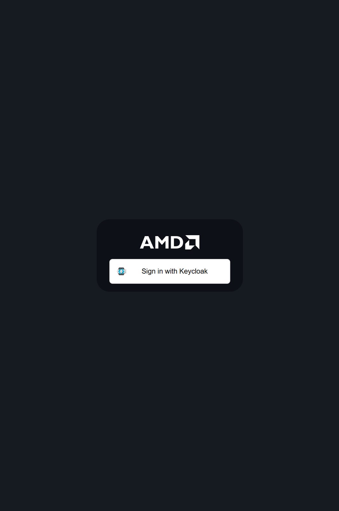

# EAI Suite — Step‑by‑Step Installation & Usage Guide

> **AMD Official Use Only — AMD Internal Distribution Only**\
> Beginner-friendly walkthrough for configuring and using the EAI Suite on AMD Developer Cloud.

------------------------------------------------------------------------

## Overview

This guide walks participants through configuring and using the **AMD Enterprise AI Suite** on a pre-provisioned environment. The environment has already been installed — you will begin directly with project setup in the AMD Resource Manager.

**Estimated Time:** 90 minutes

### Target Audience

- AMD Business Development
- Field Engineers
- Future end users

### Prerequisites

- AMD Developer Cloud access (provided for your lab session)
- Basic Linux command-line knowledge
- Familiarity with SSH

------------------------------------------------------------------------

## Lab Sections

Work through the sections in order. Each section builds on the previous one.

| # | Section | Description |
|---|---------|-------------|
| 1 | [AMD Resource Manager](./03-2-amd-resource-manager.md) | Create a project, configure quotas, attach storage, and add users |
| 2 | [AMD Workbench](./04-3-amd-workbench.md) | Deploy AI models, run benchmarks, and explore workspaces |
| 3 | [Blueprints](./05-4-blueprints.md) | Deploy solution blueprints using Helm |
| 4 | [Troubleshooting](./06-5-troubleshooting.md) | Common issues and resolutions |
| 5 | [Appendix](./07-appendix.md) | Reference commands, glossary, and cleanup |

------------------------------------------------------------------------

## Accessing the Environment

Your lab URL and credentials are provided in the **course handout** distributed at the start of the session.

------------------------------------------------------------------------
