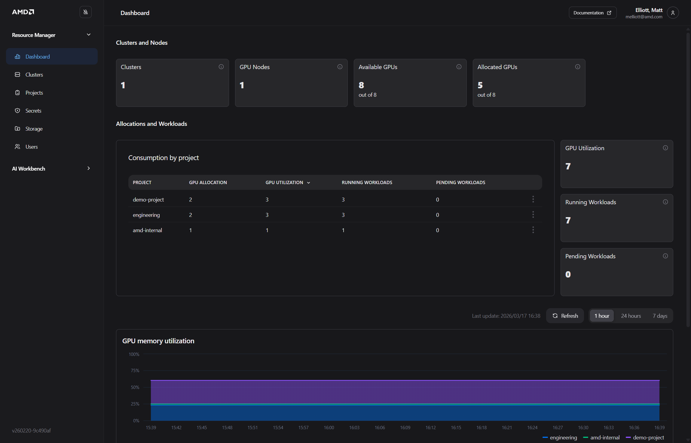
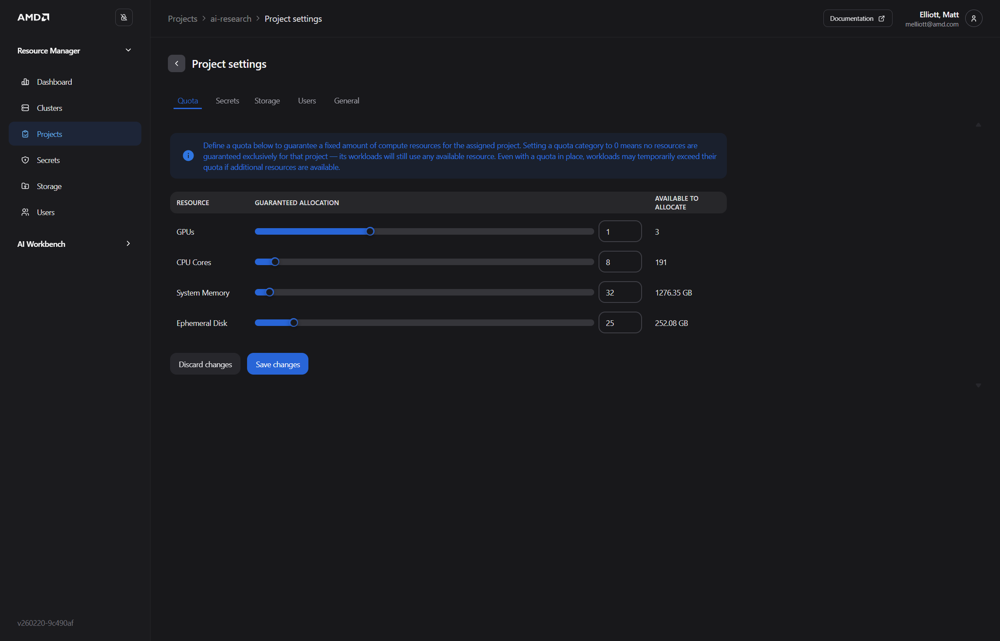
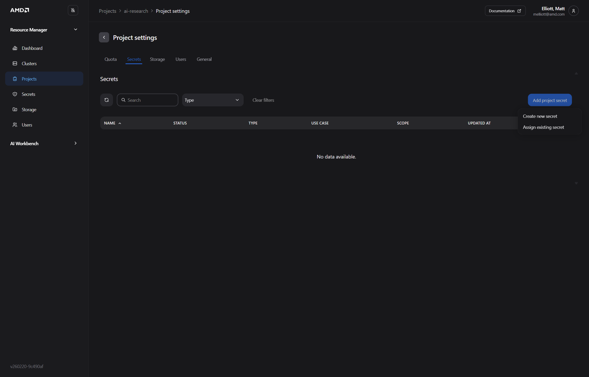
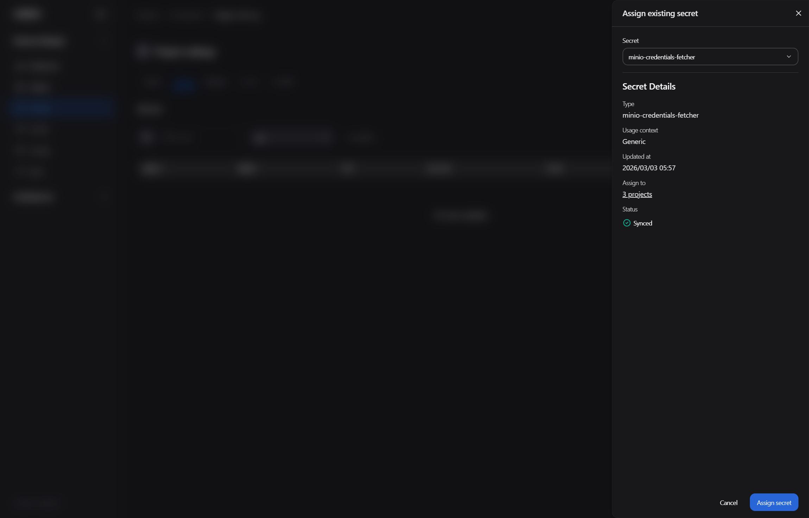
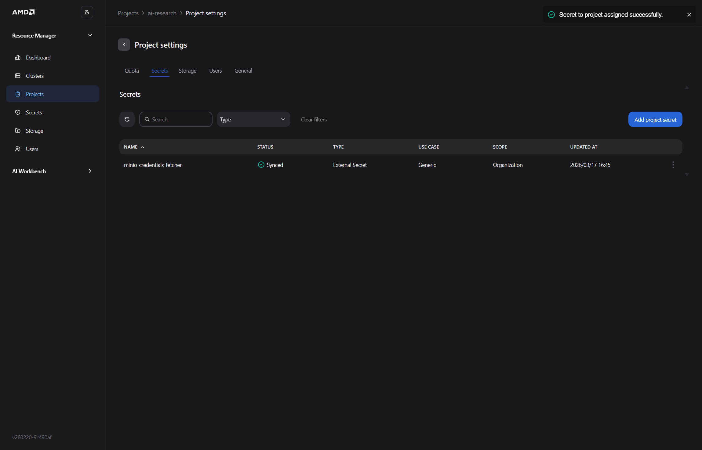
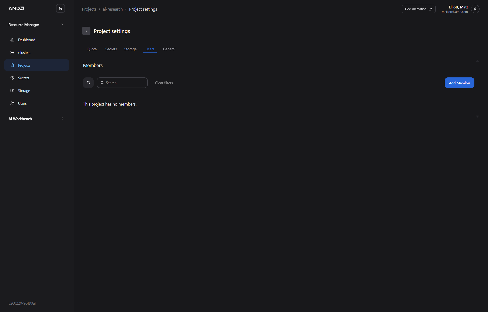
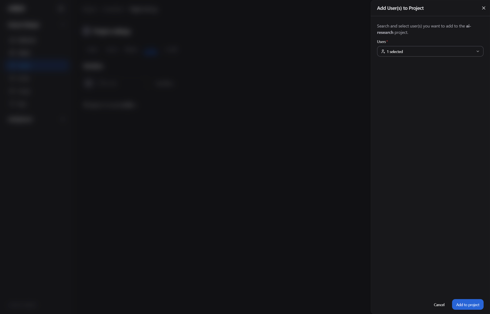
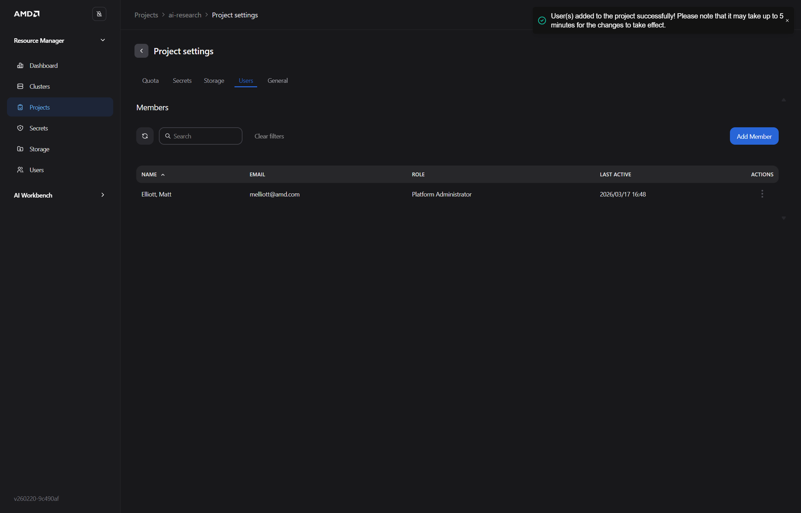

# 2. AMD Resource Manager

## Overview

AMD Resource Manager gives platform administrators a central interface for managing clusters, compute allocation, projects, workloads, storage, secrets, and user access.

For the Silogen demo environment, open:

`https://airmui.silogen-demo.silogen.ai/`

The authenticated interface was reviewed on September 1, 2026. The current primary navigation contains **Dashboard**, **Clusters**, **Projects**, **Secrets**, **Storage**, and **Users**.

See the [AMD Resource Manager overview](https://enterprise-ai.docs.amd.com/en/latest/resource-manager/overview.html) for the product-level description.

## Before You Begin

Confirm that you have:

1. Access to AMD Resource Manager.
2. The **Platform Administrator** role for cluster, project, quota, storage, secret, and user-management tasks.
3. The target cluster name and the resources approved for the project.
4. A disposable project or workload for testing any create, update, or delete operation.
5. Approval before assigning real credentials, storage, users, or production capacity.

Resource Manager distinguishes these roles:

- **Platform Administrator**: Can administer platform resources, projects, users, and organization-level configuration. Workload submission still follows project membership.
- **Team Member**: Can view clusters associated with assigned projects, inspect permitted project settings, and manage workloads in those projects.
- **Super Administrator**: A maintenance role for platform engineers responsible for identity-system administration.

See [Users Overview](https://enterprise-ai.docs.amd.com/en/latest/resource-manager/users/overview.html).

### Manual verification checklist

- [ ] [Open Resource Manager](#step-1-open-resource-manager): confirm the URL, sign-in flow, primary navigation, and active role.
- [ ] [Review the dashboard](#step-2-review-the-dashboard): compare the retained dashboard screenshot with the current deployment.
- [ ] [Inspect a cluster and its nodes](#step-3-inspect-a-cluster-and-its-nodes): confirm action-menu labels and cluster-access behavior.
- [ ] [Create a project](#step-4-create-a-project): confirm dialog fields, validation, and the resulting namespace.
- [ ] [Configure guaranteed quotas](#step-5-configure-guaranteed-quotas): save quotas and confirm the resulting allocations.
- [ ] [Assign storage and secrets](#step-6-assign-storage-and-secrets): confirm synchronization into the project.
- [ ] [Add users](#step-7-add-users-to-the-project): confirm roles, membership, and SMTP-dependent invitation behavior.
- [ ] [Inspect and delete a workload](#step-8-monitor-a-workload): confirm workload details and deletion behavior using only a disposable workload.
- [ ] [Open the project in Workbench](#step-9-open-the-project-in-amd-ai-workbench): confirm the handoff and selected project.
- [ ] [Delete a project](#step-10-delete-a-project): test only with a disposable project after confirming that no workloads or data are needed.
- [ ] Review every retained screenshot against the live UI; image assets were intentionally not changed.

---

## Step 1: Open Resource Manager

1. Open `https://airmui.silogen-demo.silogen.ai/` in a browser.
2. Complete the configured sign-in flow.
3. Confirm that the AMD Resource Manager page loads.
4. Confirm that the left navigation shows:
   - **Dashboard**
   - **Clusters**
   - **Projects**
   - **Secrets**
   - **Storage**
   - **Users**
5. Confirm that your assigned role provides the actions required for the workshop.

> **Expected result:** Resource Manager opens successfully and shows only the resources and actions permitted for your role.

> [!WARNING]
> **Manual verification required:** Confirm the current sign-in flow, navigation labels, and role-specific controls in the target deployment before running a workshop.

---

## Step 2: Review the Dashboard

1. Click **Dashboard** in the left navigation.
2. In **Clusters and Nodes**, review:
   - Cluster count
   - GPU-node count
   - Available GPUs
   - Allocated GPUs
3. In **Allocations and Workloads**, review each project's:
   - GPU allocation
   - GPU utilization
   - Running workload count
   - Pending workload count
4. Review the GPU memory and device-utilization charts.
5. Select the required time period where available.
6. Click **Refresh** to retrieve the latest state.
7. If a value requires investigation, open the related cluster or project rather than relying only on the summary.

> **Expected result:** The dashboard provides a current organization-level summary of cluster capacity, project allocation, and workload activity.

See [What the Dashboard Shows](https://enterprise-ai.docs.amd.com/en/latest/resource-manager/dashboard.html).

> [!WARNING]
> **Manual verification required:** Confirm that the dashboard screenshot below matches the current deployment. The live UI was reviewed, but image assets are outside the scope of this Markdown-only update.

---

## Step 3: Inspect a Cluster and Its Nodes

1. Click **Clusters** in the left navigation.
2. Use search or status filters to locate the target cluster.
3. In the cluster row, verify:
   - **Name**
   - **Status**
   - Healthy and total node counts
   - GPU allocation
   - CPU allocation
   - Memory allocation
   - Running workload count
4. Click the cluster name to open its details.
5. Review **Assigned projects** and confirm that the expected projects are present.
6. Open the **Nodes** table.
7. For each relevant node, review:
   - Status
   - CPU cores
   - CPU memory
   - GPU type
   - GPU device count
   - GPU memory
8. Open the cluster action menu only if you need cluster access or a Workbench handoff.

> **Expected result:** The cluster is healthy, the expected projects are assigned, and node capacity matches the intended workload requirements.

See [Clusters Overview](https://enterprise-ai.docs.amd.com/en/latest/resource-manager/clusters/overview.html).

> [!WARNING]
> **Manual verification required:** Verify the current cluster action-menu labels for kubeconfig download, Workbench access, and cluster administration. These actions can expose credentials or change cluster configuration and were not executed.

---

## Step 4: Create a Project

A project is the isolation and access boundary for workloads. Each project maps to a Kubernetes namespace and contains project-scoped quotas, storage assignments, secrets, users, and workloads.

1. Click **Projects** in the left navigation.
2. Use the cluster and status filters to confirm that the intended project does not already exist.
3. Click **Create project**.
4. Enter a unique project name using lowercase letters, numbers, and dashes.
5. Enter an optional description.
6. Select the target cluster.
7. Review the values before submitting.
8. Submit the dialog.
9. Wait for the project to appear under the selected cluster.
10. Open the project and confirm that its status progresses to **Ready**.
11. Open the project-level **Actions** menu and locate **Edit settings**.

> **Expected result:** The project appears under the selected cluster, reaches **Ready**, and has a corresponding Kubernetes namespace.

See [Manage Projects](https://enterprise-ai.docs.amd.com/en/latest/resource-manager/projects/manage-projects.html).

> [!WARNING]
> **Manual verification required:** Create only a disposable project and confirm the current dialog fields, validation rules, submit-button label, resulting namespace, and post-create redirect. Project creation was not submitted during this review.

---

## Step 5: Configure Guaranteed Quotas

A quota is a guaranteed resource floor, not a hard usage ceiling. A project can borrow idle resources above its quota. When a quota-holding project needs those resources, workloads using borrowed capacity may be suspended until capacity becomes available again.

1. Click **Projects**.
2. Select the project.
3. Open **Actions** and choose **Edit settings**.
4. Open the **Quota** tab.
5. Enter the approved guaranteed allocation for:
   - GPUs
   - CPU cores
   - System memory
   - Ephemeral disk
6. Confirm that the requested values fit within the cluster's available capacity.
7. Save the quota settings.
8. Return to the project or cluster view.
9. Confirm that the displayed GPU, CPU, memory, and disk allocations reflect the saved values.

> **Expected result:** The project shows the approved guaranteed allocation while retaining the ability to use idle shared capacity when available.

Quota-based preemption and workload priority are separate mechanisms. A workload can use the `low`, `medium`, or `high` priority class. When resources are exhausted, a higher-priority workload can suspend a lower-priority workload independently of quota-based preemption. Use checkpointing for long-running jobs where supported.

See [Project Settings](https://enterprise-ai.docs.amd.com/en/latest/resource-manager/projects/project-settings.html) and [Workload Priority Classes](https://enterprise-ai.docs.amd.com/en/latest/resource-manager/workloads/priority-classes.html).

> [!WARNING]
> **Manual verification required:** In a disposable project, save each quota and confirm the success notification, resulting allocations, and behavior when requested values exceed available cluster capacity. Quota-saving was not executed during this review.

> [!WARNING]
> **Manual verification required:** Confirm that the retained quota screenshot still reflects the current project-settings layout before presenting it.

---

## Step 6: Assign Storage and Secrets

### Review organization-level resources

1. Click **Storage** in the left navigation.
2. Use search and filters to locate the approved storage resource.
3. Review its type, status, scope, assigned projects, creation time, and creator.
4. Click **Secrets** in the left navigation.
5. Use the type and scope filters to locate the approved secret.
6. Review its type, use case, synchronization status, scope, assigned projects, and update time.
7. Do not open or copy a credential value unless the task explicitly requires it.

Resource Manager can manage Kubernetes Secrets and External Secrets. Storage may represent an S3-compatible bucket or another supported data service. Organization-scoped resources can be shared with multiple projects; project-scoped resources are limited to their assigned project.

### Assign resources to the project

1. Click **Projects** and select the project.
2. Open **Actions** and choose **Edit settings**.
3. Open the **Storage** tab.
4. Select the approved storage resource.
5. Save the assignment.
6. Confirm that the resource reports the expected assignment or synchronization state.
7. Open the **Secrets** tab.
8. Select the approved secret.
9. Save the assignment.
10. Confirm that the secret reports the expected assignment or synchronization state.

> **Expected result:** The selected storage and secret resources are assigned to the project and are available to authorized workloads.

> [!NOTE]
> **Deployment-specific behavior:** The Silogen demo includes resources such as `minio-credentials-fetcher`, but AMD documentation does not state that every project universally requires that exact secret or a default MinIO storage configuration. Use the storage and secret resources provisioned for your deployment.

> [!WARNING]
> **Manual verification required:** In a disposable project, assign an existing storage resource and secret, save the settings, and confirm synchronization. Do not enter, copy, or expose real secret values during the check.

> [!WARNING]
> **Manual verification required:** Confirm the retained secret screenshots against the current project-settings UI. They may contain deployment-specific MinIO labels.

See [Storage Overview](https://enterprise-ai.docs.amd.com/en/latest/resource-manager/storage/overview.html), [Manage Storage](https://enterprise-ai.docs.amd.com/en/latest/resource-manager/storage/manage-storage.html), [Secrets Overview](https://enterprise-ai.docs.amd.com/en/latest/resource-manager/secrets/overview.html), and [Manage Secrets](https://enterprise-ai.docs.amd.com/en/latest/resource-manager/secrets/manage-secrets.html).

---

## Step 7: Add Users to the Project

The top-level **Users** page lists active users, email, last-seen time, and role. Depending on identity configuration, users may authenticate through SSO, be added manually, or receive an email invitation when SMTP is configured.

1. Click **Users** in the left navigation.
2. Search for the user and confirm that the account exists and has the intended platform role.
3. Click **Projects** and select the project.
4. Open **Actions** and choose **Edit settings**.
5. Open the **Users** tab.
6. Click the current add-member or invite control.
7. Select the intended existing user, or enter invitation details when SMTP invitations are enabled.
8. Review the project membership and role.
9. Submit the change.
10. Confirm that the user appears in the project's member list.
11. Ask the user to confirm access to the intended project only.

> **Expected result:** The user can access the project according to the assigned platform role and project membership.

See [Set Up User Management](https://enterprise-ai.docs.amd.com/en/latest/resource-manager/users/set-up/overview.html).

> [!WARNING]
> **Manual verification required:** Add only a test user or use a disposable project. Confirm the current add/invite labels, role behavior, project membership, and SMTP-dependent invitation result; no membership was changed during this review.

> [!WARNING]
> **Manual verification required:** Confirm that the retained user-assignment screenshots match the current project-settings layout.

---

## Step 8: Monitor a Workload

1. Click **Projects** and select the project.
2. Review the project dashboard for:
   - Workload total and workload states
   - Average wait time
   - Quota utilization
   - GPU idle time
   - GPU device and VRAM usage
3. In the **Workloads** list, review each workload's name, type, status, GPU and VRAM use, creation time, run time, and creator.
4. Click a workload name to open its detail page.
5. Confirm the workload's execution status.
6. For each assigned GPU device, review available:
   - Memory utilization
   - GPU utilization
   - Power usage
7. Select the required 1-hour, 24-hour, or 7-day time window.
8. Click **Refresh** to retrieve current charts.
9. Use **View all metrics** to open the host node's complete GPU metrics when needed.
10. Review the workload information cards for workload, creator, cluster, node, and allocated GPU details.
11. If no metrics appear, confirm that the workload has GPU devices and that telemetry is configured.

> **Expected result:** The detail page shows the current workload state, resource assignment, identifying information, and available GPU telemetry.

Resource Manager monitors workloads submitted through Workbench and supported Kubernetes workload types. Workloads created through other tools still follow the project's namespace, quota, and access rules.

See [Workload Submission](https://enterprise-ai.docs.amd.com/en/latest/resource-manager/workloads/overview.html), [Workload Detail](https://enterprise-ai.docs.amd.com/en/latest/resource-manager/workloads/workload-detail.html), and [Project Dashboard](https://enterprise-ai.docs.amd.com/en/latest/resource-manager/projects/project-dashboard.html).

> [!WARNING]
> **Manual verification required:** Open only an approved test workload and confirm the current charts, time controls, information fields, and View all metrics behavior. If testing Delete, use a disposable workload and confirm the warning, final status, and released resources; deletion was not executed.

---

## Step 9: Open the Project in AMD AI Workbench

1. Click **Clusters**.
2. Locate the cluster that contains the project.
3. Open the cluster context menu or cluster details page.
4. Select the available AMD AI Workbench action.
5. If the action is unavailable, open Workbench directly at:

   `https://aiwbui.silogen-demo.silogen.ai/`

6. Complete sign-in if prompted.
7. Select the intended project in Workbench.
8. Confirm the project before deploying models, uploading datasets, creating secrets or API keys, or starting workspaces.

> **Expected result:** AMD AI Workbench opens and the intended Resource Manager project is selected.

> [!WARNING]
> **Manual verification required:** Confirm the current Resource Manager action label, destination URL, authentication handoff, and selected Workbench project before using this step in a workshop.

**Next:** Proceed to [AMD AI Workbench](./04-3-amd-workbench.md).

---

## Step 10: Delete a Project

Project deletion permanently removes the project's workloads, data, and configuration. Back up anything required before continuing.

1. Confirm that the project is disposable and approved for deletion.
2. Stop or remove workloads that must not remain active.
3. Back up any data, logs, configuration, or results that must be retained.
4. Record storage and secret assignments that must be preserved elsewhere.
5. Click **Projects** and select the project.
6. Open **Actions** and choose **Edit settings**.
7. Open the **Details** tab.
8. Locate **Danger zone**.
9. Select the project-deletion action.
10. Read the warning and verify the exact project name.
11. Complete the confirmation only when the target is correct.
12. Return to **Projects** and confirm that the project is removed.
13. Confirm that its workloads and namespace no longer appear.

> **Expected result:** The disposable project and its associated resources are removed from Resource Manager.

> [!WARNING]
> **Manual verification required:** Test deletion only with an approved disposable project after backing up anything required. Confirm the warning text, confirmation mechanism, namespace removal, workload cleanup, and final project state; deletion was not executed.