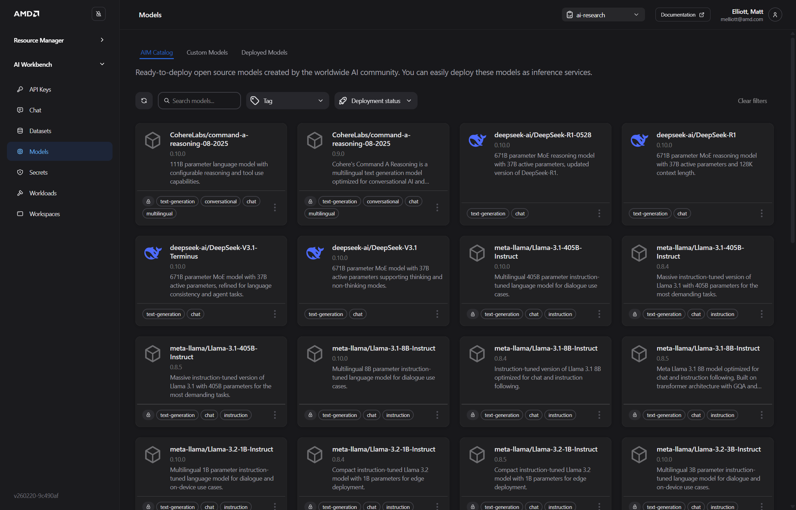
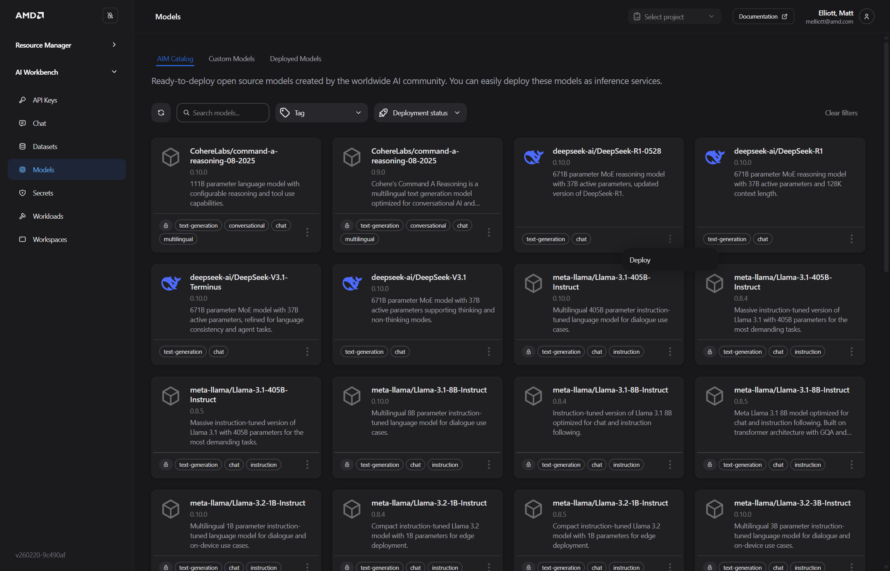

# 3. AMD Workbench

AMD AI Workbench is the end-user interface for deploying and interacting with AI models. It is accessed separately from the Resource Manager — navigate to:

> `https://<!-- TODO: confirm AMD Workbench URL pattern, e.g., airmui.<your-ip>.nip.io or a separate subdomain -->`

Log in with the same credentials used for the Resource Manager. Ensure you are working within the project you created in the previous section.

<!-- SCREENSHOT: AMD AI Workbench landing page after login, showing the main navigation -->

------------------------------------------------------------------------

## Finetuning

<!-- TODO: This section requires content. The workflow below is an outline only.
     Fill in step-by-step instructions with UI navigation for each item before the HOL. -->

Finetuning allows you to adapt a base model to domain-specific data.

### Typical Workflow

1. **Add Hugging Face token** — Required for accessing gated models and datasets
2. **Upload dataset** — <!-- TODO: Describe where/how to upload a dataset in the UI -->
3. **Select base model** — <!-- TODO: Describe model selection UI -->
4. **Configure training parameters** — <!-- TODO: Describe key parameters and recommended values for this HOL -->
5. **Launch finetuning job** — <!-- TODO: Describe how to submit and monitor the job -->

<!-- SCREENSHOT: Finetuning section of the UI (once steps are documented) -->

------------------------------------------------------------------------

## Deploy an AI Model (AIM)

> **Note:** You are in the **AMD AI Workbench** interface for this section. Ensure you have selected the correct project before proceeding.



1. Navigate to the **Models** tab to access the AIM catalog
2. Locate the model you want to deploy and click the **three-dot menu (⋮)** in the bottom-right corner of the model card
3. Select **Deploy**



4. Configure the **Deployment Settings**:

   - **Performance metric** — Select the optimization target from the dropdown:

     | Option | When to use |
     |--------|-------------|
     | **Latency** | When minimizing response time per request is the priority |
     | **Throughput** | When maximizing sustained requests/second is the priority |

   - **Unoptimized deployment** — Toggle **Allow** only when deploying to hardware the AIM is not specifically optimized for. Leave this off for standard deployments.

   <!-- TODO: Specify which performance metric to select for this HOL exercise -->

<!-- SCREENSHOT: Deployment config panel showing Performance metric dropdown open with Latency and Throughput options -->


5. If the model is gated (indicated by a lock icon — e.g., Llama family models), a **Hugging Face authentication** section appears in the panel. Either click **Select existing token** to reuse a previously stored token, or click **Add new token** and enter a name and token value directly.


6. Click **Deploy**. A confirmation message will appear indicating the workload has started.

<!-- SCREENSHOT: Deployment confirmation notification or toast message -->

7. **Wait for the model to become ready.** Navigate to **Workloads** to monitor deployment status. The model is ready when its status shows **Running**.

   > Deployment typically takes <!-- TODO: fill in approximate time, e.g., "3–5 minutes" --> depending on model size and cluster load.

<!-- SCREENSHOT: Workloads list view showing the deployed model with "Running" status -->

------------------------------------------------------------------------

## VSCode Workspace (vLLM Benchmarking)

This section demonstrates how to use the built-in Visual Studio Code workspace to benchmark a deployed model using the `vllm bench` tool.

### Launch the VSCode Workspace

1. Navigate to **Workspaces** in the left sidebar
2. Click **View and deploy** next to the Visual Studio Code workspace entry
3. Once deployed, click the **Launch** button to open VSCode in your browser

<!-- SCREENSHOT: Workspaces page — showing the "View and deploy" and "Launch" buttons -->
<!-- SCREENSHOT: VSCode workspace open in the browser -->

### Get the Model Endpoint

Before running the benchmark, retrieve the internal endpoint of your deployed model:

1. Navigate to the **Models** tab
2. On the deployed model card, click the **three-dot menu (⋮)** and select **Connect**
3. Copy the **Internal URL** — this is the endpoint used within the cluster

   > If accessing from outside the cluster (e.g., from your local machine), use the **External URL** together with an API key instead.

<!-- SCREENSHOT: Connect dialog showing Internal URL and External URL fields -->

### Run the Benchmark

Open a terminal in the VSCode workspace and run the following setup commands:

```bash
python --version          # Verify Python is available

python -m venv venv       # Create a virtual environment
source venv/bin/activate  # Activate it

pip install vllm          # Install the vllm benchmarking tool
```

Then configure and run the benchmark. Replace the placeholder values with those for your deployment:

```bash
NUM_PROMPTS=<number-of-prompts>
CONC=$((NUM_PROMPTS * 10))   # Sets concurrency to 10x the prompt count — adjust as needed
INPUT_LEN=<input-token-length>
OUTPUT_LEN=<output-token-length>
BASE_URL="<your-internal-url>"
ENDPOINT="/v1/chat/completions"
MODEL="<your-model-name>"

vllm bench serve \
  --ignore-eos \
  --backend openai-chat \
  --base-url "${BASE_URL}" \
  --endpoint "${ENDPOINT}" \
  --model "${MODEL}" \
  --dataset-name random \
  --random-input-len ${INPUT_LEN} \
  --random-output-len ${OUTPUT_LEN} \
  --num-prompts ${NUM_PROMPTS} \
  --max-concurrency ${CONC} \
  --trust-remote-code
```

<!-- TODO: Provide recommended values for this HOL, e.g.:
     NUM_PROMPTS=100, INPUT_LEN=512, OUTPUT_LEN=128, MODEL="<name of model deployed above>"
     Optionally, provide this as a pre-written bash script participants can copy. -->

<!-- SCREENSHOT: VSCode terminal showing benchmark output -->

### Understanding Benchmark Output

| Metric | Meaning |
|--------|---------|
| **Throughput** | Total tokens processed per second across all concurrent requests |
| **TTFT** | Time to First Token — how quickly the model starts responding |
| **Latency** | End-to-end time per request |
| **Tokens/sec** | Per-request token generation rate |

------------------------------------------------------------------------

## ComfyUI

<!-- TODO: This section requires content before the HOL.
     ComfyUI is used for visual AI workflow creation, image generation, and model experimentation.
     Document: how to access ComfyUI, how to load a workflow, and a simple example task. -->

ComfyUI provides a visual node-based interface for building and running AI pipelines, including image generation workflows.

<!-- SCREENSHOT: ComfyUI interface showing the node graph editor -->

------------------------------------------------------------------------

**Next:** Proceed to [Blueprints](./05-4-blueprints.md) to deploy a solution blueprint.
