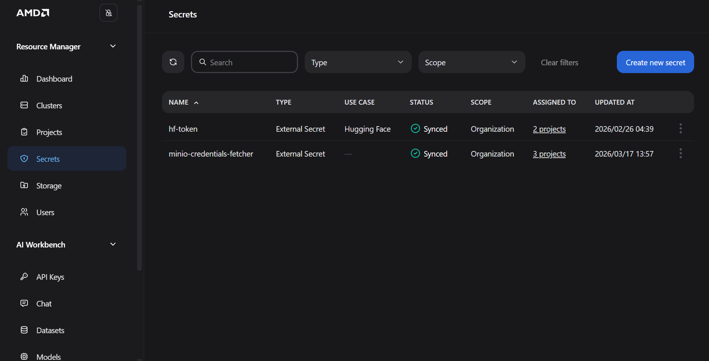

# 3. AMD AI Workbench

## Why Use AMD AI Workbench?

AMD AI Workbench is the **self-service portal for AI** on the AMD Enterprise AI platform. It puts model deployment, evaluation, fine-tuning, and developer environments in the hands of data scientists and developers — without requiring them to have Kubernetes or infrastructure expertise.

**Enterprise value:**
- Teams self-serve AI models without waiting on IT infrastructure tickets
- Unified interface for the full ML lifecycle: discover → deploy → evaluate → fine-tune → connect
- API-compatible with OpenAI standards — existing code and tooling works without modification
- Centrally managed API keys mean usage is auditable and controllable
- Pre-built workspaces eliminate environment setup friction for developers and data scientists

AMD AI Workbench is accessed separately from the Resource Manager. Navigate to the URL exposed after installation:

- For a `.nip.io` domain (default for Digital Ocean installations): `https://airmui.<master-node-ip-address>.nip.io`
- For a registered domain: `https://airmui.<your-domain>`

Log in with the same credentials used for the Resource Manager. Ensure you are working within the correct project before proceeding.

<!-- SCREENSHOT: AMD AI Workbench landing page after login, showing the main navigation -->

------------------------------------------------------------------------

## Deploy an AI Model (AIM) via the Workbench GUI

> **You are in the AMD AI Workbench interface for this section.** Confirm you have selected the correct project in the top navigation before proceeding.

AIMs (AMD Inference Microservices) are pre-packaged, AMD-optimized AI model servers. The Workbench lets you deploy them through a graphical interface with no command-line required.

### Browse the Model Catalog

1. Click **Models** in the left navigation sidebar
2. Browse the catalog — you will see language models, vision models, embedding models, and more
3. Each card shows the model name, provider, parameter count, and hardware requirements

> **What am I looking at?** Each model is an AIM — a container image built by AMD that includes the model weights, optimized serving configuration, and all dependencies for running efficiently on AMD GPUs. AMD has profiled each model on AMD hardware, so you get the right configuration automatically.


### Deploy a Model

1. Find the model you want to deploy
2. Click the **three-dot menu (⋮)** in the bottom-right corner of the model card
3. Select **Deploy**


4. In the **Deployment Settings** panel:

   | Setting | Options | When to Use |
   |---------|---------|-------------|
   | **Performance metric** | Latency | Minimize response time per request — best for interactive chat applications |
   | **Performance metric** | Throughput | Maximize requests/second — best for batch processing or high-volume APIs |
   | **Unoptimized deployment** | Toggle Allow | Only enable when deploying to hardware the AIM is not specifically optimized for |


5. If the model is **gated** (shown with a lock icon — common for Llama family models), a Hugging Face authentication section appears. Either click **Select existing token** to reuse a stored token, or click **Add new token** and enter your token name and value.


6. Click **Deploy**. A confirmation notification will appear.

### Monitor Deployment Status

1. Click **Workloads** in the left sidebar
2. Find your model in the list — it will show `Pending` or `Starting` initially
3. Wait for the status to change to **Running** (typically 3–5 minutes depending on model size)

> **What is happening?** The platform is pulling the model container image to a GPU node, scheduling GPU memory, and starting the serving process. Once `Running`, the model is ready to receive inference requests.

### View Inference Metrics and SLOs

Once your model is running:

1. In the **Workloads** view, click **Open details** for your model
2. View live performance metrics:
   - **Requests/second** — Current query load
   - **Time to First Token (TTFT)** — Latency to first generated token
   - **Total throughput** — Tokens generated per second across all requests
   - **SLO compliance** — Whether the model is meeting its latency Service Level Objectives
3. These metrics update in real time — you can watch them change as you send requests

> **Why do SLOs matter?** In enterprise deployments, teams need to commit to response time guarantees for their applications. The Workbench shows you whether the deployed model is meeting those targets before you put it in production.

### Chat with Your Model

From the model details or Workloads view, click **Chat** to open a direct chat interface. Test your model's responses, evaluate quality, and compare multiple models side by side.

------------------------------------------------------------------------

## Fine-Tuning a Model

Fine-tuning adapts a general-purpose model to your specific domain — customer support language, internal documentation style, industry terminology, or proprietary data formats. The Workbench makes this accessible without requiring ML engineering expertise.

**Enterprise value:** Fine-tuned models are typically more accurate and consistent for domain-specific tasks than general models. You maintain ownership and control of your fine-tuned models — they never leave your cluster.

### Step 1: Add a Hugging Face Token (If Needed)

If you are fine-tuning a gated model (e.g., Llama family), you need a Hugging Face token. Navigate to **Settings** or the Hugging Face token section in the Workbench and add your token.



### Step 2: Upload Training Data

1. Click **Datasets** in the left sidebar
2. Click **Upload**
3. For this workshop, use the sample dataset:  
   `https://github.com/isab8liu-alum/eai-suite-guides/blob/main/dataset/argilla-1.jsonl`


4. In the upload dialog:
   - **Dataset name** — Enter a descriptive name (e.g., `workshop-demo-data`)
   - **Data type** — Select the appropriate format (`.jsonl` for instruction fine-tuning data)
   - **Description** — Optional but recommended for future reference
5. Upload your `.jsonl` file and click **Upload**

> **What is JSONL format?** JSON Lines (`.jsonl`) is a standard format for fine-tuning data. Each line is a JSON object representing one training example — typically a `prompt` and a desired `response`. The Workbench accepts this format directly.

### Step 3: Create the Fine-Tuned Model

1. Click **Models** in the left sidebar
2. Switch to the **Custom Models** tab


3. Click **Fine-tune model**
4. In the configuration panel:
   - **Base model** — Select the foundation model to start from
   - **Dataset** — Select the dataset you uploaded
   - **Training parameters** — Adjust epochs, learning rate, and batch size as needed (defaults work for initial experiments)
5. Click **Start training**


The fine-tuning job appears in the **Workloads** view. Training time varies based on dataset size and model parameters — a small dataset on a compact model may complete in minutes; larger jobs take longer.

Once complete, your fine-tuned model appears as a custom model in your catalog, ready to deploy the same way as any standard AIM.

------------------------------------------------------------------------

## API Keys and Programmatic Access

To use deployed models from your own code, you need the model's endpoint URL and an API key.

### Get the Model Endpoint

1. Click **Models** in the left sidebar
2. On the deployed model card, click the **three-dot menu (⋮)** and select **Connect**
3. Copy the URL you need:
   - **Internal URL** — Use this from within the cluster (e.g., from a Blueprint or workspace)
   - **External URL** — Use this from outside the cluster (your local machine, your application)

### Create an API Key

1. Click **API Keys** in the left sidebar
2. Click **Create API Key**
3. Give it a name (e.g., `my-app-key`)
4. Copy the key — **it is only shown once**

**Using the API key in your code:**

The deployed models are fully compatible with the OpenAI API format. Any library or tool that works with OpenAI will work with AMD-deployed models:

```python
from openai import OpenAI

client = OpenAI(
    base_url="<your-external-url>/v1",
    api_key="<your-api-key>"
)

response = client.chat.completions.create(
    model="<your-model-name>",
    messages=[{"role": "user", "content": "Hello! What can you help me with?"}]
)
print(response.choices[0].message.content)
```

------------------------------------------------------------------------

## VSCode Workspace and vLLM Benchmarking

The AMD AI Workbench includes pre-built development workspaces that launch directly in the browser. The VSCode workspace is connected to your cluster and is pre-configured for AI development tasks.

**Enterprise value:** Consistent, managed development environments eliminate the "works on my machine" problem. Developers get the same tools and cluster access without any local setup.

### Launch the VSCode Workspace

1. Click **Workspaces** in the left sidebar
2. Click **View and deploy** next to the Visual Studio Code workspace
3. Click **Customize Resource Allocation** and set **GPUs = 0** (the IDE itself doesn't need GPU)
4. Once deployed, click **Launch** to open VS Code in your browser


### Benchmark a Deployed Model with vLLM

The `vllm bench serve` tool measures real-world model performance — throughput, latency, and time to first token — under realistic load. Use this to validate model performance before production use.

**Get the model endpoint:**

1. In the Workbench, click **Models**
2. On the deployed model card, click **Connect**
3. Copy the **Internal URL** — this is the endpoint used within the cluster

**Create the benchmark script:**

Create a new file called `bench_serve.sh` and paste:

```bash
NUM_PROMPTS=20                         # Number of concurrent test prompts
CONC=$((NUM_PROMPTS * 10))             # Set concurrency to 10x prompt count
INPUT_LEN=1024                         # Input token length per prompt
OUTPUT_LEN=1024                        # Output token length per response
BASE_URL="<your-internal-url>"         # Replace with your model's Internal URL
ENDPOINT="/v1/chat/completions"
MODEL="<your-model-name>"              # Replace with your deployed model name

vllm bench serve \
  --ignore-eos \
  --backend openai-chat \
  --base-url "${BASE_URL}" \
  --endpoint "${ENDPOINT}" \
  --model "${MODEL}" \
  --dataset-name random \
  --random-input-len ${INPUT_LEN} \
  --random-output-len ${OUTPUT_LEN} \
  --num-prompts ${NUM_PROMPTS} \
  --max-concurrency ${CONC} \
  --trust-remote-code
```


**Run the benchmark from your terminal:**

```bash
python --version              # Verify Python is available

python -m venv venv           # Create a virtual environment
source venv/bin/activate      # Activate it

pip install vllm              # Install vllm benchmarking tool

chmod +x bench_serve.sh
./bench_serve.sh
```

### Understanding Benchmark Output

| Metric | Meaning | What to Look For |
|--------|---------|------------------|
| **Throughput** | Total tokens processed per second across all requests | Higher is better for batch workloads |
| **TTFT** | Time to First Token — how quickly the model starts responding | Lower is better for interactive use |
| **Latency** | End-to-end time per request | Lower is better; compare against your SLO target |
| **Tokens/sec** | Per-request token generation rate | Higher means faster completions per user |

------------------------------------------------------------------------

## ComfyUI Workspace

ComfyUI provides a visual, node-based interface for building and running AI image generation pipelines.

**Enterprise value:** ComfyUI makes image generation workflows accessible to non-technical users and enables rapid prototyping of complex multi-step pipelines.

1. Click **Workspaces** in the left sidebar and locate **ComfyUI Text-to-Image**


2. Click **View and deploy**, then allocate the appropriate number of GPUs based on workload demand
3. Once deployment is ready, click **Launch**
4. In ComfyUI, select one of the available text-to-image templates
5. Enter a text prompt and run the workflow to generate images

------------------------------------------------------------------------

## Deploy an AIM via Command Line (AIM Engine)

For teams that prefer automation, scripted deployments, or GitOps workflows, AIMs can be deployed via the **AIM Engine** — a Kubernetes operator that manages model lifecycle.

**Enterprise value:** The AIM Engine enables infrastructure-as-code workflows, CI/CD pipeline integration, and programmatic management of AI model deployments at scale.

### Prerequisites

- `kubectl` configured with cluster access (see the [Accessing the Cluster guide](https://enterprise-ai.docs.amd.com/en/latest/resource-manager/workloads/accessing-the-cluster.html))
- AIM Engine installed in the cluster (included with EAI Suite installation)

### Deploy an AIM Using a Manifest

Create a file called `my-aim.yaml`:

```yaml
apiVersion: aimsoperator.amd.com/v1alpha1
kind: AIModelService
metadata:
  name: my-llm
  namespace: my-namespace      # Replace with your namespace
spec:
  aimName: meta-llama/Llama-3.1-8B-Instruct   # Replace with your chosen model
  performanceProfile: latency                   # Options: latency, throughput
```

Apply the manifest:

```bash
kubectl apply -f my-aim.yaml
```

Monitor the deployment:

```bash
# Watch status in real time
kubectl get aimodelservice -n my-namespace -w

# Or check once
kubectl get aimodelservice -n my-namespace
```

Wait for the status to show `Ready`. The AIM Engine automatically selects the correct container image, GPU configuration, and serving parameters for the hardware in your cluster.

### Remove the Deployment

```bash
kubectl delete -f my-aim.yaml
```

### Finding Available AIMs for CLI Deployment

Browse the AIM catalog at: https://enterprise-ai.docs.amd.com/en/latest/aims/aims_catalog.html

------------------------------------------------------------------------

**Next:** Proceed to [Blueprints](./05-4-blueprints.md) to deploy a complete AI application using a Solution Blueprint.
