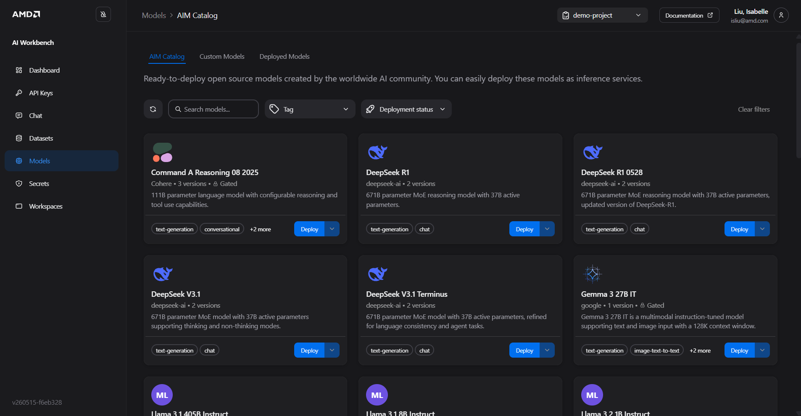
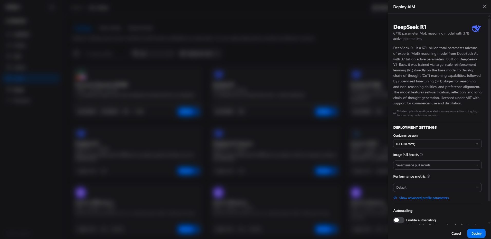
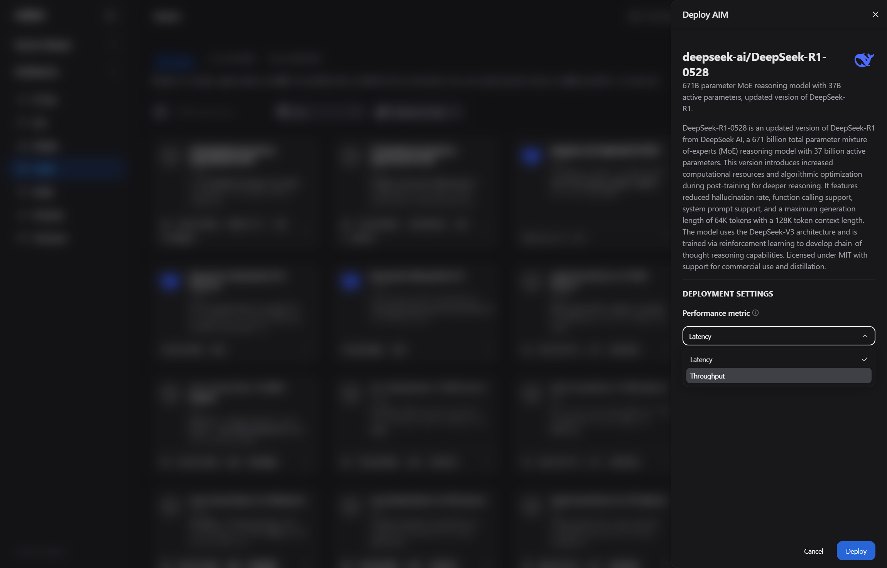
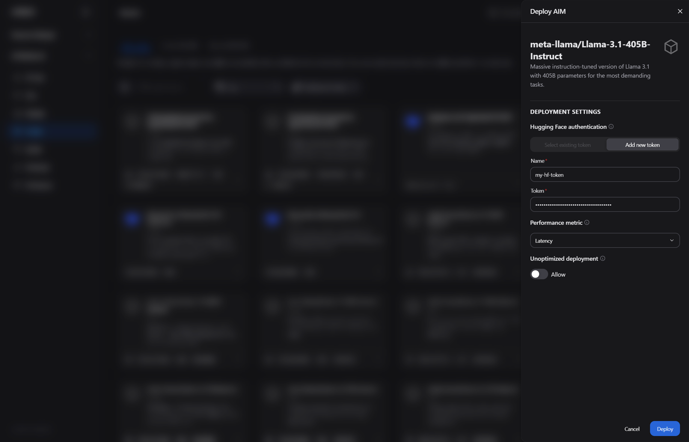
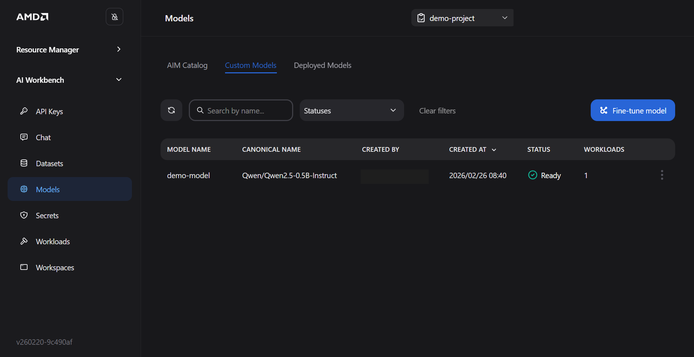
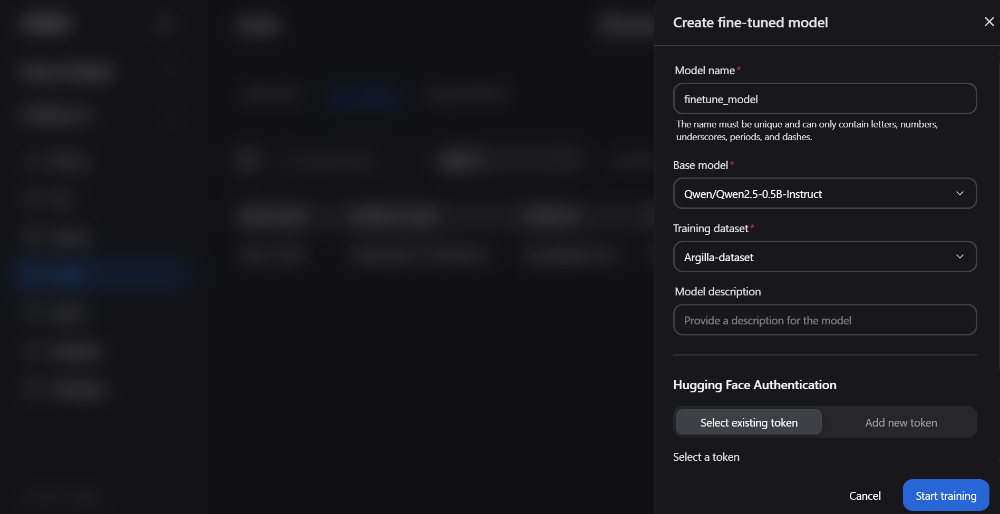
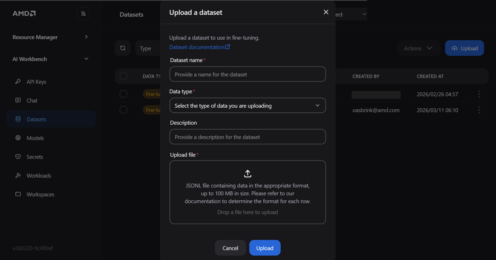
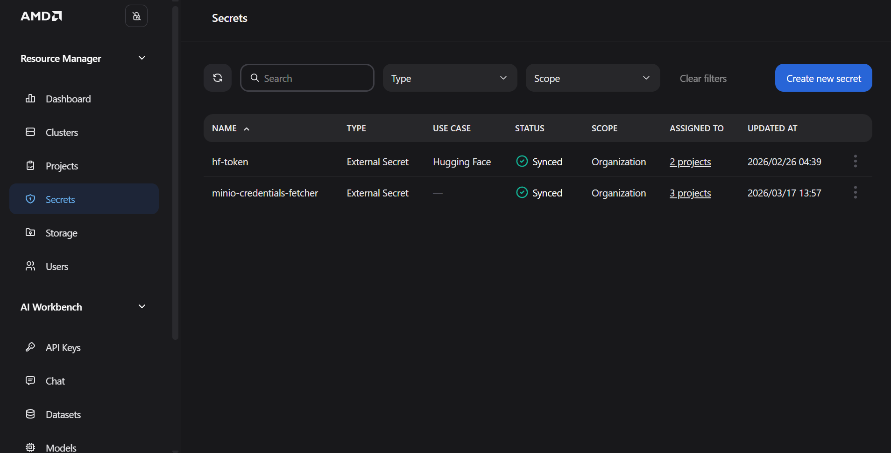
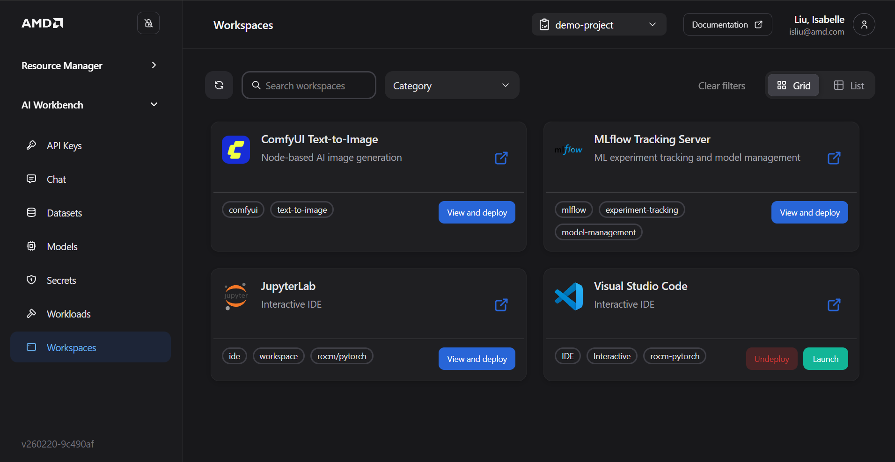
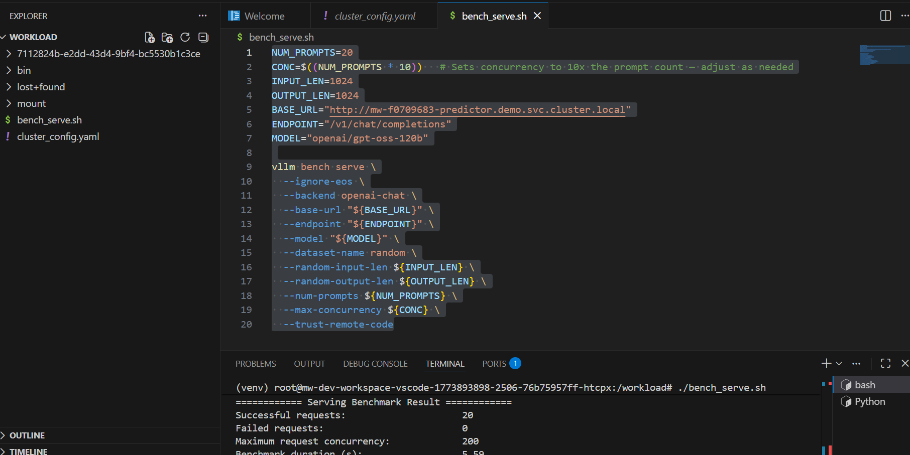

# 3. AMD AI Workbench

## Overview

AMD AI Workbench is the project-scoped, self-service interface for discovering and deploying models, testing inference, managing datasets and secrets, fine-tuning models, creating API keys, and launching development workspaces.

Open the Silogen demo Workbench at:

`https://aiwbui.silogen-demo.silogen.ai/`

The authenticated interface was reviewed on September 1, 2026. Select the intended project before creating or changing resources. The current primary navigation contains **Dashboard**, **API Keys**, **Chat**, **Datasets**, **Models**, **Secrets**, and **Workspaces**.

See the [AMD AI Workbench overview](https://enterprise-ai.docs.amd.com/en/latest/workbench/overview.html) for the product-level description.

### Manual verification checklist

- [ ] [Deploy an AIM](#deploy-an-aim): confirm the deployment form, resource choices, gated-model authentication, and successful deployment.
- [ ] [Onboard a custom model](#custom-models): confirm supported model sources, fields, validation, and resulting catalog entry.
- [ ] [Upload a dataset](#datasets): confirm JSONL validation, upload behavior, and dataset metadata.
- [ ] [Start a fine-tuning job](#fine-tune-models): confirm available base models, training parameters, status states, and output model.
- [ ] [Create a project secret](#project-secrets-and-hugging-face-access): confirm secret type, use case, scope, and redaction behavior.
- [ ] [Create and manage an API key](#api-keys-and-programmatic-access): confirm one-time display, expiration and renewal controls, deployment binding, and usage limits.
- [ ] [Deploy each workspace type](#workspace-catalog): confirm resource settings, launch behavior, persistence, and cleanup.
- [ ] [Delete a deployed model](#deployed-models): verify the warning and dependencies using only a disposable deployment.
- [ ] [Run the AIMService commands](#deploy-an-aim-with-aim-engine): validate the manifest and commands in a non-production namespace.
- [ ] [Review retained screenshots](#screenshot-review): compare every retained image with the current UI; image assets were intentionally not edited.
- [ ] [Review unchanged SLO and timing text](#intentionally-unchanged-slo-and-timing-text): validate the legacy statements before relying on them.

---

## Current Navigation and Project Context

| Area | Current purpose |
|---|---|
| **Dashboard** | Summarizes the selected project's workloads and recent activity. |
| **API Keys** | Creates and manages project-scoped credentials for programmatic inference access. |
| **Chat** | Tests deployed models in single-model **Chat** or side-by-side **Compare** mode. |
| **Datasets** | Uploads and manages training datasets. |
| **Models** | Provides **AIM Catalog**, **Custom Models**, **Fine-tune models**, and **Deployed Models** tabs. |
| **Secrets** | Manages project secrets, including Hugging Face credentials. |
| **Workspaces** | Deploys browser-based development and AI tools. |

The active project determines which datasets, secrets, API keys, deployments, and workspaces are visible. Confirm the project selector before any state-changing action.

---

## Models

Open **Models** from the left navigation. The current interface contains four tabs.

### AIM Catalog

The **AIM Catalog** contains AMD Inference Microservices (AIMs): packaged, optimized model-serving workloads for supported AMD hardware. Use search and the available **Accelerator**, **Tag**, and **Deployment status** filters to narrow the catalog. Models that require provider authorization display a gated-model label.

The current cards provide a direct **Deploy** control. The previous instruction to open a three-dot menu is obsolete.



> [!WARNING]
> **Manual verification required:** Confirm that the retained AIM Catalog screenshot matches the current card layout, filter labels, gated-model indicators, and direct Deploy controls.

### Deploy an AIM

1. Open **Models** and select **AIM Catalog**.
2. Search or filter for the required model and confirm that its accelerator and deployment requirements match the project cluster.
3. Click the model card's direct **Deploy** button.
4. Review the deployment configuration, project resources, and any model-specific options.
5. For a gated model, select an existing Hugging Face secret or create the required project secret first.
6. Submit the deployment.
7. Open **Deployed Models** to monitor and manage the deployment.

See [Deploy and Run Inference](https://enterprise-ai.docs.amd.com/en/latest/workbench/inference/how-to-deploy-and-inference.html).

> [!WARNING]
> **Manual verification required:** Deploy only an approved test model. Confirm the current form labels, resource options, gated-model flow, deployment states, endpoint information, and successful cleanup; deployment was not submitted during this review.

> [!WARNING]
> **Manual verification required:** Confirm that the retained deployment and Hugging Face screenshots below still match the current dialogs. The obsolete three-dot-menu screenshot reference was removed, but image assets were not edited.







### Custom Models

The **Custom Models** tab supports bringing models from Hugging Face or an organization's model registry into the project catalog. Click **Onboard model** to begin. After onboarding succeeds, use the resulting model entry's **Deploy** control when deployment is supported.

See [Models](https://enterprise-ai.docs.amd.com/en/latest/workbench/models.html).

> [!WARNING]
> **Manual verification required:** Onboard only an approved test model. Confirm the supported registry choices, authentication fields, model identifier and revision fields, validation behavior, status states, and resulting model entry; onboarding was not executed.



> [!WARNING]
> **Manual verification required:** Confirm that the retained Custom Models screenshot shows the current Onboard model and Deploy controls.

### Fine-tune models

The **Fine-tune models** tab lists fine-tuning runs and provides **Fine-tune model**. The current table identifies the model name, canonical name, status, and related workloads.

A typical workflow is:

1. Add any required Hugging Face credential under **Secrets**.
2. Upload a supported JSONL dataset under **Datasets**.
3. Open **Models** > **Fine-tune models** and click **Fine-tune model**.
4. Select the supported base model and dataset, then review the training configuration.
5. Start the job and monitor its status.
6. Review the output model and deploy it only after validation.

See [Fine-tuning Overview](https://enterprise-ai.docs.amd.com/en/latest/workbench/training/overview.html).

> [!WARNING]
> **Manual verification required:** Start fine-tuning only with approved data and capacity. Confirm the current base-model choices, dataset compatibility, parameter fields, status states, output-model behavior, and cancellation or cleanup flow; no training job was started.



> [!WARNING]
> **Manual verification required:** Confirm that the retained fine-tuning screenshot matches the current Fine-tune models tab and dialog.

### Deployed Models

The **Deployed Models** tab is the current management view for model deployments. It lists name, canonical name, type, creator, creation time, and status. Open the row or action menu to inspect the deployment, retrieve connection information where available, or perform supported lifecycle actions.

> [!WARNING]
> **Manual verification required:** Using only a disposable deployment, confirm the details view, connection controls, lifecycle actions, deletion warning, dependency checks, and final removal. Model deletion was not executed.

---

## Chat and Compare

Open **Chat** in the left navigation. The page provides two modes:

- **Chat**: Select one deployed model and test prompts interactively.
- **Compare**: Select multiple available models and compare their responses side by side.

Use the model selector to choose a deployment. **Show settings** exposes available generation or retrieval settings for the selected model and mode. Record the settings used when comparing responses so results remain reproducible.

See [Chat with a Model](https://enterprise-ai.docs.amd.com/en/latest/workbench/inference/chat.html) and [Compare Models](https://enterprise-ai.docs.amd.com/en/latest/workbench/inference/compare.html).

---

## Datasets

Open **Datasets** to view dataset type, name, description, creator, and creation time. Workbench supports JSONL conversation datasets for supported fine-tuning workflows. Each line must be a valid JSON object conforming to the schema required by the selected training workflow; validate content and remove sensitive data before upload.

For this workshop, the existing sample is:

`https://github.com/isab8liu-alum/eai-suite-guides/blob/main/dataset/argilla-1.jsonl`

See [Manage Datasets](https://enterprise-ai.docs.amd.com/en/latest/workbench/training/datasets.html).

> [!WARNING]
> **Manual verification required:** Upload only a non-sensitive test JSONL file. Confirm the current create/upload control label, accepted schema and size, metadata fields, validation errors, successful listing, and deletion or cleanup behavior; no dataset was uploaded.



> [!WARNING]
> **Manual verification required:** Confirm that the retained dataset-upload screenshot matches the current Datasets workflow.

---

## Project Secrets and Hugging Face Access

Open **Secrets** to manage credentials in the selected project. The current page provides **Create new secret** and lists name, use case, creator, and creation time. Common use cases include:

- A Hugging Face token for gated model downloads or onboarding.
- Registry credentials for a custom-model source.
- Generic application credentials required by a workspace or workload.

Use the least-privileged credential necessary and follow the organization's rotation and revocation policy. See [Secrets](https://enterprise-ai.docs.amd.com/en/latest/workbench/secrets.html) and [Create a Hugging Face Token](https://enterprise-ai.docs.amd.com/en/latest/tutorials/create-hugging-face-token.html).

> [!WARNING]
> **Manual verification required:** Create only a disposable test secret. Confirm the current type and use-case choices, field redaction, scope, assignment behavior, edit or rotation controls, and deletion behavior. Do not paste a real credential during review.



> [!WARNING]
> **Manual verification required:** Confirm that the retained Hugging Face secret screenshot matches the current Secrets interface and contains no sensitive value.

---

## API Keys and Programmatic Access

API keys are managed directly from **API Keys** and are scoped to the selected project. Click **Create API Key** to configure a key. Depending on the available policy and permissions, key creation and management can include:

- An expiration date or unlimited lifetime.
- Binding the key to one or more deployments.
- Usage limits.
- Renewal and revocation controls.

The full secret is shown only once; store it in an approved secret manager and never commit it to source control. The table subsequently shows a redacted key together with creation metadata. Management API automation uses the documented Keycloak/OAuth2 flow rather than the inference API key itself.

See [API Keys](https://enterprise-ai.docs.amd.com/en/latest/workbench/api-keys.html).

> [!WARNING]
> **Manual verification required:** Create only a disposable key. Confirm the one-time secret display, expiration or unlimited choice, renewal behavior, deployment binding, usage limits, redaction, revocation, and management-API authorization flow; no key was created or renewed.

### Connect an application

An AMD-deployed model can expose an OpenAI-compatible API, but compatibility does not mean every existing application works without configuration. The application must use:

- The correct deployment endpoint or base URL.
- The exact model identifier exposed by that deployment.
- A valid project API key as the bearer token.
- Request fields supported by the deployed model and serving implementation.

```python
from openai import OpenAI

client = OpenAI(
    base_url="<deployment-base-url>/v1",
    api_key="<project-api-key>",
)

response = client.chat.completions.create(
    model="<deployed-model-identifier>",
    messages=[{"role": "user", "content": "Hello!"}],
)
print(response.choices[0].message.content)
```

Retrieve endpoint and model values from the deployed-model connection information; do not infer them from the catalog display name.

---

## Workspace Catalog

Open **Workspaces** to browse deployable development and AI environments. The current catalog contains:

| Workspace | Typical use |
|---|---|
| **ComfyUI Text-to-Image** | Build and run node-based image-generation workflows. |
| **MLflow Tracking Server** | Track experiments, parameters, metrics, and artifacts. |
| **JupyterLab** | Use notebooks and terminals for interactive data science and model development. |
| **Visual Studio Code** | Use a browser-based development environment connected to project resources. |

Use the catalog filters to narrow workspace types, open the workspace details, and click **Deploy** when ready. Workspace settings and available resources depend on cluster configuration and project quota. See [Workspaces Overview](https://enterprise-ai.docs.amd.com/en/latest/workbench/workspaces/overview.html) and [MLflow Tracking Server](https://enterprise-ai.docs.amd.com/en/latest/workbench/workspaces/mlflow.html).

> [!WARNING]
> **Manual verification required:** Deploy each workspace type only in an approved test project. Confirm resource settings, secret or storage integration, launch URL, persistence, access control, stop/delete behavior, and quota release; no workspace was deployed.



> [!WARNING]
> **Manual verification required:** Confirm that the retained workspace screenshot includes the current catalog entries and Deploy controls.

### Visual Studio Code benchmarking workflow

A Visual Studio Code workspace can provide a project-connected terminal for testing a deployed endpoint. The existing workshop benchmark commands are retained below and were not executed during this review.

```bash
NUM_PROMPTS=20
CONC=$((NUM_PROMPTS * 10))
INPUT_LEN=1024
OUTPUT_LEN=1024
BASE_URL="<your-internal-url>"
ENDPOINT="/v1/chat/completions"
MODEL="<your-model-name>"

vllm bench serve \
  --ignore-eos \
  --backend openai-chat \
  --base-url "${BASE_URL}" \
  --endpoint "${ENDPOINT}" \
  --model "${MODEL}" \
  --dataset-name random \
  --random-input-len ${INPUT_LEN} \
  --random-output-len ${OUTPUT_LEN} \
  --num-prompts ${NUM_PROMPTS} \
  --max-concurrency ${CONC} \
  --trust-remote-code
```

```bash
python --version
python -m venv venv
source venv/bin/activate
pip install vllm
chmod +x bench_serve.sh
./bench_serve.sh
```

### Understanding Benchmark Output

| Metric | Meaning | What to Look For |
|--------|---------|------------------|
| **Throughput** | Total tokens processed per second across all requests | Higher is better for batch workloads |
| **TTFT** | Time to First Token — how quickly the model starts responding | Lower is better for interactive use |
| **Latency** | End-to-end time per request | Lower is better; compare against your SLO target |
| **Tokens/sec** | Per-request token generation rate | Higher means faster completions per user |

> [!WARNING]
> **Manual verification required:** The existing benchmark-output descriptions above, including the SLO reference, were retained unchanged. Validate them against the benchmark version and target workload before use.

> [!WARNING]
> **Manual verification required:** Validate package availability, command syntax, authentication, endpoint reachability, workload impact, and expected output in the target workspace before running these commands. They were not executed as part of this update.



> [!WARNING]
> **Manual verification required:** Confirm that the retained benchmark screenshot remains appropriate for the current workspace image and does not expose endpoint or credential data.

---

## Intentionally Unchanged SLO and Timing Text

> [!WARNING]
> **Manual verification required:** The following deployment timing, Workloads-navigation, metric, real-time-update, and SLO statements were intentionally left unchanged per user instruction. Validate them against the target release and deployment before publication or operational use.

### Monitor Deployment Status

1. Click **Workloads** in the left sidebar
2. Find your model in the list — it will show `Pending` or `Starting` initially
3. Wait for the status to change to **Running** (typically 3–5 minutes depending on model size)

> **What is happening?** The platform is pulling the model container image to a GPU node, scheduling GPU memory, and starting the serving process. Once `Running`, the model is ready to receive inference requests.

### View Inference Metrics and SLOs

Once your model is running:

1. In the **Workloads** view, click **Open details** for your model
2. View live performance metrics:
   - **Requests/second** — Current query load
   - **Time to First Token (TTFT)** — Latency to first generated token
   - **Total throughput** — Tokens generated per second across all requests
   - **SLO compliance** — Whether the model is meeting its latency Service Level Objectives
3. These metrics update in real time — you can watch them change as you send requests

> **Why do SLOs matter?** In enterprise deployments, teams need to commit to response time guarantees for their applications. The Workbench shows you whether the deployed model is meeting those targets before you put it in production.

---

## Deploy an AIM with AIM Engine

AIM Engine supports Kubernetes-native model lifecycle management for automation and GitOps workflows. The current API uses `aim.eai.amd.com/v1alpha2` and the `AIMService` kind.

### Prerequisites

- `kubectl` configured for the intended cluster and namespace. See [Accessing the Cluster](https://enterprise-ai.docs.amd.com/en/latest/resource-manager/workloads/accessing-the-cluster.html).
- AIM Engine installed and the selected AIM available to the cluster.
- Project quota, secrets, and storage configured as required by the selected model.

Create `my-aim.yaml`:

```yaml
apiVersion: aim.eai.amd.com/v1alpha2
kind: AIMService
metadata:
  name: qwen-chat
  namespace: my-namespace
spec:
  model:
    name: qwen-qwen3-32b
```

Apply and monitor it:

```bash
kubectl apply -f my-aim.yaml
kubectl get aimservice -n my-namespace -w
```

Remove it when finished:

```bash
kubectl delete -f my-aim.yaml
```

See [AIMService](https://enterprise-ai.docs.amd.com/en/latest/aim-engine/concepts/services.html) and the [AIM Catalog](https://enterprise-ai.docs.amd.com/en/latest/aims/catalog/models.html).

> [!WARNING]
> **Manual verification required:** Replace the example namespace and model with values valid for the target cluster, then validate the CRD version, permissions, admission response, resource status, endpoint, and deletion in a non-production namespace. The manifest and commands were verified from documentation but not executed.

---

## Screenshot Review

All existing image assets were left unchanged. References to screenshots that still support a workflow were retained and marked for comparison with the current UI. The reference to the clearly obsolete three-dot deployment-menu screenshot was removed.

---

**Next:** Proceed to [Blueprints](./05-4-blueprints.md) to deploy a complete AI application using a Solution Blueprint.