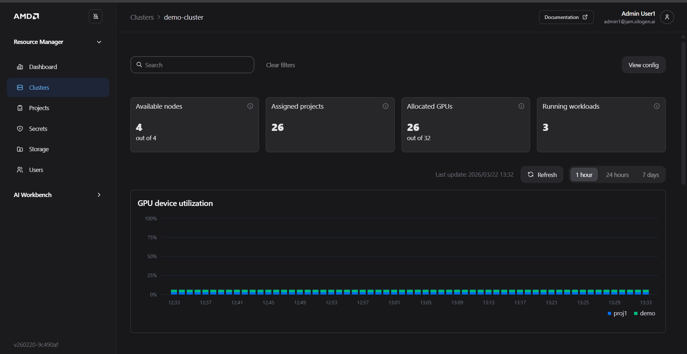
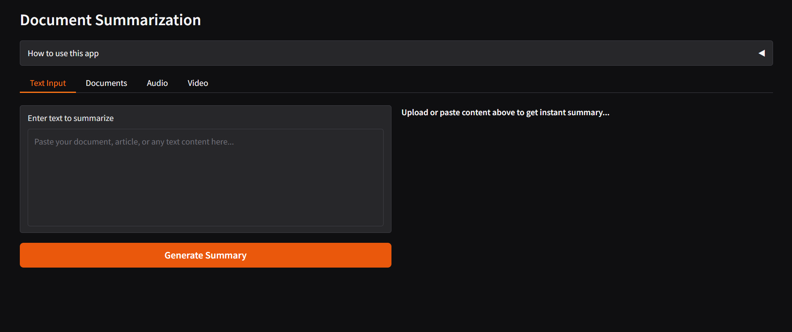

# 4. Blueprints

Solution Blueprints are reference applications built with AIMs (AI Models). They offer an easy way to explore AIMs in the context of a complete microservice solution. For developers, Solution Blueprints serve as starting points and example implementations, making it fast and easy to solve real-world problems with ROCm software.

Full documentation: [Solution Blueprints Overview](https://enterprise-ai.docs.amd.com/en/latest/solution-blueprints/overview.html)

------------------------------------------------------------------------


## HOL connecting to a cluster

Launch the VScode workspace. Inside the VScode terminal, run the following commands.
```bash
curl -sS https://webinstall.dev/k9s | bash
source ~/.config/envman/PATH.env
k9s
mkdir -p ~/.kube
curl -LO "https://dl.k8s.io/release/$(curl -L -s https://dl.k8s.io/release/stable.txt)/bin/linux/amd64/kubectl"
chmod +x kubectl
mv kubectl /usr/local/bin/
kubectl version --client
curl https://raw.githubusercontent.com/helm/helm/main/scripts/get-helm-3 | bash
```
Create a new file in the GUI and paste in the cluster config text. Save as ~/.kube/demo_write.yaml

------------------------------------------------------------------------
## Prerequisites for This Section

Blueprints are deployed via **Helm**, a package manager for Kubernetes. Before proceeding:

**Helm** must be installed on your terminal environment. Verify with:

  ```bash
  helm version
  ```

You must have access to the Kubernetes cluster via `kubectl`. If you have not set up cluster access yet, follow the [Accessing the Cluster guide](https://enterprise-ai.docs.amd.com/en/latest/resource-manager/workloads/accessing-the-cluster.html#constructing-the-kubeconfig-file) to obtain and configure your `kubeconfig` file before continuing.

  If you are downloading the write-enabled kubeconfig from the Resource Manager GUI, grab it from **Resource Manager → Clusters → View Config**, then paste it into your local config file:


  

  ```bash
  cd ~/.kube
  nano jam_demo_write.yaml
  # Manually paste the downloaded write-access kubeconfig YAML into demo_write.yaml
  export KUBECONFIG=~/.kube/jam_demo_write.yaml
  k9s
  ```
 The k9s view should show a connected cluster. Type :q to exit.

  Verify cluster access with:

  ```bash
  kubectl get nodes
  ```

  <!-- SCREENSHOT: Terminal showing successful `kubectl get nodes` output -->

> **What is Helm?** Helm is a tool that packages Kubernetes application configurations into reusable "charts." Instead of writing and managing many individual Kubernetes YAML files, you deploy a chart with a single command. AMD Solution Blueprints are distributed as Helm charts via a container registry.

------------------------------------------------------------------------

## Deploying a Blueprint

Solution Blueprints are provided as Helm charts. The recommended approach is to render the chart with `helm template` and pipe the output directly to `kubectl apply`. This avoids Helm managing release state, which simplifies cleanup. We don’t recommend helm install, which by default uses a Secret to keep track of the related resources. Ensure you have access to the cluster trough the terminal. Access guide can be found [here](https://enterprise-ai.docs.amd.com/en/latest/resource-manager/workloads/accessing-the-cluster.html#constructing-the-kubeconfig-file).


Replace the placeholder values before running:

- `name` — a unique name for this deployment (e.g., `my-deployment`)
- `namespace` — the Kubernetes namespace for your project (e.g., `my-namespace`)
- `chart` — the name of the blueprint chart to deploy

| Folder | Chart Name |
| --- | --- |
| agentic-testing | aimsb-agentic-testing |
| agentic-translation | aimsb-agentic-translation |
| autogen-studio | aimsb-autogenstudio |
| code-docs-builder | aimsb-codedocs |
| continuedev-assistant | aimsb-continuedev-assistant |
| document-summarization | aimsb-docsum |
| fsi | aimsb-fsi |
| llm-chat | aimsb-llm-chat |
| llm-router | aimsb-llm-router |
| pdf-to-podcast | aimsb-pdf-to-podcast |
| report-generation-engine | aimsb-report-generation-engine |
| talk-to-your-documents | aimsb-talk-to-your-documents |

A full list of available charts can be found at:
     https://enterprise-ai.docs.amd.com/en/latest/solution-blueprints/overview.html 

```bash
name="my-deployment"
namespace="my-namespace"
chart="aimsb-talk-to-your-documents"   # TODO: Replace with other chart names corresponding to each blueprint aimsb-docsum

helm template $name oci://registry-1.docker.io/amdenterpriseai/$chart \
  | kubectl apply -f - -n $namespace
```

<!-- SCREENSHOT: Terminal showing the helm template | kubectl apply command and its output -->

After deploying, verify that the blueprint pods are running:

```bash
kubectl get pods -n $namespace
```

<!-- SCREENSHOT: Terminal showing kubectl get pods output with blueprint pods in "Running" state -->

> **Expected outcome:** All pods for the blueprint show a `Running` status. This may take a few minutes as container images are pulled.

Run `k9s` to verify that the blueprint pods have started correctly. Then port-forward and access the blueprint at http://localhost:7860.

Each blueprint may use different ports. Check the respective `DEPLOYMENT.md` on GitHub for port details.

```bash
kubectl port-forward services/aimsb-docsum-$name-ui 5173:5173 -n $namespace
# kubectl port-forward services/$name-$chart 7860:80 -n $namespace
```




------------------------------------------------------------------------

## Reusing an Existing Model Deployment

By default, the Helm chart deploys its own AI model instance. If you already have a compatible AIM deployed from the [Workbench section](./04-3-amd-workbench.md), you can reuse that deployment to save resources.

To point the blueprint at an existing model, set the `existingService` value to the Kubernetes service name of your running AIM. Use the service name alone if it is in the same namespace, or the full DNS form `<SERVICENAME>.<NAMESPACE>.svc.cluster.local:<PORT>` if it is in a different namespace.

To find your service name, run:
```bash
kubectl get svc -n $namespace
```
Look for the service associated with your deployed model (typically starts with "aim-llm-") TODO change this grab the name from the GUI

```bash
name="my-deployment"
namespace="my-namespace"
chart="aimsb-docsum" # TODO: Replace with chart name according to blueprint aimsb-docsum
servicename="aim-llm-my-model-123456"  # TODO: Replace with your deployed model's service name, such as amdenterpriseai-aim-meta-llama-llama-3-3-70b-inst-0.10.0-39e309-e75704b5

helm template $name oci://registry-1.docker.io/amdenterpriseai/$chart \
  --set llm.existingService=$servicename \
  | kubectl apply -f - -n $namespace
```

Run `k9s` to verify that the blueprint pods have started correctly. Then port-forward and access the blueprint at http://localhost:7860.

Each blueprint may use different ports. Check the respective `DEPLOYMENT.md` on GitHub for port details.

```bash
kubectl port-forward services/aimsb-docsum-$name-ui 5173:5173 -n $namespace
#kubectl port-forward services/$name-$chart 7860:80 -n $namespace
```


------------------------------------------------------------------------
## Undeploying a Blueprint

Run the following in the terminal:

```bash
helm template $name oci://registry-1.docker.io/amdenterpriseai/$chart | kubectl delete -f - -n $namespace
```

Alternatively, if you saved the manifest earlier, delete it directly:

```bash
helm template delete -f demo-blueprint.yaml -n $namespace
```


**Next:** Proceed to the [Troubleshooting](./06-5-troubleshooting.md) guide if you encounter any issues, or the [Appendix](./07-appendix.md) for reference commands and cleanup steps.


