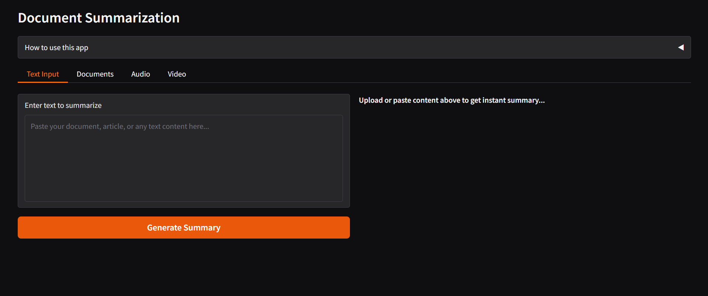

# 4. Solution Blueprints

## Why Use Solution Blueprints?

Solution Blueprints are complete, production-ready AI applications built on top of AIMs (AI Inference Microservices). Rather than starting from scratch, your development team gets a working reference implementation — with a UI, a backend, and an AI model — deployed in a single command.

**Enterprise value:**
- Reduce time-to-demo from weeks to minutes
- Evaluate real-world AI use cases without writing application code
- Use as a starting point: the Blueprints are open-source and customizable
- Compose Blueprints with your centrally managed AIMs to share model resources across applications

Full documentation: [Solution Blueprints Overview](https://enterprise-ai.docs.amd.com/en/latest/solution-blueprints/overview.html)

------------------------------------------------------------------------

## Prerequisites for This Section

Blueprints are deployed via **Helm**, a package manager for Kubernetes. Before proceeding, install the required tools in your terminal environment.

### Install Required Tools

Run the following commands in your terminal:

```bash
# Install k9s — a visual dashboard for your Kubernetes cluster
curl -sS https://webinstall.dev/k9s | bash
source ~/.config/envman/PATH.env

# Install kubectl — the command-line tool for communicating with Kubernetes
mkdir -p ~/.kube
curl -LO "https://dl.k8s.io/release/$(curl -L -s https://dl.k8s.io/release/stable.txt)/bin/linux/amd64/kubectl"
chmod +x kubectl
mv kubectl /usr/local/bin/
kubectl version --client

# Install Helm — the package manager for Kubernetes applications
curl https://raw.githubusercontent.com/helm/helm/main/scripts/get-helm-3 | bash
```

Verify all three tools are installed:

```bash
kubectl version --client
helm version
k9s version
```

> **What is Helm?** Helm packages Kubernetes application configurations into reusable "charts." Instead of writing and managing many individual Kubernetes YAML files, you deploy a chart with a single command. AMD Solution Blueprints are distributed as Helm charts via a container registry.

### Connect to the Kubernetes Cluster

You must have access to the cluster via `kubectl`. Follow the [Accessing the Cluster guide](https://enterprise-ai.docs.amd.com/en/latest/resource-manager/workloads/accessing-the-cluster.html#constructing-the-kubeconfig-file) to obtain your kubeconfig file.

If downloading the write-enabled kubeconfig from the Resource Manager GUI, go to **Resource Manager → Clusters → View Config**:


Save the kubeconfig and configure your terminal:

```bash
mkdir -p ~/.kube
nano ~/.kube/demo_write.yaml
# Paste the downloaded write-access kubeconfig YAML into this file, then save (Ctrl+O, Enter, Ctrl+X)

export KUBECONFIG=~/.kube/demo_write.yaml
```

Verify cluster access:

```bash
kubectl get nodes
```

**Expected output:** A list of cluster nodes with `Ready` status. If you see this, your terminal is connected to the cluster.

You can also run `k9s` for a visual cluster view. Press `:q` to exit.

------------------------------------------------------------------------

## Deploying a Blueprint

Solution Blueprints are provided as Helm charts stored in AMD's container registry. The recommended approach is to render the chart with `helm template` and pipe the output directly to `kubectl apply`. This avoids Helm managing release state, which simplifies cleanup.

> **We recommend `helm template | kubectl apply` over `helm install`** because `helm install` stores release state in Kubernetes Secrets, which makes cleanup more complex. The template approach gives you full visibility into what is being deployed.

### Set Your Deployment Variables

Replace the placeholder values with your own:

```bash
name="my-deployment"          # A unique name for this deployment (e.g., your username)
namespace="my-namespace"      # Your Kubernetes namespace
chart="aimsb-docsum"          # The Blueprint chart to deploy (see table below)
```

### Available Blueprints

| Folder | Chart Name | Description |
|--------|------------|-------------|
| document-summarization | `aimsb-docsum` | Summarize uploaded documents |
| talk-to-your-documents | `aimsb-talk-to-your-documents` | Q&A chatbot over your documents |
| llm-chat | `aimsb-llm-chat` | Simple LLM chat interface |
| agentic-translation | `aimsb-agentic-translation` | Multi-language translation |
| pdf-to-podcast | `aimsb-pdf-to-podcast` | Convert PDFs to audio |
| code-docs-builder | `aimsb-codedocs` | Generate code documentation |
| report-generation-engine | `aimsb-report-generation-engine` | Automated report creation |
| llm-router | `aimsb-llm-router` | Route queries to optimal models |
| agentic-testing | `aimsb-agentic-testing` | AI-powered test generation |
| autogen-studio | `aimsb-autogenstudio` | Multi-agent workflow builder |
| continuedev-assistant | `aimsb-continuedev-assistant` | In-IDE AI coding assistant |
| fsi | `aimsb-fsi` | Financial services AI application |

A full list is available at: https://enterprise-ai.docs.amd.com/en/latest/solution-blueprints/overview.html

### Deploy the Blueprint

```bash
helm template $name oci://registry-1.docker.io/amdenterpriseai/$chart \
  | kubectl apply -f - -n $namespace
```

> **What is this doing?** `helm template` downloads the Blueprint package and generates Kubernetes configuration files. `kubectl apply` sends those configurations to the cluster to create all the necessary services, deployments, and containers.

### Verify the Deployment

Check pod status:

```bash
kubectl get pods -n $namespace
```

Pods may initially show `ContainerCreating` or `Pending` while images are pulled — this is normal. Wait 2–3 minutes and run the command again. All Blueprint pods should reach `Running` status.

> **Expected outcome:** All pods for the Blueprint show a `Running` status. Use `k9s` for a live view.

### Access the Blueprint UI

Once pods are running, open a port-forward to access the UI in your browser:

```bash
# For Document Summarization (aimsb-docsum):
kubectl port-forward services/aimsb-docsum-$name-ui 5173:5173 -n $namespace
```

Open your browser to **http://localhost:5173**.

Each Blueprint may use different ports. Check the respective `DEPLOYMENT.md` on GitHub for port details.



------------------------------------------------------------------------

## Reusing an Existing Model Deployment

By default, a Blueprint deploys its own AI model instance. If you already have a compatible AIM deployed — either from the [Workbench](./04-3-amd-workbench.md) or via the AIM Engine — you can point the Blueprint at that existing model. This avoids running duplicate model instances and is the recommended approach for shared environments.

**Why this matters for enterprise teams:** Multiple applications can share a single model deployment, reducing GPU resource consumption and simplifying model lifecycle management. When the centrally managed model is updated, all applications using it benefit automatically.

### Find Your Deployed Model's Service Name

```bash
kubectl get svc -n $namespace
```

Look for the service associated with your deployed model — typically starting with `aim-llm-`. Copy the full service name.

For a model in a **different namespace**, use the full DNS form:

```
<SERVICENAME>.<NAMESPACE>.svc.cluster.local:<PORT>
```

### Deploy the Blueprint with an Existing Model

```bash
name="my-deployment"
namespace="my-namespace"
chart="aimsb-docsum"
servicename="aim-llm-my-model-123456"   # Replace with your deployed model's service name

helm template $name oci://registry-1.docker.io/amdenterpriseai/$chart \
  --set llm.existingService=$servicename \
  | kubectl apply -f - -n $namespace
```

Verify pods are running, then port-forward and access the Blueprint as before:

```bash
kubectl port-forward services/aimsb-docsum-$name-ui 5173:5173 -n $namespace
```

------------------------------------------------------------------------

## Undeploying a Blueprint

To remove a Blueprint and free cluster resources:

```bash
helm template "$name" "oci://registry-1.docker.io/amdenterpriseai/$chart" \
  | kubectl delete -n "$namespace" -f -
```

If you saved the rendered manifest to a file earlier, you can also delete using that file:

```bash
kubectl delete -f demo-blueprint.yaml -n $namespace
```

------------------------------------------------------------------------

## HOL: Connecting to a Cluster (Pre-Req Steps for TechJam HOL)

Open a terminal on your Linux laptop and run the following commands:

```bash
curl -sS https://webinstall.dev/k9s | bash
source ~/.config/envman/PATH.env
k9s    # Verify k9s is installed — press :q to exit

mkdir -p ~/.kube
curl -LO "https://dl.k8s.io/release/$(curl -L -s https://dl.k8s.io/release/stable.txt)/bin/linux/amd64/kubectl"
chmod +x kubectl
mv kubectl /usr/local/bin/
kubectl version --client

curl https://raw.githubusercontent.com/helm/helm/main/scripts/get-helm-3 | bash
```

Create a new file and paste in the cluster config text provided by your facilitator. Save it as `~/.kube/demo_write.yaml`. Then:

```bash
export KUBECONFIG=~/.kube/demo_write.yaml
kubectl get nodes
```

------------------------------------------------------------------------

**Next:** Proceed to the [Troubleshooting](./06-5-troubleshooting.md) guide if you encounter any issues, or the [Appendix](./07-appendix.md) for reference commands and cleanup steps.
