# Taiwan ODM Workshop
### AMD Enterprise AI Software Stack — Hands On Labs (45 Minutes)

**Audience:** Enterprise IT administrators, platform engineers, and team leads evaluating the AMD AI platform  
**Prerequisites:** A browser, the workshop credentials provided by your facilitator  
**Time:** 45 minutes total  
**No local terminal required** — browser-based commands run inside the in-cluster VSCode workspace

## Workshop Access

Use the following workshop portals and your assigned participant number:

| Portal | URL |
|---|---|
| **AMD AI Workbench** | [https://aiwbui.amd-workshop.silogen.ai/](https://aiwbui.amd-workshop.silogen.ai/) |
| **AMD Resource Manager** | [https://airmui.amd-workshop.silogen.ai/](https://airmui.amd-workshop.silogen.ai/) |

- **Username:** `userN@amd-workshop.silogen.ai` — replace `N` with your assigned number (for example, `user1@amd-workshop.silogen.ai`)
- **Password:** Use the password provided by the workshop facilitator
- **Project:** Select the project assigned to your participant number, or the project specified by the facilitator

---

## System Setup: Preparing Your Laptop

This workshop runs entirely in the browser — no local commands are required. All benchmarking in Part 2 is done inside an in-cluster VSCode workspace (which is Linux-based), so your laptop's operating system does not affect any workshop commands.

---

## What You Will Learn Today

This workshop takes you deep into the administrative and operational capabilities of the AMD Enterprise AI Software Stack through its two main management interfaces.

You will:
1. **Kubernetes Concepts - Slides**
2. **Deploy and manage the GPT-OSS-20B AIM** through AMD AI Workbench — observe live inference metrics, configure autoscaling, and chat with the running model
3. **Benchmark a deployed model in VSCode** — measure throughput, latency, and time to first token with `vllm bench serve`
4. **Explore AMD Resource Manager** — view the admin control plane for projects, quotas, secrets, and storage

No Kubernetes or ML engineering experience required. The guided terminal commands run inside VSCode in your browser.

---

## Platform Overview

| Component | What It Does | Who Uses It |
|---|---|---|
| **AMD AI Workbench** | Self-service UI for deploying models and running development workspaces | Data scientists, developers, and engineers |
| **AIMs** (AI Inference Microservices) | Pre-packaged AMD-optimized model servers | Deployed and managed through both UIs |
| **Workspaces** | JupyterLab, VSCode, or ComfyUI environments that run inside the cluster | End users running experiments or tools |
| **AMD Resource Manager** | Admin UI for clusters, projects, quotas, users, secrets, and storage | IT admins and platform operators |

---

# Part 1: AMD AI Workbench — Model Deployment and Autoscaling (20 minutes)

## Why Workbench?

**AMD AI Workbench** is the self-service portal for AI practitioners — data scientists, developers, and engineers who need to deploy models, run experiments, and collaborate on AI workloads without needing Kubernetes or infrastructure expertise.

---

## Step 1A: Log In to Workbench and Select Your Project

Open a browser and navigate to AMD AI Workbench:

- [https://aiwbui.amd-workshop.silogen.ai/](https://aiwbui.amd-workshop.silogen.ai/)


Sign in as `userN@amd-workshop.silogen.ai`, replacing `N` with your assigned participant number. Use the password provided by the facilitator. After login, confirm you are in the correct project by checking the project name in the top navigation bar.

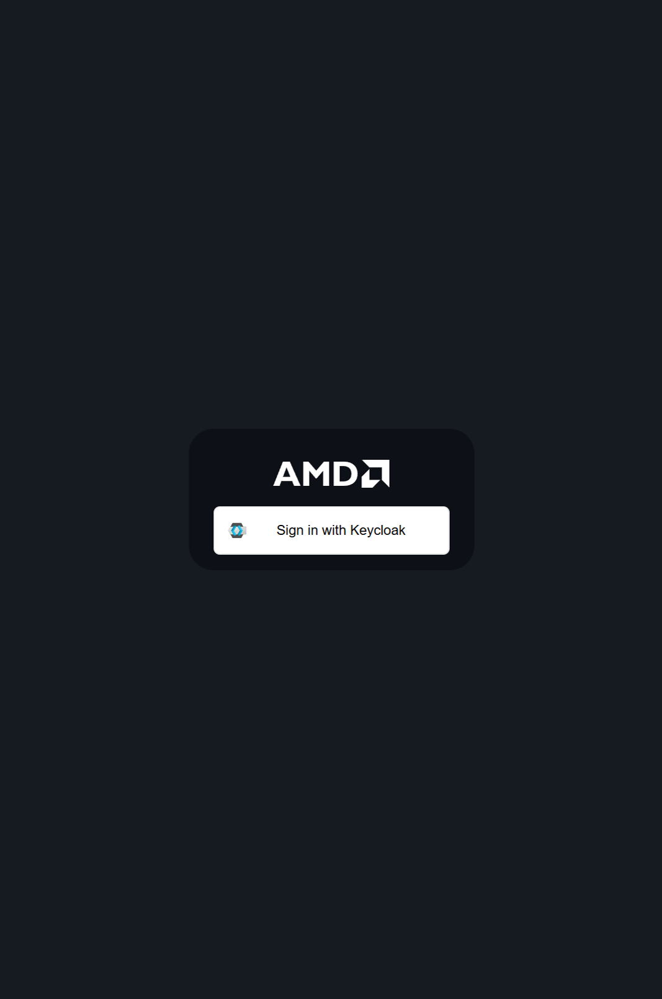

Then select your project from the dropdown

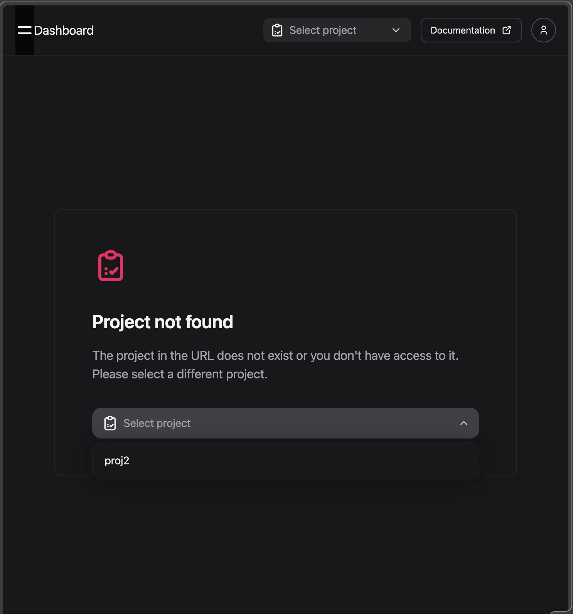

---

## Step 1B: Deploy an AI Model

### Browse the Model Catalog

Click **Models** in the left sidebar. You will see a catalog of available AIMs — AMD-packaged model servers for a range of model families.

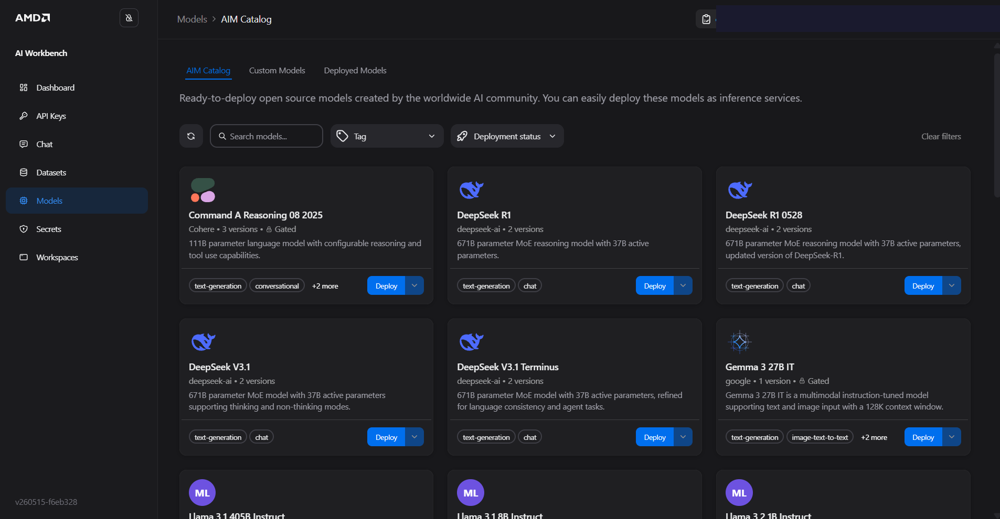

Each card shows the model name, size, and family. AMD has pre-configured the serving stack, hardware tuning, and memory layout for each — you do not configure any of this manually.

### Deploy Your Model

1. Find **GPT-OSS-20B** in the model catalog. This is the AIM used throughout this workshop.
2. Click the **three-dot menu (⋮)** on the model card
3. Select **Deploy**

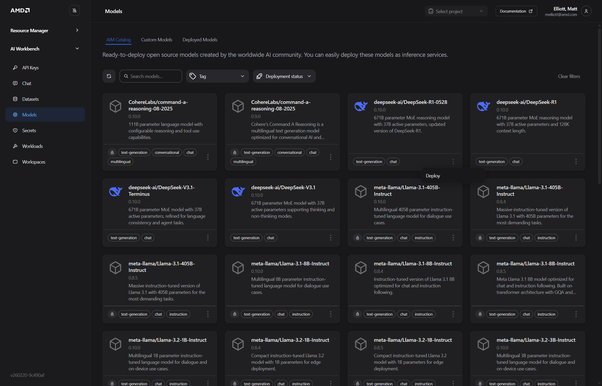

> **Note:** You may see fewer models than shown here. Administrators control which models are available to each user, so your menu will only display the models you have been granted access to.

### Configure the Deployment

In the deployment panel:


- **Performance metric** — Select **Latency** for this workshop

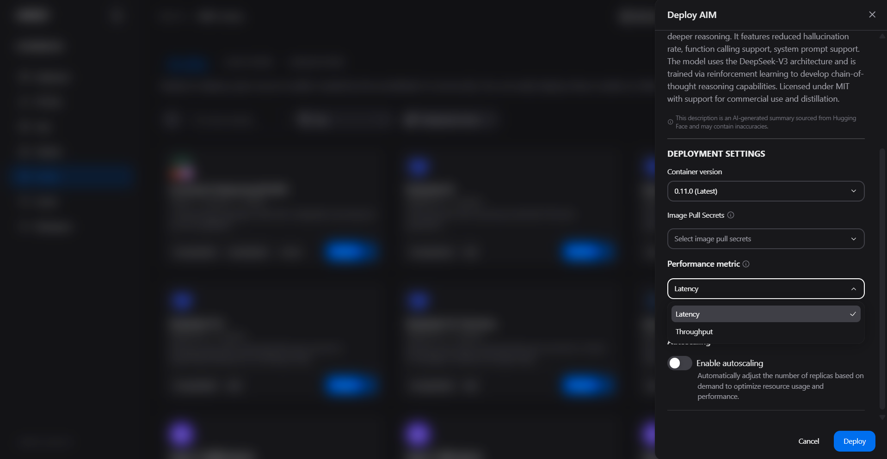

> **Why GPT-OSS instead of Llama for this lab?** Llama model repositories are gated. Before deploying a Llama AIM, a user must accept the model's access terms on Hugging Face and provide an authorized Hugging Face token, normally through a pre-configured project secret. GPT-OSS-20B avoids that gated-model prerequisite for this workshop. Do not select a Llama AIM unless the facilitator confirms that access and the token are ready.

> **Autoscaling** — **Leave disabled** (do not enable autoscaling for this deployment — the workshop environment has limited GPU quota and enabling autoscaling may cause your deployment to stall in a pending state)

Click **Deploy**.

---

## Step 1C: Monitor Your Model — Live Inference Metrics

### Watch the Deployment Start

Click **Dashboard** in the left sidebar. Your model will show **Pending** or **Starting** while the platform schedules it on a GPU node and initializes the serving process. This typically takes 3–5 minutes.

> **What is happening under the hood?** The platform is creating a Kubernetes pod on an AMD GPU node, pulling the AIM container image, and starting the vLLM serving process. GPU memory allocation and model weight loading happen during this initialization window.

Wait for the status to change to **Running**.

### Explore Live Metrics

Once the model is running, click the **three-dot menu** on the right side of the model row and select **Open Details** to view the real-time metrics dashboard:

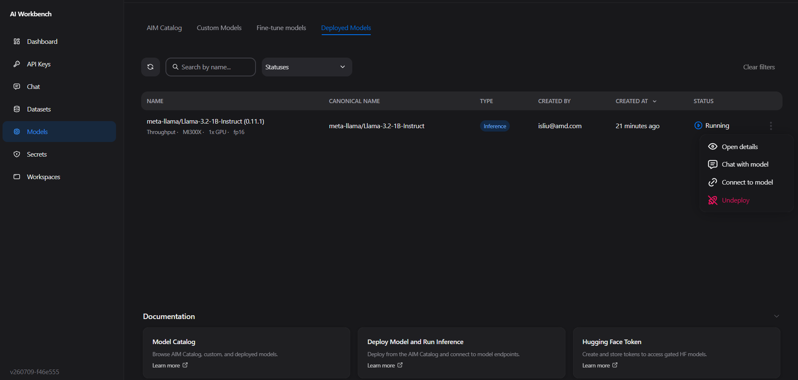

| SLA Metric | What It Tells You |
|---|---|
| **Inference Requests** | Current inference load on the model |
| **Time to First Token (TTFT)** | Latency from request submission to first token generated |
| **Throughput (tokens/sec)** | Total generation rate across all concurrent requests |
| **End-to-end latency** | Total time from request submission to the complete response being generated |
| **GPU Utilization** | Hardware utilization — helps right-size the deployment |

> **Why do Metrics matter?** Enterprise applications commit to response time guarantees. For example, a customer-facing AI assistant might require TTFT < 500ms.

### Chat with Your Model

From the model details page, click **Chat**. Ask a question and observe:
- The response latency (TTFT)
- The quality of the response
- How the metrics dashboard updates in real time as you generate traffic

---

## Step 1D: Configure Autoscaling 

> **Important — GPU capacity limit:** For this workshop, please do not configure autoscaling since each participant project has a limited GPU quota shared across the lab environment. If you would like to try it in the developer zone, set **Max replicas to 1**. If you set a higher max, the autoscaler may attempt to schedule additional replicas that exceed your quota — the workload will hang in a pending state and never run. Keep it at 1 to ensure your deployment starts successfully.

Autoscaling automatically adjusts the number of running model replicas based on real-time demand — scaling up during traffic spikes and back down during low usage, so you only consume GPU resources when you need them.


> **Important:** Autoscaling must be enabled **at deployment time** — you cannot enable it on an existing deployment. If it was enabled at deploy time, you can update its parameters later via **Settings** on the workload detail page.

### Enable Autoscaling at Deploy Time

When deploying a model (Step 1B), locate the **Autoscaling** section in the deployment drawer and toggle **Enable autoscaling** on:

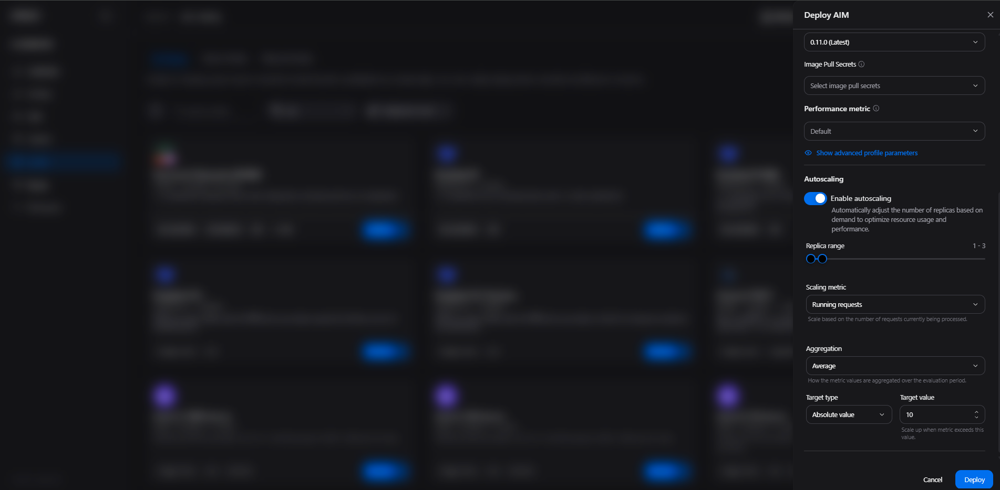

Configure the following parameters:

| Parameter | Recommended Value | What It Does |
|---|---|---|
| **Min replicas** | 1 | Minimum replicas always running — ensures baseline capacity even at zero traffic |
| **Max replicas** | **1** | Upper bound — prevents runaway resource use; constrained by your project's GPU quota |
| **Scaling metric** | Running requests (default) | The vLLM signal used to drive scaling decisions |
| **Aggregation** | Average (default) | How metric values are combined across all running pods |
| **Target type** | Absolute value (default) | How the target threshold is interpreted |
| **Target value** | 10 (default) | Scale up when total running requests across all pods exceed this number |

> **Important — GPU capacity limit:** For this workshop, set **Max replicas to 1**. Each participant project has a limited GPU quota shared across the lab environment. If you set a higher max, the autoscaler may attempt to schedule additional replicas that exceed your quota — the workload will hang in a pending state and never run. Keep it at 1 to ensure your deployment starts successfully.

### How It Works

- The platform evaluates the scaling metric every **30 seconds**
- **Scale-up:** When demand exceeds your target threshold, additional replicas are added (up to your configured maximum)
- **Scale-down:** When demand drops below the threshold and stays low through a **5-minute cooling period**, replicas are removed (down to your configured minimum) — the cooldown prevents flapping

### Scaling Metric Options

| Metric | When to Use |
|---|---|
| **Running requests** (default) | Stable, reactive scaling based on active load — good for most workloads |
| **Waiting requests** | Proactive scaling that reacts before latency degrades — triggers on queue buildup before response times increase |

> **How autoscaling interacts with quotas:** Autoscaling scales within your project's GPU quota. If your quota allows 4 GPUs and each replica uses 1, autoscaling can create up to 4 replicas. When autoscaling borrows resources beyond a project's guaranteed quota, those pods may be preempted if other projects reclaim their allocation.

You can generate controlled request load later using the `vllm bench serve` test in Part 2 and compare the results with the live metrics in the Workloads tab.

---

# Part 2: Benchmarking with vLLM Bench Serve in VSCode (15 minutes)

The AMD AI Workbench includes browser-based development workspaces connected to the cluster. You will use its VSCode workspace to benchmark the GPT-OSS-20B AIM deployed in Part 1 without installing tools on your laptop.

## Why Benchmark?

Deploying a model is only the first step. Before committing to a production configuration, you need to understand how the model performs under realistic load:

- What is the maximum throughput?
- Does latency stay within SLO at 10 concurrent users? 50? 100?
- At what concurrency does latency degrade or throughput stop increasing?

The `vllm bench serve` tool measures real-world model performance — throughput, latency, and time to first token — under realistic load. Use this to validate model performance before production use.

---

## Step 2A: Find Your GPT-OSS Model's Internal Endpoint

You need the cluster-internal service URL for the model you deployed in Part 1.

In AMD AI Workbench:
1. Click **Models** and open the running **GPT-OSS-20B** deployment
2. Click **Connect** on the model details page
3. Copy the **Internal URL** — it looks like `http://aim-llm-<model-name>-<id>.<namespace>.svc.cluster.local`
4. Copy the **Model name or model ID** shown in the connection details. Use that exact value in the benchmark.

Keep this URL — you will use it in the next step.

---

## Step 2B: Launch a VSCode Workspace

Click **Workspaces** in the left sidebar, then click on the VSCode workspace card (or **Create Workspace** → VSCode).

In the workspace configuration panel:

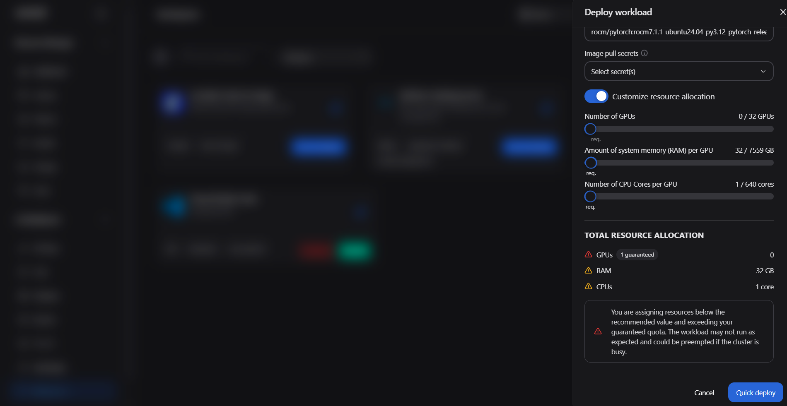

- **Name** — e.g., `bench-workspace`
- **CPU/Memory** — leave defaults for the workshop
- **GPU** — set to `0` for the benchmarking workspace (the benchmark sends HTTP requests; it does not need a GPU itself)
- **Storage** — the workspace comes with a persistent home directory

Click **Create**. The workspace status will show **Starting** — typically 1–2 minutes.

Once **Running**, click **Open** to launch VSCode in your browser.

> **What makes this different from a local VSCode?** The workspace runs inside the same Kubernetes cluster as your models. You can reach model services directly by their internal cluster hostname — no port-forwarding or VPN required. Your work is also persistent: files saved in the workspace home directory survive workspace restarts.

---

## Step 2C: Run the Benchmark

In VSCode, open a terminal: **Terminal → New Terminal** (or `` Ctrl+` ``), then prepare the benchmarking tool:

```bash
python --version
python -m venv venv
source venv/bin/activate
python -m pip install --upgrade pip
pip install vllm requests
```

> **Expected result:** The virtual environment activates and both packages install without errors. If `python -m venv` reports that `venv` or `ensurepip` is unavailable, stop and ask the facilitator to use a workspace image with Python virtual-environment support. Do not install operating-system packages or use `sudo` inside the managed workspace unless the facilitator explicitly authorizes it.

Set the exact GPT-OSS values copied in Step 2A, then use `requests` to confirm that the endpoint is reachable and that it reports the expected model ID:

```bash
export BASE_URL="<your-gpt-oss-internal-url>"
export MODEL="<your-gpt-oss-model-id>"

python - <<'PY'
import os
import requests

base_url = os.environ["BASE_URL"].rstrip("/")
expected_model = os.environ["MODEL"]
response = requests.get(f"{base_url}/v1/models", timeout=30)
response.raise_for_status()
model_ids = [item.get("id") for item in response.json().get("data", [])]
print("Endpoint check: OK")
print("Available model IDs:", model_ids)
if expected_model not in model_ids:
    raise SystemExit(
        f"MODEL={expected_model!r} was not returned by /v1/models. "
        "Copy the exact served model ID and try again."
    )
print("Model ID check: OK")
PY
```

Expected output includes `Endpoint check: OK` and `Model ID check: OK`. Resolve any connection or model-ID error before running the benchmark.

Create `bench_serve.sh` with the benchmark procedure used in the Workbench guide. It reuses the exported `BASE_URL` and `MODEL` values:

```bash
cat > bench_serve.sh <<'EOF'
NUM_PROMPTS=20
CONC=10
INPUT_LEN=1024
OUTPUT_LEN=1024
ENDPOINT="/v1/chat/completions"

: "${BASE_URL:?Set and export BASE_URL before running this script}"
: "${MODEL:?Set and export MODEL before running this script}"

vllm bench serve \
  --ignore-eos \
  --backend openai-chat \
  --base-url "${BASE_URL}" \
  --endpoint "${ENDPOINT}" \
  --model "${MODEL}" \
  --dataset-name random \
  --random-input-len ${INPUT_LEN} \
  --random-output-len ${OUTPUT_LEN} \
  --num-prompts ${NUM_PROMPTS} \
  --max-concurrency ${CONC} \
  --trust-remote-code
EOF

chmod +x bench_serve.sh
./bench_serve.sh
```

> **What do these parameters mean?**
> - `NUM_PROMPTS` controls the total requests sent
> - `CONC` caps simultaneous requests; reduce it if the shared workshop environment is busy
> - `INPUT_LEN` and `OUTPUT_LEN` set the synthetic prompt and response token lengths
> - `MODEL` must match the model ID served by your GPT-OSS endpoint


---

## Step 2D: Interpret the Benchmark Output

The benchmark prints measured results from your deployment. Do not compare runs unless the model, prompt lengths, output lengths, request count, concurrency, and serving configuration are the same.

| Metric | Meaning | What to Look For |
|---|---|---|
| **Throughput** | Total tokens processed per second across all requests | Higher is better for batch workloads |
| **TTFT** | Time to First Token — how quickly the model starts responding | Lower is better for interactive use; compare P99 with your SLO |
| **Latency** | End-to-end time per request | Lower is better; compare equivalent workload settings |
| **Tokens/sec** | Per-request token generation rate | Higher means faster completions per user |

> **Exercise:** Change `NUM_PROMPTS` and `CONC`, re-run the benchmark, and compare throughput and TTFT. Use the Workbench metrics page to correlate client-observed results with the live service metrics.

## Cleanup: Undeploy GPT-OSS-20B

After completing the benchmark, undeploy GPT-OSS-20B to release its GPU allocation:

1. In the Workbench left sidebar, click **Models**
2. Select the **Deployed Models** tab
3. Find your GPT-OSS-20B deployment and click the **⋮** (three-dot menu)
4. Click **Undeploy** (shown in red)

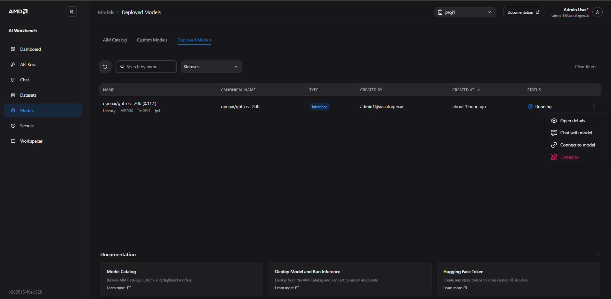

> **Note:** Undeploying stops the model and releases the GPU allocation back to your project quota. Any running inference requests will be terminated.

---

# Part 3: AMD Resource Manager — Platform Administration (10 minutes)

## Why Resource Manager?

In enterprise environments, AI infrastructure is shared. Multiple teams — data science, engineering, product — all want access to GPUs. Without governance, one team can accidentally consume all cluster resources, leaving others blocked.

**AMD Resource Manager** is the administrative control plane. It lets IT administrators:
- Create isolated **projects** for each team or use case
- Set **resource quotas** (GPU hours, memory, storage) per project
- Manage **user access** and assign roles
- Store and distribute **secrets** (API keys, model tokens) securely
- Attach **persistent storage** for datasets and model artifacts

In this section you will tour the user workflow. Your instructor will also demo the administrator workflow

---

## Step 3A: Log In to Resource Manager

Open a browser and navigate to AMD Resource Manager:

- [https://airmui.amd-workshop.silogen.ai/](https://airmui.amd-workshop.silogen.ai/)

Sign in as `userN@amd-workshop.silogen.ai`, replacing `N` with your assigned participant number. Use the password provided by the facilitator.

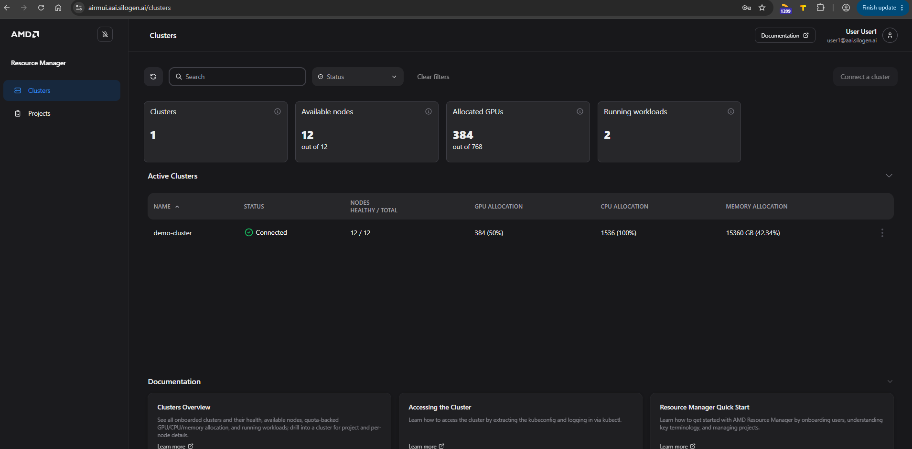

The dashboard has two sections:

**Clusters and Nodes** — summary cards showing the number of clusters, GPU nodes, available GPUs, and allocated GPUs across the cluster.

**Allocations and Workloads** — a **Consumption by project** table listing each project's GPU allocation, GPU utilization, running workloads, and pending workloads. Summary cards on the right show total GPU Utilization, Running Workloads, and Pending Workloads across all projects.

---

## Step 3B: Explore the Projects Page

Projects are the primary isolation boundary. Each team or use case gets its own project with its own quota, users, secrets, and storage.

Click **Projects** in the left sidebar to see all projects in the cluster.

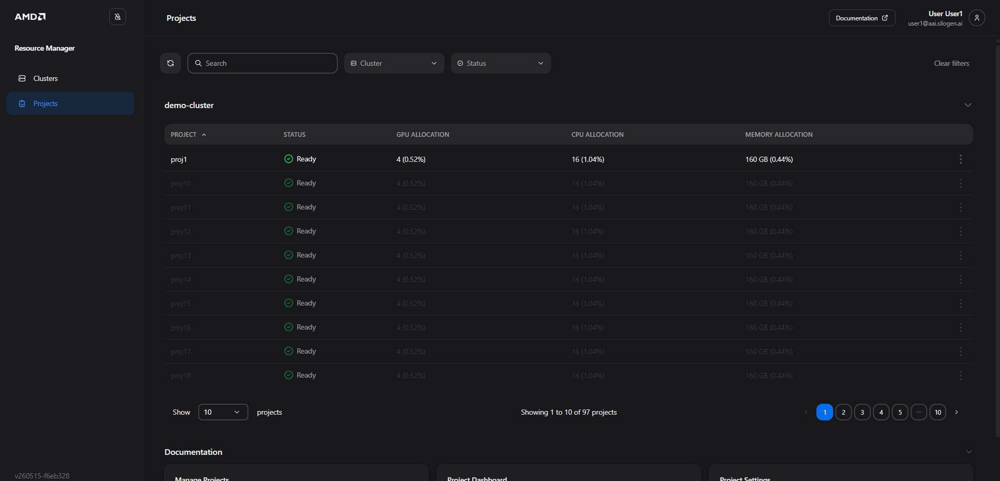

The projects list shows every project provisioned on the cluster, with a summary of its resource allocation:

| Column | What It Shows |
|---|---|
| **Project** | The project name — typically named by team, use case, or workshop participant |
| **Status** | Whether the project is **Ready** (fully provisioned and accepting workloads) |
| **GPU Allocation** | Number of GPUs allocated to the project and what share of total cluster GPU capacity that represents |
| **CPU Allocation** | CPU cores allocated, shown as a count and cluster percentage |
| **Memory Allocation** | RAM allocated, shown in GB and cluster percentage |

> **Admin demo only — Creating projects:** Your account has read access to the Projects page. Creating and managing projects is an administrator function. Your facilitator will now demonstrate how to create a new project, set its name and description, and assign it a resource quota.

---

## Step 3C: Explore Your Project

Double-click your assigned project in the list to open its detail view.

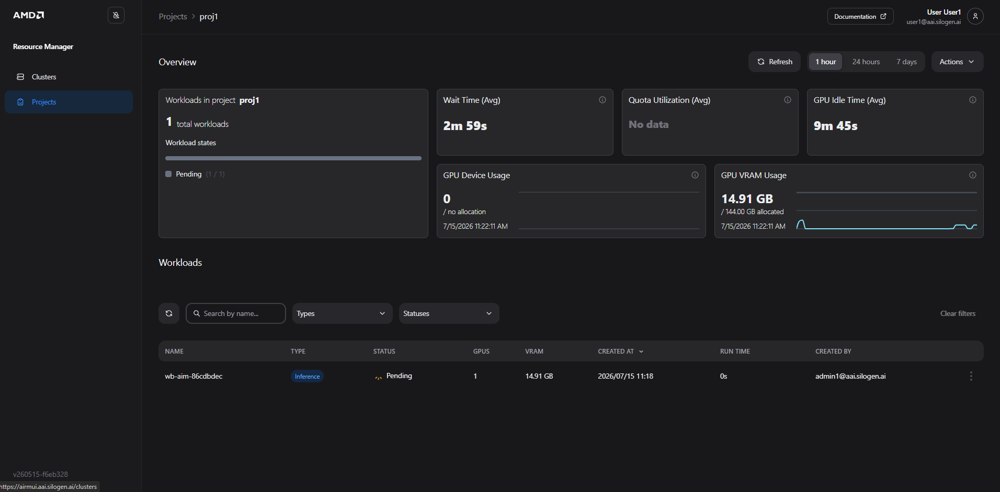

The project overview shows live resource consumption at a glance:

| Panel | What It Shows |
|---|---|
| **Workloads in project** | Total workload count and their current states (Running, Pending, etc.) |
| **Wait Time (Avg)** | How long workloads have been waiting for GPU resources to become available |
| **Quota Utilization (Avg)** | How much of the project's guaranteed quota is currently in use |
| **GPU Idle Time (Avg)** | Time GPUs have been allocated but not actively computing — useful for identifying waste |
| **GPU Device Usage** | Current number of GPUs in active use |
| **GPU VRAM Usage** | Memory consumed across allocated GPUs, shown against the project's total allocation |

The **Workloads** table at the bottom lists every running or queued job in the project — name, type, status, GPU count, VRAM, creation time, run duration, and the user who submitted it.

---

## Step 3D: View Resource Quotas

To view quota settings, click the **Actions** button in the top-right corner of the project page.

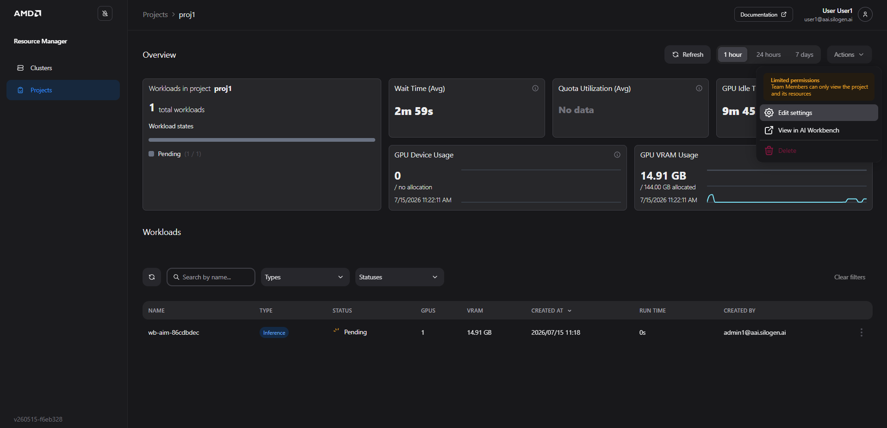

> **Note — Limited permissions:** As a team member, you will see the tooltip *"Team Members can only view the project and its resources."* The **Edit settings** and **Delete** options are visible but restricted. Select **Edit settings** to open the Project settings in read-only mode.

In the **Project settings** panel, click the **Quota** tab.

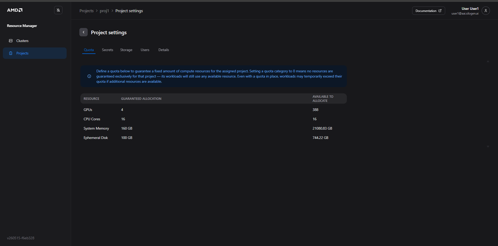

The quota table shows two values for each resource:

| Column | What It Means |
|---|---|
| **Guaranteed Allocation** | Resources reserved exclusively for this project — always available, even when the cluster is busy |
| **Available to Allocate** | Slack capacity across the cluster that this project could temporarily use if demand spikes |

> **Understanding quota enforcement:** The platform supports *quota bursting* — a project can temporarily use slack cluster capacity beyond its guaranteed allocation when additional resources are available. However, **when the cluster is under contention, no project can exceed its guaranteed quota and displace another team's workloads.** The guaranteed allocation is both the floor your team is assured and the enforced ceiling under contention.

> **Note:** The Project settings panel also includes **Secrets**, **Storage**, **Users**, and **Details** tabs. As a team member, you can view the contents of these tabs but cannot make changes.

### Admin demo — Configuring Quotas and Managing Secrets

The steps below are performed by a **cluster administrator**. Your account does not have permission to complete them, but please follow along as your facilitator demonstrates.

**Quota configuration (admin only)**

Administrators set the guaranteed resource allocation for each project from the same **Quota** tab you just viewed. They can adjust GPU, CPU, memory, and disk limits at any time — changes take effect immediately and apply to all subsequent workloads in the project.

**Secrets (admin only)**

Secrets let administrators distribute credentials — such as a Hugging Face API token for gated models — to all workloads in a project without users ever handling the raw token value.

From the **Secrets** tab, an admin clicks **Add** → **Hugging Face Token**:

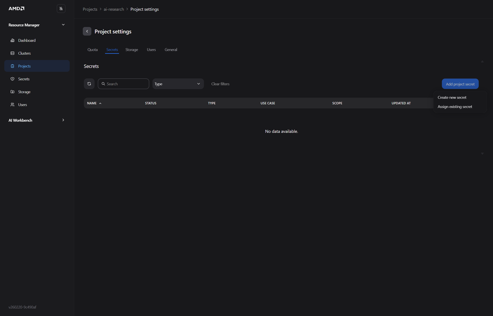

In the dialog, the admin provides a name and pastes the token:

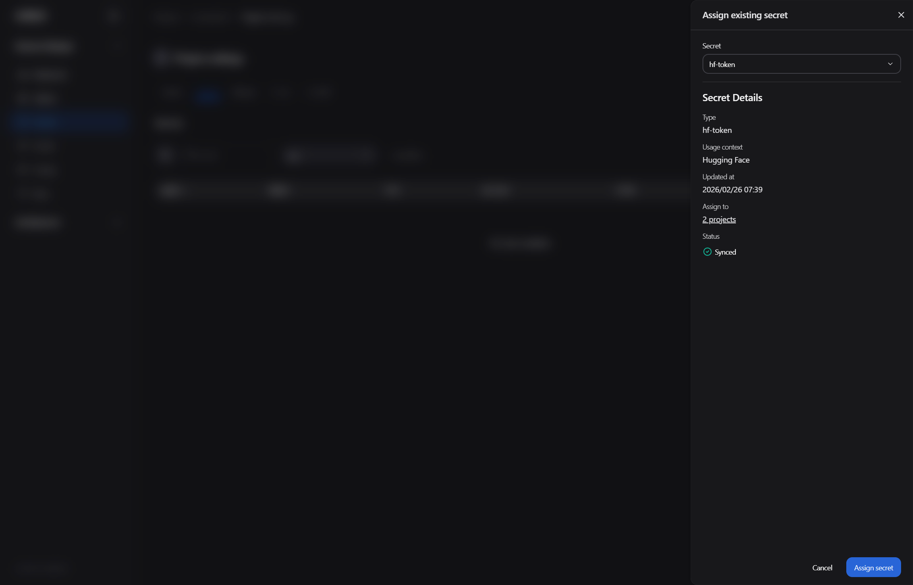

Once saved, the token value is never shown again in the UI. The secret appears in Workbench's deployment panel whenever a gated model requires authentication — users can use the secret without ever seeing its value.


For teams that need access to shared dataset or model artifact storage, admins can also assign object storage credentials under **Add** → **MinIO / S3 Compatible**. If the credentials already exist at the cluster level, the admin assigns them to the project from a list rather than re-entering the values:


The resulting secret is mounted as environment variables into authorized workspaces and model deployments — workloads access the bucket automatically without users handling raw credentials.


---

## Workshop Complete

You have now experienced the full administrative and operational lifecycle of the AMD Enterprise AI Software Stack:

| What You Did | What It Demonstrates |
|---|---|
| Deployed an AI model and observed live metrics | Production visibility from the first deployment |
| Reviewed autoscaling controls and quota limits | Dynamic resource efficiency under variable load |
| Benchmarked GPT-OSS-20B from a VSCode workspace | Quantified throughput and latency before production commitment |
| Toured Resource Manager — projects, quotas, and secrets | IT governance and multi-team resource control |

**Next steps:**
- Explore additional workspace types (JupyterLab, ComfyUI) for different team workflows
- Ask your facilitator about bringing the AMD AI platform to your organization
- Review the [AMD Enterprise AI documentation](https://enterprise-ai.docs.amd.com) for architecture guides and API references
