# Advancing AI Day Workshop
### AMD Enterprise AI Software Stack — Hands On Labs (45 Minutes)

**Audience:** Enterprise IT administrators, platform engineers, and team leads evaluating the AMD AI platform  
**Prerequisites:** A browser, the workshop credentials provided by your facilitator  
**Time:** 45 minutes total  
**No terminal required** — this workshop is entirely GUI-driven

---

## System Setup: Preparing Your Laptop

This workshop runs entirely in the browser — no local commands are required. All benchmarking in Part 3 is done inside an in-cluster VSCode workspace (which is Linux-based), so your laptop's operating system does not affect any workshop commands.

That said, if your facilitator asks you to run any setup steps locally (e.g., copying a kubeconfig), use a proper shell for your OS:

### 🐧 Linux
No setup required. Your default terminal is ready.

### 🪟 Windows — Use WSL (Windows Subsystem for Linux)
Use **WSL** rather than PowerShell or Command Prompt for any local shell work.

1. Open **PowerShell as Administrator**
2. Run: `wsl --install`
3. Restart your machine when prompted
4. After restart, open **WSL** (search "Ubuntu" or "WSL" in the Start menu) and complete the Ubuntu first-run setup (create a username and password)

### 🍎 macOS
Open **Terminal** (Applications → Utilities → Terminal). No additional tools are needed for this workshop.

---

## What You Will Learn Today

This workshop takes you deep into the administrative and operational capabilities of the AMD Enterprise AI Software Stack through its two main management interfaces.

You will:
1. **Deploy and manage AI models** through AMD AI Workbench — observe live inference metrics, configure autoscaling, and chat with a running model
2. **Fine-tune a model on your own data** — upload a training dataset and start a supervised fine-tuning job through the Workbench UI
3. **(Bonus)** Tour the ComfyUI workspace for AI image generation
4. **(Optional)** **Benchmark your model** with `vllm bench serve` — launch a VSCode workspace inside the platform and run a load test against your deployed model
5. **Explore AMD Resource Manager** — view the admin control plane for projects, quotas, secrets, and storage

No Kubernetes, terminal, or ML engineering experience required.

---

## Platform Overview

| Component | What It Does | Who Uses It |
|---|---|---|
| **AMD AI Workbench** | Self-service UI for deploying models, running workspaces, and fine-tuning | Data scientists, developers, and engineers |
| **AIMs** (AI Inference Microservices) | Pre-packaged AMD-optimized model servers | Deployed and managed through both UIs |
| **Workspaces** | JupyterLab, VSCode, or ComfyUI environments that run inside the cluster | End users running experiments or tools |
| **AMD Resource Manager** | Admin UI for clusters, projects, quotas, users, secrets, and storage | IT admins and platform operators |

---

# Part 1: AMD AI Workbench — Model Deployment and Autoscaling (20 minutes)

## Why Workbench?

**AMD AI Workbench** is the self-service portal for AI practitioners — data scientists, developers, and engineers who need to deploy models, run experiments, and collaborate on AI workloads without needing Kubernetes or infrastructure expertise.

---

## Step 1A: Log In to Workbench and Select Your Project

Open a browser and navigate to the AI Workbench URL:

- Format: `https://aiwbui.<your-domain>` or the IP-based URL on your workshop sheet
 <!-- TODO update url This comment will not appear in the rendered Markdown -->


Use the **user credentials** your facilitator provided. After login, confirm you are in the correct project by checking the project name in the top navigation bar.

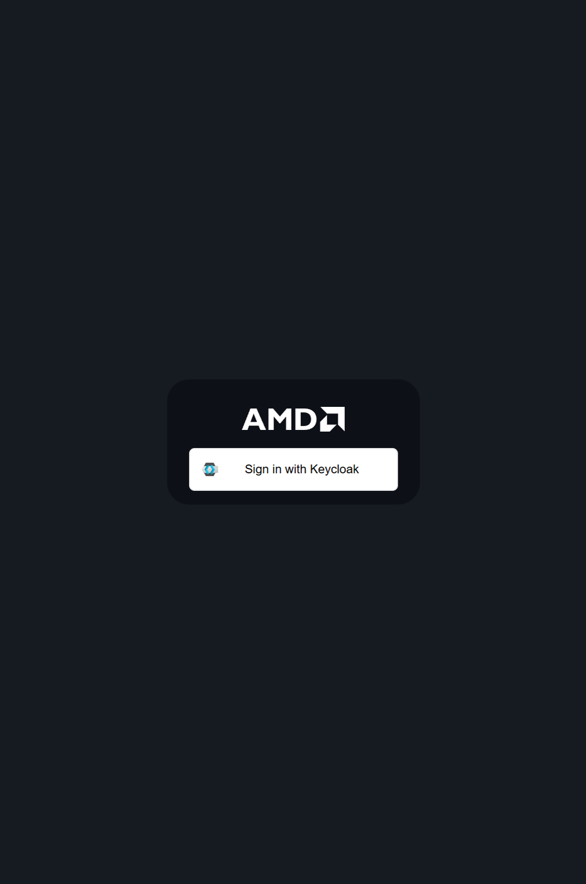

---

## Step 1B: Deploy an AI Model

### Browse the Model Catalog

Click **Models** in the left sidebar. You will see a catalog of available AIMs — AMD-packaged model servers for a wide range of model families (Llama, Mistral, Gemma, Deepseek and more).

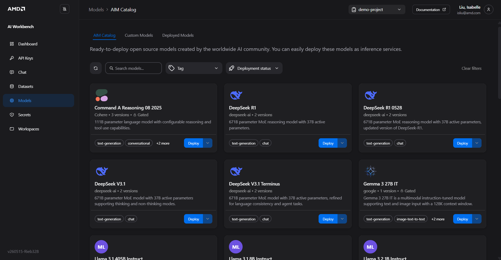

Each card shows the model name, size, and family. AMD has pre-configured the serving stack, hardware tuning, and memory layout for each — you do not configure any of this manually.

### Deploy Your Model

1. Find the model your facilitator recommends (e.g., **GPT-OSS-20B**)
2. Click the **three-dot menu (⋮)** on the model card
3. Select **Deploy**

<!-- TODO: pick an non gated model that can be finetuned This comment will not appear in the rendered Markdown -->

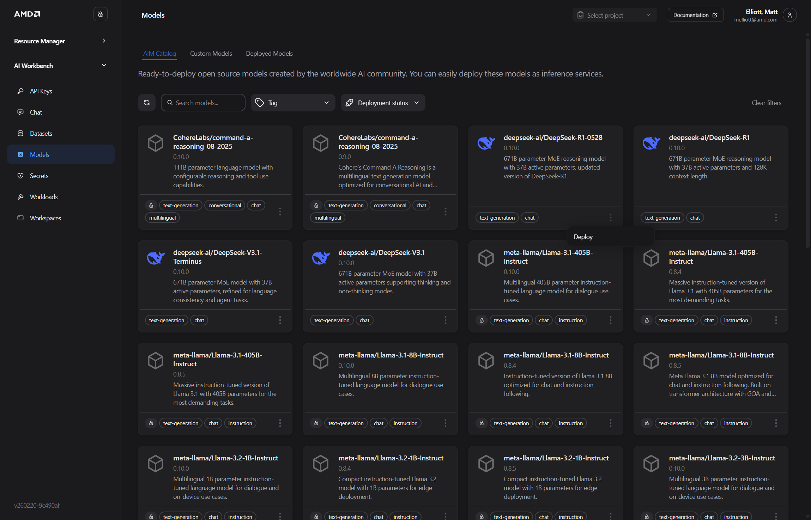

### Configure the Deployment

In the deployment panel:


- **Performance metric** — Select **Latency** for this workshop


- If the model shows a lock icon (gated model), a Hugging Face token field appears. Click **Select existing token** to use the pre-configured secret from Resource Manager.


Click **Deploy**.

---

## Step 1C: Monitor Your Model — Live Inference Metrics

### Watch the Deployment Start

Click **Workloads** in the left sidebar. Your model will show **Pending** or **Starting** while the platform schedules it on a GPU node and initializes the serving process. This typically takes 3–5 minutes.

> **What is happening under the hood?** The platform is creating a Kubernetes pod on an AMD GPU node, pulling the AIM container image, and starting the vLLM serving process. GPU memory allocation and model weight loading happen during this initialization window.

Wait for the status to change to **Running**.

### Explore Live Metrics

Once running, click the model name or **Open Details** to see the real-time metrics dashboard:

| SLA Metric | What It Tells You |
|---|---|
| **Inference Requests** | Current inference load on the model |
| **Time to First Token (TTFT)** | Latency from request submission to first token generated |
| **Throughput (tokens/sec)** | Total generation rate across all concurrent requests |
| **End-to-end latency** | Total time from request submission to the complete response being generated |
| **GPU Utilization** | Hardware utilization — helps right-size the deployment |

> **Why do Metrics matter?** Enterprise applications commit to response time guarantees. For example, a customer-facing AI assistant might require TTFT < 500ms.

### Chat with Your Model

From the model details page, click **Chat**. Ask a question and observe:
- The response latency (TTFT)
- The quality of the response
- How the metrics dashboard updates in real time as you generate traffic

---

## Step 1D: Configure Autoscaling

Autoscaling automatically adjusts the number of running model replicas based on real-time demand — scaling up during traffic spikes and back down during low usage, so you only consume GPU resources when you need them.

> **Important:** Autoscaling must be enabled **at deployment time** — you cannot enable it on an existing deployment. If it was enabled at deploy time, you can update its parameters later via **Settings** on the workload detail page.

### Enable Autoscaling at Deploy Time

When deploying a model (Step 1B), locate the **Autoscaling** section in the deployment drawer and toggle **Enable autoscaling** on:

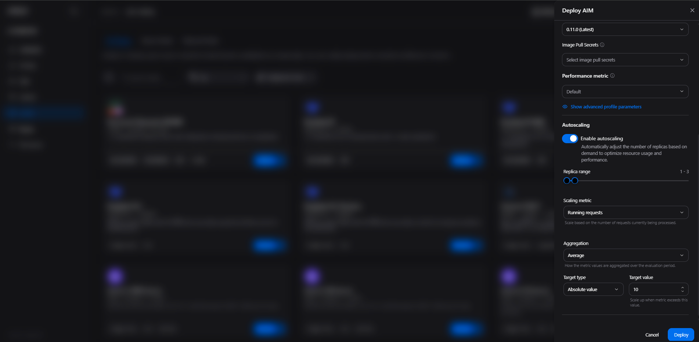

Configure the following parameters:

| Parameter | Recommended Value | What It Does |
|---|---|---|
| **Min replicas** | 1 | Minimum replicas always running — ensures baseline capacity even at zero traffic |
| **Max replicas** | 3 | Upper bound — prevents runaway resource use; constrained by your project's GPU quota |
| **Scaling metric** | Running requests (default) | The vLLM signal used to drive scaling decisions |
| **Aggregation** | Average (default) | How metric values are combined across all running pods |
| **Target type** | Absolute value (default) | How the target threshold is interpreted |
| **Target value** | 10 (default) | Scale up when total running requests across all pods exceed this number |

### How It Works

- The platform evaluates the scaling metric every **30 seconds**
- **Scale-up:** When demand exceeds your target threshold, additional replicas are added (up to your configured maximum)
- **Scale-down:** When demand drops below the threshold and stays low through a **5-minute cooling period**, replicas are removed (down to your configured minimum) — the cooldown prevents flapping

### Scaling Metric Options

| Metric | When to Use |
|---|---|
| **Running requests** (default) | Stable, reactive scaling based on active load — good for most workloads |
| **Waiting requests** | Proactive scaling that reacts before latency degrades — triggers on queue buildup before response times increase |

> **How autoscaling interacts with quotas:** Autoscaling scales within your project's GPU quota. If your quota allows 4 GPUs and each replica uses 1, autoscaling can create up to 4 replicas. When autoscaling borrows resources beyond a project's guaranteed quota, those pods may be preempted if other projects reclaim their allocation.

You can validate autoscaling behavior later using the `vllm bench serve` load test in Part 3 (Optional) — increase concurrency and watch the replica count change in real time in the Workloads tab.

---

# Part 2: Fine-Tune a Model on Your Own Data (15 minutes)

Fine-tuning adapts a general-purpose model to your domain — your terminology, your writing style, your proprietary data. This turns a capable but generic model into one that understands your organization's context and produces outputs that match your standards.

**AMD AI Workbench makes fine-tuning a UI workflow** — no Python, no training scripts, no GPU configuration required. You upload a dataset, select a base model, and the platform handles the rest.

---

## Step 2A: Upload Training Data

Your training data needs to be in **JSONL format** — one JSON object per line, where each object contains a prompt/response pair. A sample dataset is provided by your facilitator at:

```
https://github.com/isab8liu-alum/eai-suite-guides/blob/main/dataset/sft-demo-data.jsonl
```
<!--  TODO: update this to actual dev repo dataset. This comment will not appear in the rendered Markdown -->

In AMD AI Workbench:

1. Click **Datasets** in the left sidebar
2. Click **Upload**

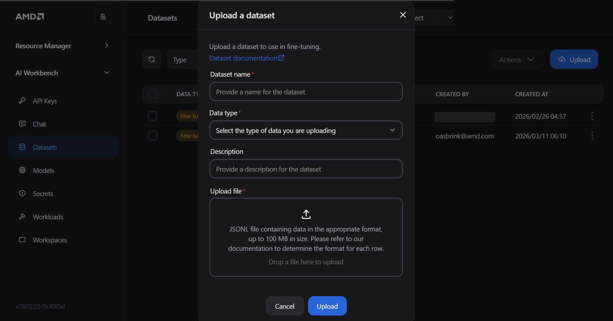

3. Fill in:
   - **Dataset name** — e.g., `workshop-demo-data`
   - **Data type** — `.jsonl` / instruction fine-tuning format
   - **Description** — optional
4. Select your file and click **Upload**

> **What is in the dataset?** The sample dataset contains instruction-response pairs in the standard SFT (Supervised Fine-Tuning) format. Each entry looks like:
> ```json
> {"messages": [{"role": "user", "content": "..."}, {"role": "assistant", "content": "..."}]}
> ```
> Your production dataset would contain examples of the exact responses you want the model to learn — clinical notes, customer service replies, domain-specific Q&A, and so on.

---

## Step 2B: Start a Fine-Tuning Job

1. Click **Models** in the left sidebar → switch to the **Custom Models** tab

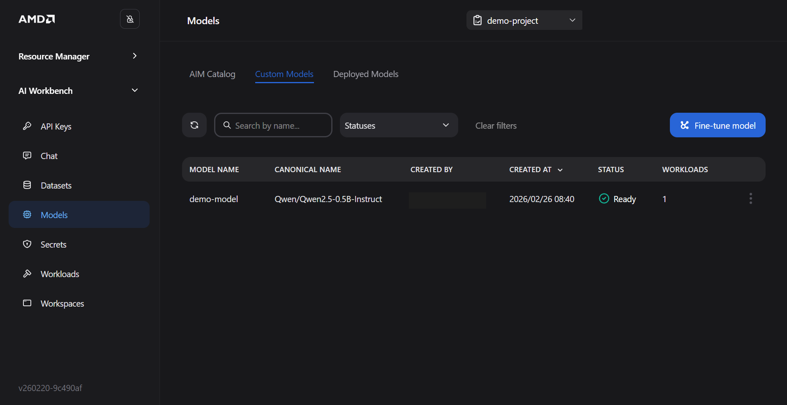

2. Click **Fine-tune model**

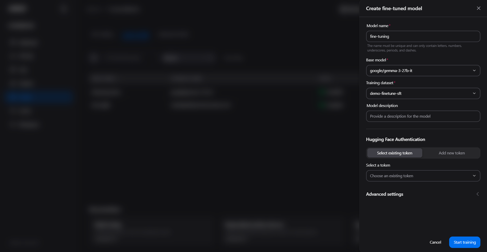

3. Configure the fine-tuning job:

| Setting | Value | Notes |
|---|---|---|
| **Base model** | Select the model gemma-3-27b-it | The starting point — your dataset teaches it new behavior |
| **Dataset** | `workshop-demo-data` | The training data you uploaded in Step 2A |

Leave the Advanced Settings on default menu. Or for the sake of time, put value of 1 for Batch size and Number of epochs


1. Click **Start training**

2. The fine-tuning job appears in **Workloads** with a **Pending** status badge. You can monitor its progress.

3. Proceed to next step when the status shows **Complete**

> **How long does it take?** With a small dataset on 1 GPU, a 3-epoch job typically finishes in 5–15 minutes. Larger datasets or more epochs take proportionally longer. Resource Manager quotas apply — the training job consumes GPU resources from your project's quota while running.

---

## Step 2C: Test Your Fine-Tuned Model

Once training completes, the custom model appears in the **Custom Models** tab in the **Models** side menu.

1. Right click the three dots  on your fine-tuned model — then select **Deploy** -  it deploys exactly like any other AIM
2. Wait for status to show **Running**
3. Click **Chat** and ask it questions from the training domain

Compare the fine-tuned model's responses against the base model from Part 1. The fine-tuned model should show noticeably better alignment with your domain terminology and the response style captured in the training data.

> **What LoRA produces:** Fine-tuning with LoRA creates a small set of adapter weights — typically 1–5% the size of the base model — that encode the domain-specific behavior you trained. These adapters are stored separately and layered on top of the base model at inference time. The result is a model that retains general capability while applying your domain knowledge precisely where it matters.


---

# Part 3: Benchmarking with vLLM Bench Serve in VSCode (Optional)

> **This section is optional.** The core workshop (Parts 1–2) does not require it. Come back here if time allows, or explore it after the session to quantify your model's performance under realistic load.

## Why Benchmark?

Deploying a model is only the first step. Before committing to a production configuration, you need to understand how the model performs under realistic load:

- What is the maximum throughput?
- Does latency stay within SLO at 10 concurrent users? 50? 100?
- At what load does autoscaling kick in, and how quickly?

**`vllm bench serve`** is the standard benchmarking tool for OpenAI-compatible endpoints. It simulates concurrent users, measures throughput and latency percentiles, and produces a summary you can use to validate your SLO targets.

---

## Step 3A: Find Your Model's Internal Endpoint

You need the cluster-internal service URL for the model you deployed in Part 1.

In AMD AI Workbench:
1. Click **Models** → click your running model
2. Click **Connect** on the model details page
3. Copy the **Internal URL** — it looks like `http://aim-llm-<model-name>-<id>.<namespace>.svc.cluster.local`

Keep this URL — you will use it in the next step.

---

## Step 3B: Launch a VSCode Workspace

Click **Workspaces** in the left sidebar, then click on the VSCode workspace card (or **Create Workspace** → VSCode).

In the workspace configuration panel:

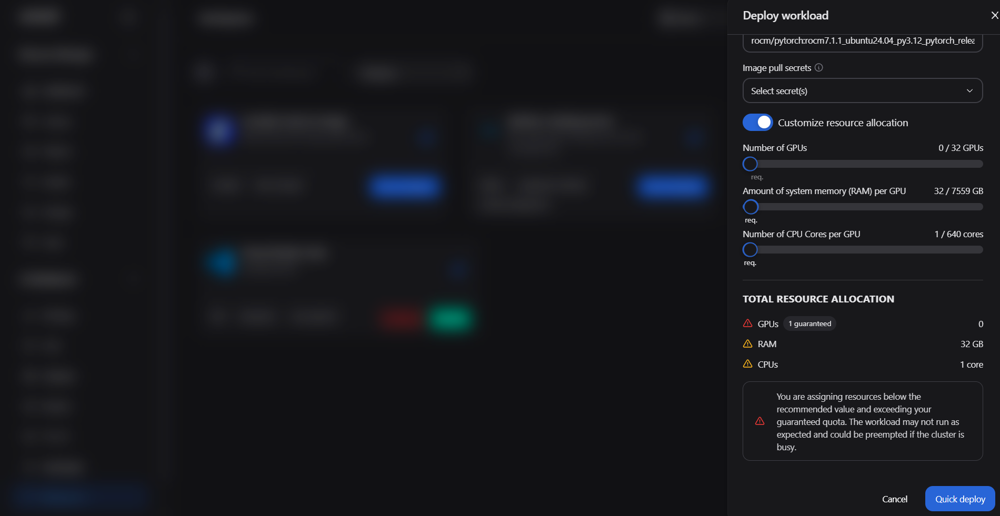

- **Name** — e.g., `bench-workspace`
- **CPU/Memory** — leave defaults for the workshop
- **GPU** — set to `0` for the benchmarking workspace (the benchmark sends HTTP requests; it does not need a GPU itself)
- **Storage** — the workspace comes with a persistent home directory

Click **Create**. The workspace status will show **Starting** — typically 1–2 minutes.

Once **Running**, click **Open** to launch VSCode in your browser.

> **What makes this different from a local VSCode?** The workspace runs inside the same Kubernetes cluster as your models. You can reach model services directly by their internal cluster hostname — no port-forwarding or VPN required. Your work is also persistent: files saved in the workspace home directory survive workspace restarts.

---

## Step 3C: Run the Benchmark

In VSCode, open a terminal: **Terminal → New Terminal** (or `` Ctrl+` ``).

Run the benchmark using the Python invocation below — this is the most reliable method and matches exactly what is shown in the screenshot. Substitute your model's internal URL and name from Step 3A:

```bash
# Set your model endpoint and name
MODEL_URL="http://aim-llm-<model-name>-<id>.<namespace>.svc.cluster.local"
MODEL_NAME="meta-llama/Meta-Llama-3-8B-Instruct"   # match the model ID shown in Workbench

# Run a benchmark — 100 prompts, 10 concurrent users
python -m vllm.entrypoints.openai.run_bench \
  --backend openai-chat \
  --base-url $MODEL_URL \
  --model $MODEL_NAME \
  --num-prompts 100 \
  --max-concurrency 10 \
  --input-len 256 \
  --output-len 128
```

> **What do these parameters mean?**
> - `--num-prompts 100` — total number of requests to send
> - `--max-concurrency 10` — simulates 10 simultaneous users
> - `--input-len 256` / `--output-len 128` — controls the size of synthetic prompts and responses

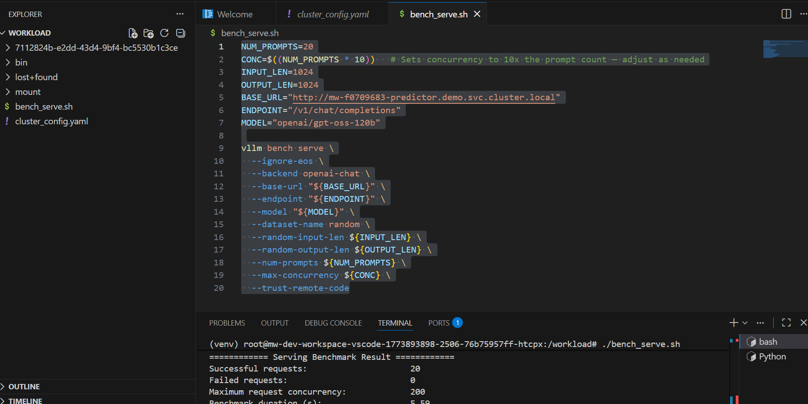

> **Shorthand alias:** If `vllm bench serve` appears in the workspace documentation, it is an alias for the same Python entrypoint. Use the `python -m` form above if the shorthand is not found in PATH.

---

## Step 3D: Interpret the Benchmark Output

When the benchmark completes, you will see a summary like:

```
============ Serving Benchmark Result ============
Successful requests:                100
Benchmark duration (s):             47.23
Total input tokens:                 25,600
Total generated tokens:             12,800
Request throughput (req/s):         2.12
Output token throughput (tok/s):    271.0
Total token throughput (tok/s):     813.0

Time to First Token (ms):
  Mean:   143.2
  Median: 138.5
  P99:    312.8

Inter-Token Latency (ms):
  Mean:   18.4
  Median: 17.1
  P99:    41.3
==================================================
```

| Metric | What to Look For |
|---|---|
| **Request throughput** | Requests/second the model handled sustainably |
| **TTFT Mean / P99** | P99 TTFT tells you the worst-case latency for 99% of users — compare against your SLO target |
| **Output token throughput** | Overall generation rate — useful for capacity planning |
| **Inter-token latency** | Streaming response smoothness — high values cause choppy output in chat interfaces |

> **Exercise:** Increase `--max-concurrency` to 25, re-run the benchmark, and observe how TTFT and throughput change. If autoscaling is configured, switch to the Workbench Workloads tab and watch for a new replica to appear.

---

# Part 4: AMD Resource Manager — Platform Administration (10 minutes)

## Why Resource Manager?

In enterprise environments, AI infrastructure is shared. Multiple teams — data science, engineering, product — all want access to GPUs. Without governance, one team can accidentally consume all cluster resources, leaving others blocked.

**AMD Resource Manager** is the administrative control plane. It lets IT administrators:
- Create isolated **projects** for each team or use case
- Set **resource quotas** (GPU hours, memory, storage) per project
- Manage **user access** and assign roles
- Store and distribute **secrets** (API keys, model tokens) securely
- Attach **persistent storage** for datasets and model artifacts

In this section you will tour the user workflow. Your instructor will also demo the administrator workflow

---

## Step 4A: Log In to Resource Manager

Open a browser and navigate to the Resource Manager URL provided by your facilitator:

- Format: `https://airm.<your-domain>` or the IP-based URL on your workshop sheet

Use the **login credentials** your facilitator provided.

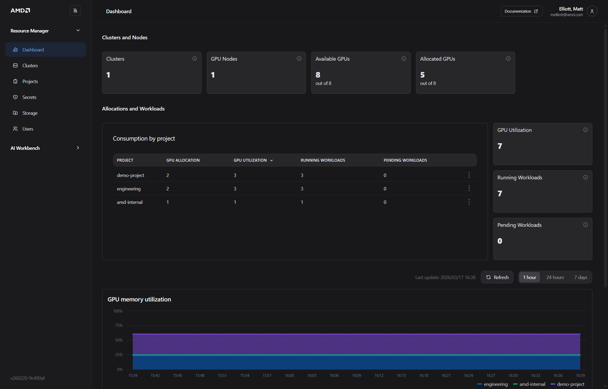

The dashboard shows:
- **Cluster-level resource utilization** — total GPU capacity, current usage, and available headroom
- **Active projects** and their quota consumption
- **System alerts** and recent events

Click **View Config** (top right) to see cluster-level details such as node count, GPU type, and software versions.

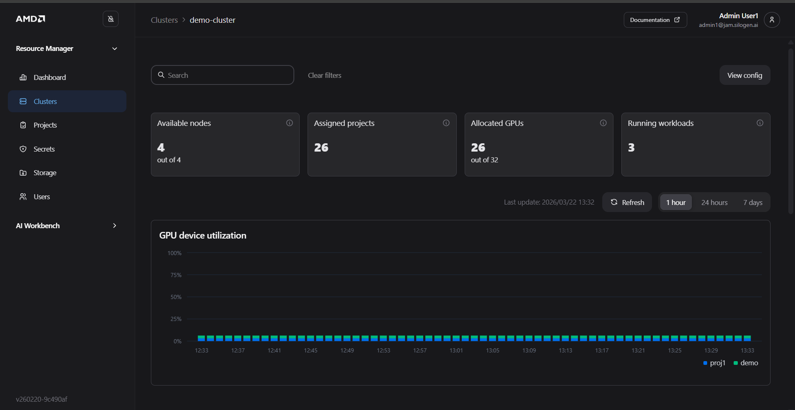

---

## Step 4B: Create a Project

Projects are the primary isolation boundary. Each team or use case gets its own project with its own quota, users, secrets, and storage.

Click **Projects** in the left sidebar, then click **Create Project**.

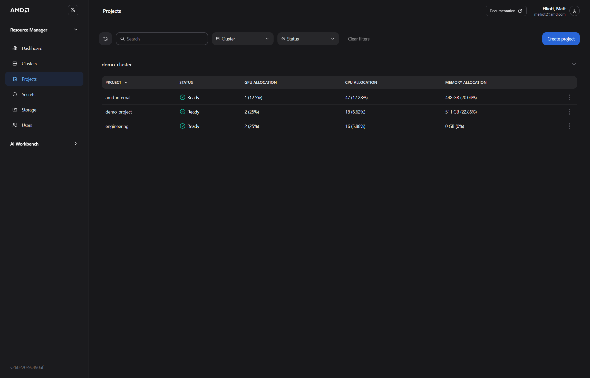

In the **Create Project** dialog:


Fill in:
- **Project Name** — use your first name or team name (e.g., `workshop-yourname`)
- **Description** — optional, but useful for multi-team environments

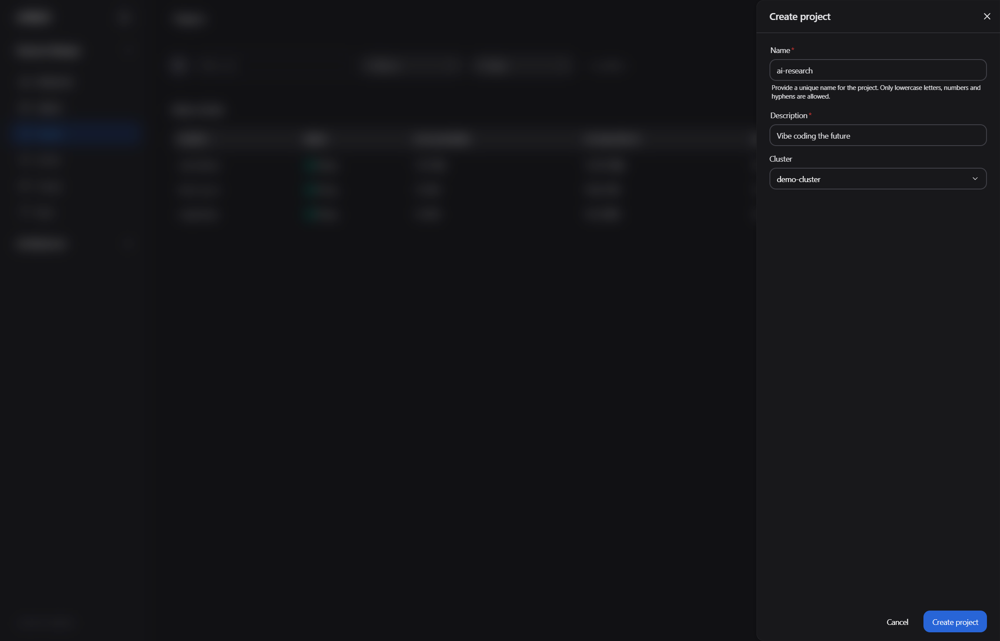

Click **Create**. The new project appears in the list and is immediately ready for quota configuration.

---

## Step 4C: View Resource Quotas

Click your new project to open its detail view, then click the **Quota** tab.

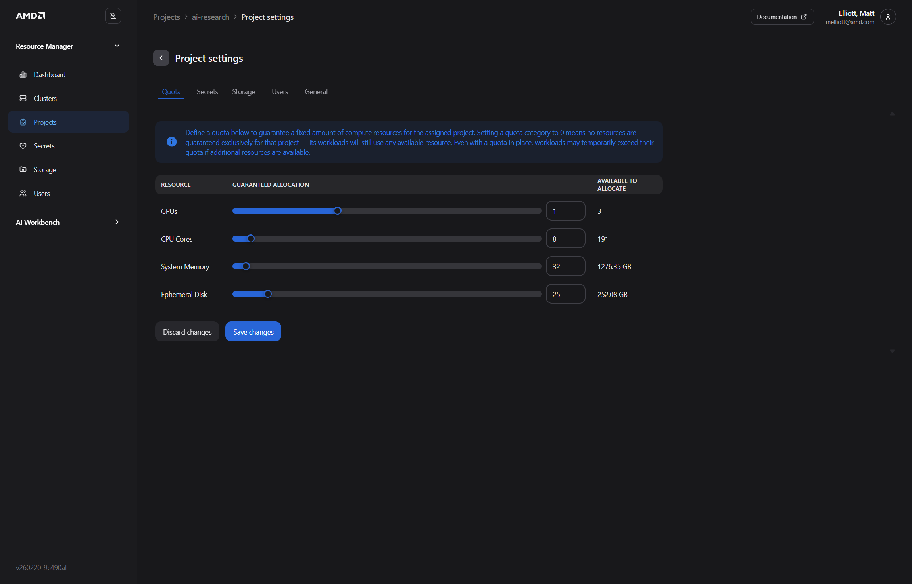

> **Note:** In this workshop environment, quota values are pre-configured by the cluster admin and are read-only for your account. You can view the current limits but will not be able to modify them.

The quota tab shows limits set for the project:

| Resource | What It Controls |
|---|---|
| **GPU Limit** | Hard ceiling on simultaneous GPU usage — prevents any one team from monopolizing cluster GPUs |
| **CPU Limit** | Maximum CPU cores the project can consume |
| **Memory Limit** | Maximum RAM |
| **Storage** | Total PVC storage available |

> **Understanding quota enforcement:** The platform supports *quota bursting* — a project can temporarily use slack cluster capacity beyond its set limit when additional resources are available. However, **when the cluster is under contention, no project is allowed to exceed its quota and displace another team's workloads.** The quota you see here is both the floor (your team is assured at least this much) and the enforced ceiling under contention.

---

## Step 4D: Add a Secret 

Secrets allow you to securely distribute credentials — like a Hugging Face API token for downloading gated models — to all workloads in a project, without users ever seeing the raw token value.

Click the **Secrets** tab inside your project, then click the **Add** dropdown.

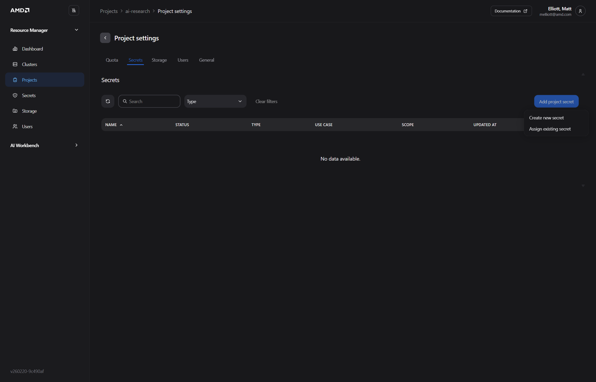

Select **Hugging Face Token**. In the **Create Secret** dialog that appears:

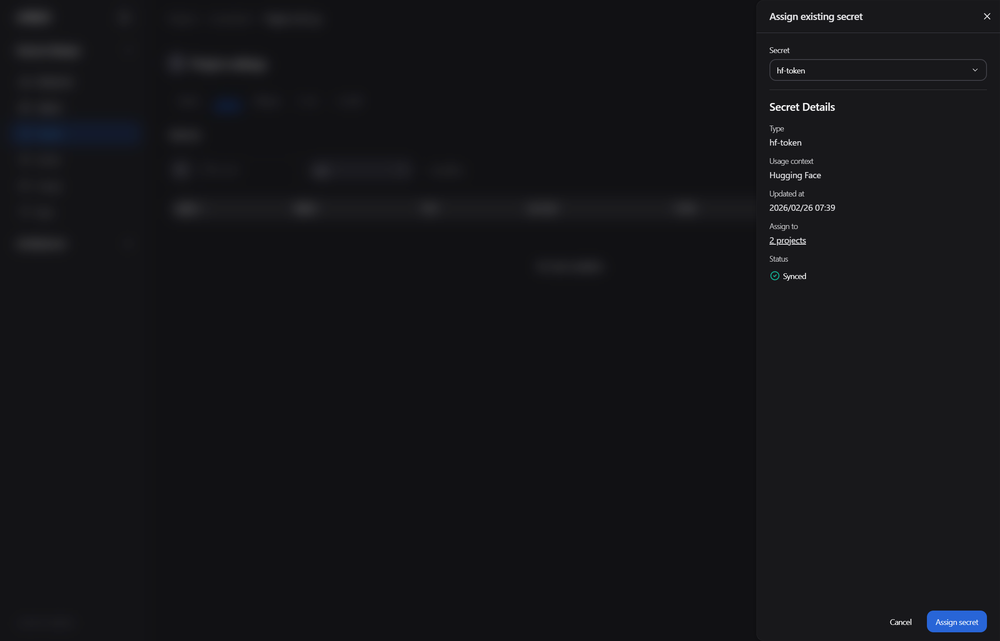

- **Secret name** — a memorable label (e.g., `hf-token`)
- **Token** — paste the Hugging Face token your facilitator provided

Click **Create**. The secret is stored in the cluster's secret store — it will appear in Workbench's deployment panel whenever a gated model requires authentication.

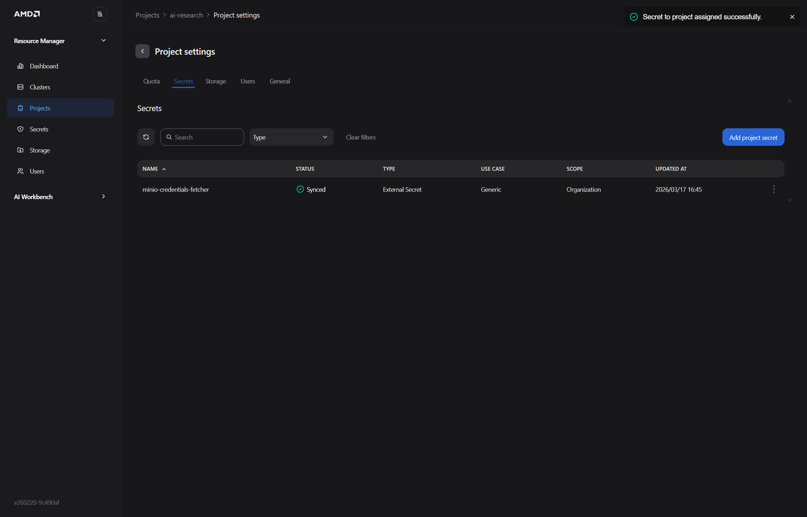

> **Security note:** Once saved, the token value is never shown again in the UI. Users in the project can _use_ the secret (it is injected as an environment variable into model containers) but cannot read the raw value.

### Assigning a MinIO/S3 Storage Secret

For teams that need to access shared dataset or model artifact buckets, you can also add object storage credentials. Click **Add** again and select **MinIO / S3 Compatible**.

If you are **creating a new MinIO secret**, the dialog prompts you for a secret name, bucket endpoint, access key, and secret key. Fill in the fields and click **Create** — the credential is stored and available to any workload in the project.

If the MinIO credentials already exist in the cluster (created by an admin at cluster setup), you will instead see an **Assign Existing Secret** panel where you select the pre-created credential from a list and assign it to your project. The screenshot below shows this workflow:

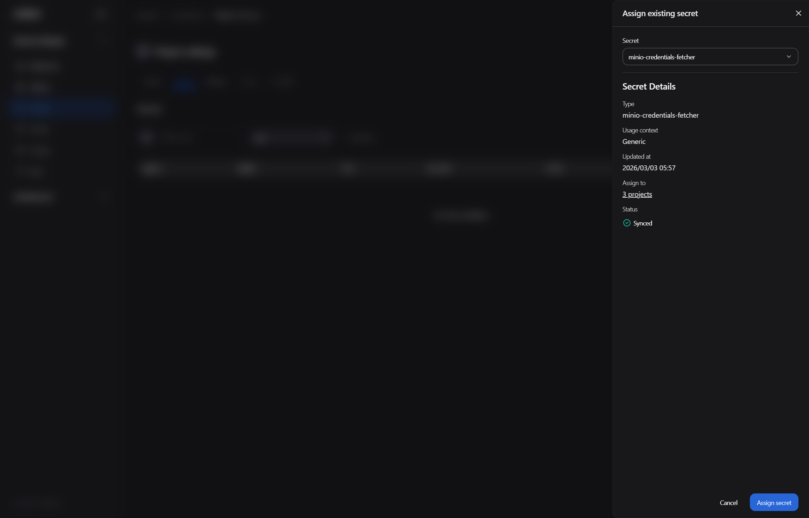

Either way, the resulting secret can be mounted into workspaces and fine-tuning jobs as environment variables — users access the bucket without ever handling the raw credentials.

---

## Workshop Complete

You have now experienced the full administrative and operational lifecycle of the AMD Enterprise AI Software Stack:

| What You Did | What It Demonstrates |
|---|---|
| Deployed an AI model and observed live metrics | Production visibility from the first deployment |
| Configured autoscaling | Dynamic resource efficiency under variable load |
| Fine-tuned a model on custom data | Domain adaptation without ML engineering expertise |
| Ran a benchmark with vLLM bench serve (optional) | Quantified SLO validation before production commitment |
| Toured Resource Manager — projects, quotas, and secrets | IT governance and multi-team resource control |

**Next steps:**
- Explore additional workspace types (JupyterLab, ComfyUI) for different team workflows
- Ask your facilitator about bringing the AMD AI platform to your organization
- Review the [AMD Enterprise AI documentation](https://enterprise-ai.docs.amd.com) for architecture guides and API references
