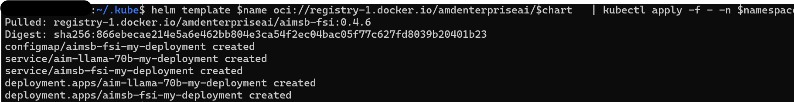
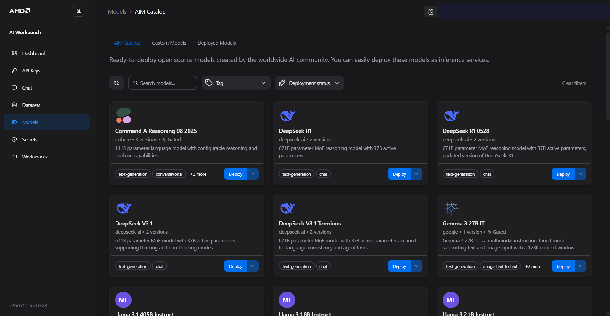
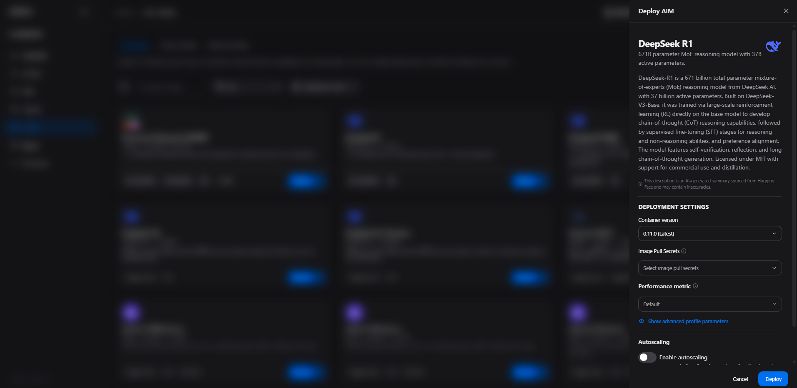
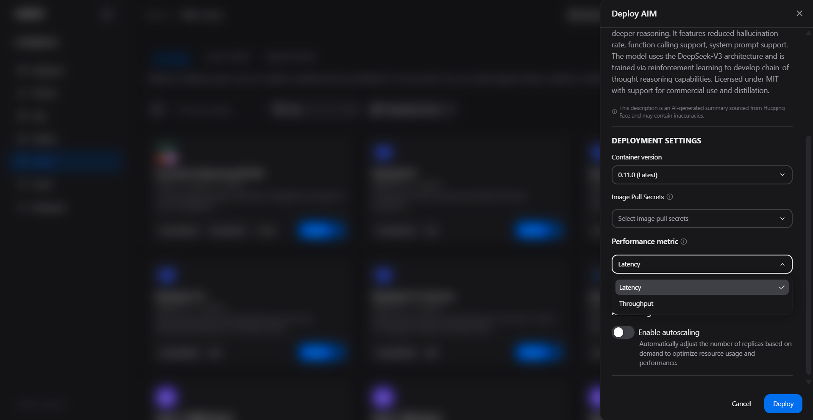
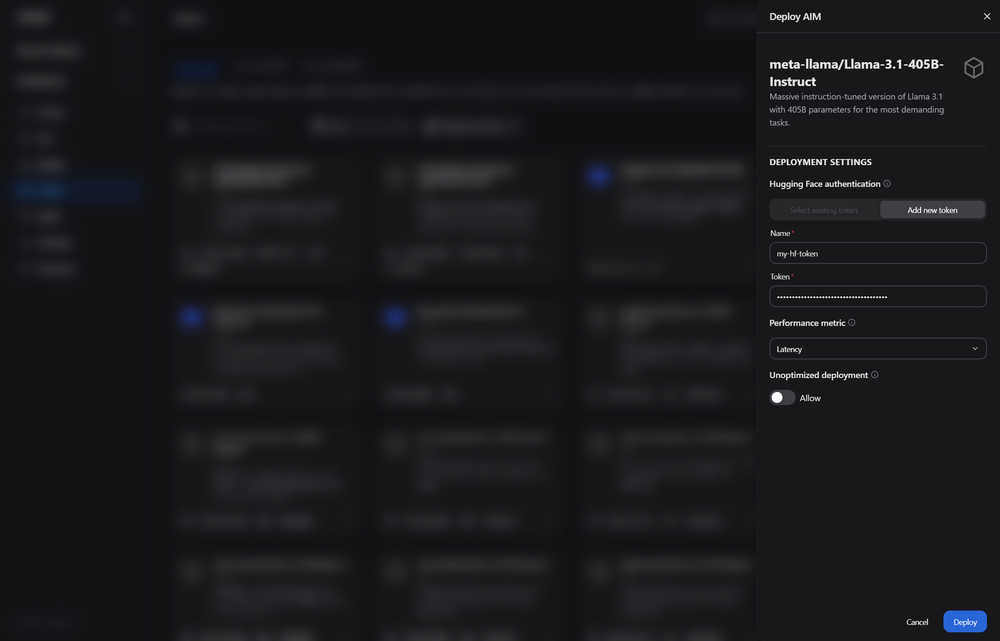

# Advancing AI Day Workshop
### AMD Enterprise AI - AIMS and Blueprints — Hands-On Lab (45 Minutes)

**Audience:** Enterprise evaluators and developers new to the AMD AI platform  
**Prerequisites:** A laptop (Linux, macOS, or Windows with WSL), a terminal, and the workshop credentials provided by your facilitator  
**Time:** 45 minutes total

---

## What You Will Build Today

In this workshop you will experience the AMD Inference Microservices (AIMs) and Solution Blueprints — from deploying a healthcare focused AI application to customizing and extending it.

You will:
1. **Deploy an AIM via kubectl** — the CLI-native approach for launching a model on the cluster (llama-3.2-1b-instruct)
2. **Deploy a complete medical imaging AI application** using a Solution Blueprint — pointed directly at the AIM you just deployed
3. **Customize the Blueprint** — tear down the initial deployment and redeploy it with default AIM
4. **(Optional)** Deploy and monitor an AI model through the AMD AI Workbench UI

No deep Kubernetes or ML experience required. Every command is explained step by step.

---

## System Setup: Preparing Your Laptop

This workshop uses local terminal commands to install tools and connect to the cluster. The instructions are written for Linux; follow the section for your OS before starting Part 1.

### 🐧 Linux
No additional setup required. Open your terminal and proceed.

### 🪟 Windows — Use WSL (Windows Subsystem for Linux)
All workshop commands must run inside **WSL**, not PowerShell or Command Prompt. If WSL is not already installed:

1. Open **PowerShell as Administrator**
2. Run: `wsl --install`
3. Restart your machine when prompted
4. After restart, open **WSL** (search "Ubuntu" or "WSL" in the Start menu) and complete the Ubuntu first-run setup (create a username and password)

All subsequent terminal commands in this workshop are run inside your WSL terminal.

### 🍎 macOS
Open **Terminal** (Applications → Utilities → Terminal) or a terminal emulator of your choice. The workshop commands run as-is on macOS with one exception: the `kubectl` install step uses a Linux binary URL — see the footnote in Step 1A.

<!-- TODO test on mac once deployed -->

### Required Tools Summary
The tools below are installed during Step 1A. For reference:

| Tool | Purpose | Pre-installed? |
|---|---|---|
| `curl` | Downloads tools and sends API test requests | Yes (Linux, macOS, WSL) |
| `git` | Clones Blueprint source for customization | Usually — if not: `sudo apt install git` (Linux/WSL) or `xcode-select --install` (macOS) |
| `kubectl` | Communicates with the Kubernetes cluster | Installed in Step 1A |
| `helm` | Deploys Kubernetes applications (Blueprints) | Installed in Step 1A |
| `k9s` | Visual terminal dashboard for the cluster | Installed in Step 1A |


---

## Platform Overview

| Component | What It Does | Why It Matters |
|---|---|---|
| **AMD AI Workbench** | Web UI for deploying, chatting with, and managing AI models | Teams self-serve AI without waiting on IT |
| **AIMs** (AI Inference Microservices) | Pre-packaged, AMD-optimized model servers | Deployment in minutes instead of weeks |
| **Solution Blueprints** | Complete AI applications — UI, backend, and model — in one package | Working starting points; no app dev required |
| **Resource Manager** | Admin UI for clusters, quotas, users, and storage | IT control over who uses what resources |

---

# Part 1: Deploy an AIM via kubectl (15 minutes)

The AMD AI Workbench UI is ideal for self-service model deployment, but enterprise platform teams often need to deploy AIMs programmatically from CI/CD pipelines, scripts, or automation tooling. In this lab you will deploy a minimal AIM service with standard Kubernetes `Deployment` and `Service` manifests.

> **When would you use this?** Scripted deployments, automated scaling triggers, GitOps workflows, or workshop namespaces that are already prepared by a platform administrator.

---

## Step 1A: Open a Terminal and Set Up Tools

All commands in this workshop run from the terminal on your laptop (WSL if on Windows).

> **Why the terminal?** kubectl and Helm are industry-standard tools for deploying applications to Kubernetes. Once you know these commands, you can deploy any AIM or Blueprint in seconds.

### Install Required Tools

Run each block of commands in your terminal:

```bash
# Install k9s - a visual Kubernetes dashboard
curl -sS https://webinstall.dev/k9s | bash
source ~/.config/envman/PATH.env
```

> **macOS note:** You can also install k9s via Homebrew: `brew install k9s`

```bash
# Install kubectl - communicates with the Kubernetes cluster
mkdir -p ~/.kube
curl -LO "https://dl.k8s.io/release/$(curl -L -s https://dl.k8s.io/release/stable.txt)/bin/linux/amd64/kubectl"
chmod +x kubectl
sudo mv kubectl /usr/local/bin/
kubectl version --client
```

> **macOS note:** Replace `linux/amd64` in the kubectl URL with `darwin/amd64` (Intel Mac) or `darwin/arm64` (Apple Silicon M1/M2/M3). The rest of the command is identical.

```bash
# Install Helm - the package manager used to deploy Blueprints
curl https://raw.githubusercontent.com/helm/helm/main/scripts/get-helm-3 | bash
```

Verify all three installed correctly:

```bash
kubectl version --client && helm version && k9s version
```

Install kubelogin

**Linux / WSL:**
```bash
curl -LO https://github.com/Azure/kubelogin/releases/latest/download/kubelogin-linux-amd64.zip

sudo apt update
sudo apt install unzip -y

unzip kubelogin-linux-amd64.zip

sudo mv bin/linux_amd64/kubelogin /usr/local/bin/

kubelogin --version
```

**macOS:**
```bash
brew install kubelogin
kubelogin --version
```

Install krew (kubectl plugin manager) and the oidc-login plugin

**Linux / WSL:**
```bash
(
  set -x; cd "$(mktemp -d)" &&
  OS="$(uname | tr '[:upper:]' '[:lower:]')" &&
  ARCH="$(uname -m | sed -e 's/x86_64/amd64/' -e 's/arm.*$/arm/')" &&
  KREW="krew-${OS}_${ARCH}" &&
  curl -fsSLO "https://github.com/kubernetes-sigs/krew/releases/latest/download/${KREW}.tar.gz" &&
  tar zxvf "${KREW}.tar.gz" &&
  ./"${KREW}" install krew
)

export PATH="${KREW_ROOT:-$HOME/.krew}/bin:$PATH"
echo 'export PATH="${KREW_ROOT:-$HOME/.krew}/bin:$PATH"' >> ~/.bashrc

kubectl krew install oidc-login
kubectl oidc-login --help
```

**macOS:**
```bash
brew install krew

export PATH="${KREW_ROOT:-$HOME/.krew}/bin:$PATH"
echo 'export PATH="${KREW_ROOT:-$HOME/.krew}/bin:$PATH"' >> ~/.zshrc

kubectl krew install oidc-login
kubectl oidc-login --help
```
---

## Step 1B: Connect Your Terminal to the Workshop Cluster

Your facilitator will provide a **kubeconfig file** - a credential file that lets your terminal communicate with the cluster.

Save the kubeconfig content to your machine:

Create the kubeconfig file with the following content:

```bash
mkdir -p ~/.kube
cat > ~/.kube/kube_config_aai.yaml << 'EOF'
apiVersion: v1
clusters:
- cluster:
    insecure-skip-tls-verify: true
    server: https://k8s.aai.silogen.ai
  name: default
contexts:
- context:
    cluster: default
    user: default
  name: default
current-context: default
kind: Config
preferences: {}
users:
- name: default
  user:
    exec:
      apiVersion: client.authentication.k8s.io/v1beta1
      args:
      - oidc-login
      - get-token
      - --oidc-issuer-url=https://kc.aai.silogen.ai/realms/airm
      - --oidc-client-id=k8s
      - --oidc-client-secret=0e2d1aac6a57d37957ffd7e0af144c89
      - --insecure-skip-tls-verify
      command: kubectl
      env: null
      interactiveMode: IfAvailable
      provideClusterInfo: false
EOF
```

Activate it and verify the connection:

```bash
export KUBECONFIG=~/.kube/kube_config_aai.yaml
```
> **Note:** Admins can run `kubectl get nodes` to view all nodes.

**Expected output:** This should lead you to a login page. Enter the user credentials and password the workshop instructor has shared. 

<!-- kubectl get nodes will work for admin login only
A list of cluster nodes with `Ready` status. If you see this, your terminal is connected to the cluster.
-->
Also set your namespace - your facilitator will confirm your project number:

```bash
namespace="proj<your project number>"   # Your assigned Kubernetes namespace, such as "proj1"
```

---

## Step 1C: Understand How AIMs Deploy Under the Hood

For this CLI exercise, you will deploy the AIM container directly with a native Kubernetes `Deployment`, then expose it with a Kubernetes `Service`. The model container serves an OpenAI-compatible API on port `8000`.

The deployment does **not** put a Hugging Face token in the YAML. Instead, it reads `HF_TOKEN` from a Kubernetes Secret named `hf-token` in your namespace.
<!--
Verify the workshop Secret exists:

```bash
kubectl get secret hf-token -n $namespace
```

The workshop cluster should provide this Secret ahead of time with a key named `token`. You can verify the key name without printing the token value:

```bash
kubectl get secret hf-token -n $namespace -o yaml \
  | sed -n '/^data:/,/^[^ ]/p' \
  | sed -n 's/^  \([^:]*\):.*/key: \1/p'
```

Expected output:

```text
key: token
```
this doesn't work! get error can't get secret-->
<!-- 
> **Facilitator setup:** For a public workshop, do not publish the Hugging Face token in this guide. Pre-create `hf-token` in every participant namespace with key `token`, or use External Secrets Operator / your platform secret manager to sync the same secret into each namespace. If a cluster uses a different key name, update the `secretKeyRef.key` field in the deployment YAML to match.

TODO facilitator add hf-token to all project namespaces as kubernetes secrets -->

> **Note:** Hugging Face tokens have been pre-loaded into your project namespace for this workshop. As a regular project user you do not have permission to view or modify secrets directly — this is by design. In a real deployment, you would manage secrets as a platform admin through AMD Resource Manager or via `kubectl` with admin credentials.

---

## Step 1D: Deploy an AIM via kubectl

Create the deployment manifest:

```bash
cat <<'EOF' > aai-test-deployment.yaml
apiVersion: apps/v1
kind: Deployment
metadata:
  name: minimal-aim-deployment
  labels:
    app: minimal-aim-deployment
spec:
  progressDeadlineSeconds: 3600
  replicas: 1
  selector:
    matchLabels:
      app: minimal-aim-deployment
  template:
    metadata:
      labels:
        app: minimal-aim-deployment
    spec:
      containers:
        - name: minimal-aim-deployment
          image: amdenterpriseai/aim-meta-llama-3-2-1b-instruct:0.11.1
          imagePullPolicy: Always
          env:
            - name: AIM_PRECISION
              value: "FP16"
            - name: AIM_GPU_COUNT
              value: "1"
            - name: AIM_GPU_MODEL
              value: "MI350X"
            - name: AIM_ENGINE
              value: "vllm"
            - name: AIM_METRIC
              value: "latency"
            - name: AIM_LOG_LEVEL_ROOT
              value: "INFO"
            - name: AIM_LOG_LEVEL
              value: "INFO"
            - name: AIM_PORT
              value: "8000"
            - name: HF_TOKEN
              valueFrom:
                secretKeyRef:
                  name: hf-token
                  key: hf-token
          ports:
            - name: http
              containerPort: 8000
          resources:
            requests:
              memory: "16Gi"
              cpu: "4"
              amd.com/gpu: "1"
            limits:
              memory: "16Gi"
              cpu: "4"
              amd.com/gpu: "1"
          startupProbe:
            httpGet:
              path: /v1/models
              port: http
            periodSeconds: 10
            failureThreshold: 360
          livenessProbe:
            httpGet:
              path: /health
              port: http
          readinessProbe:
            httpGet:
              path: /v1/models
              port: http
          volumeMounts:
            - name: ephemeral-storage
              mountPath: /tmp
            - name: dshm
              mountPath: /dev/shm
      volumes:
        - name: ephemeral-storage
          emptyDir:
            sizeLimit: 256Gi
        - name: dshm
          emptyDir:
            medium: Memory
            sizeLimit: 32Gi
EOF
```

Create the service manifest:

```bash
cat <<'EOF' > aai-test-service.yaml
apiVersion: v1
kind: Service
metadata:
  name: minimal-aim-deployment
  labels:
    app: minimal-aim-deployment
spec:
  type: ClusterIP
  ports:
    - name: http
      port: 80
      targetPort: 8000
  selector:
    app: minimal-aim-deployment
EOF
```

Apply both manifests to your namespace:

```bash
kubectl apply -f aai-test-deployment.yaml -f aai-test-service.yaml -n $namespace
```

> **Why Llama 3.2 1B?** This AIM image is packaged and optimized for AMD Instinct GPUs. It can take several minutes to download model weights, compile kernels, and pass its startup probe on first launch.

Watch the AIM come up:

```bash
kubectl rollout status deployment/minimal-aim-deployment -n $namespace --timeout=15m
kubectl get pods -n $namespace -l app=minimal-aim-deployment
```

You can also watch it in k9s:

```bash
k9s -n $namespace
```

Wait until the AIM pod shows **Running** and **1/1 Ready** before continuing to Part 2.

If the pod reports `CreateContainerConfigError`, check the Secret key:

```bash
kubectl describe pod -n $namespace -l app=minimal-aim-deployment
```

If the event says `couldn't find key ... in Secret`, update `secretKeyRef.key` in `aai-test-deployment.yaml` to match the key shown by the Secret verification command, then re-apply the deployment.

---

## Step 1E: Query the AIM Directly

Once the pod is **Running**, confirm the model is serving by sending a test request.

Port-forward the service:

```bash
kubectl port-forward service/minimal-aim-deployment 8000:80 -n $namespace
```

In a second terminal, verify the model endpoint:

```bash
curl http://localhost:8000/v1/models
```

Then send a test inference request:

```bash
curl http://localhost:8000/v1/chat/completions \
  -H "Content-Type: application/json" \
  -d '{
    "model": "meta-llama/Llama-3.2-1B-Instruct",
    "messages": [{"role": "user", "content": "Summarize the key benefits of AMD MI350X GPUs in two sentences."}],
    "max_tokens": 150
  }'
```

The response streams back in OpenAI-compatible format, meaning any application already written for OpenAI's API can point to this endpoint with no code changes.
<!-- this doesn't work for user...kubectl get nodes and svc don't work
Now note the AIM's internal service name. You will use it in Step 2B:

```bash
kubectl get svc minimal-aim-deployment -n $namespace
```
-->

Set the service name as a variable:

```bash
aimservice="minimal-aim-deployment"
```

---
## CLI vs. UI: When to Use Each

| Scenario | Use |
|---|---|
| Developer / data scientist self-service | **Workbench UI** |
| Automated deployment from CI/CD | **kubectl / AIM Engine CLI** |
| GitOps — model config stored in git | **kubectl apply** with YAML manifests |
| Batch deployment of many models | **kubectl** with a loop or Helm |
| Exploring the catalog and testing models | **Workbench UI** |

---

# Part 2: Solution Blueprints — Deploy and Customize a Medical Imaging AI Application (20 minutes)

## Why Solution Blueprints?

Building an AI application from scratch — even with a model already running — still requires writing a UI, a backend, prompt engineering, API wiring, and deployment code. For enterprise teams evaluating use cases, this delay kills momentum.

**Solution Blueprints** eliminate that gap. Each Blueprint is a complete, production-ready AI application distributed as a single deployable package. In this section you will deploy the **MRI Documentation Blueprint** — a full application for AI-assisted medical imaging analysis and report generation — connected directly to the AIM you deployed in Part 1.

---

## Step 2A: Deploy the MRI Documentation Blueprint

The **MRI Documentation Blueprint** (`aimsb-mri-doc`) provides:
- AI-assisted analysis and summarization of MRI scan reports
- Natural language querying over medical imaging documentation
- Automated report generation for radiologists and clinical teams
- A ready-to-use web interface for healthcare and imaging workflows

### Set Your Variables

```bash
name="my-deployment"       # A unique label for your Blueprint deployment
chart="aimsb-mri-doc"      # The MRI Documentation Blueprint
```

### Deploy

Deploy the Blueprint pointed at the AIM you deployed in Part 1, with HTTP routing enabled so the application is reachable through the cluster gateway:

```bash
helm template $name oci://registry-1.docker.io/amdenterpriseai/$chart \
  --set llm.existingService=$aimservice \
  | kubectl apply -f - -n $namespace
```

### Access the MRI Documentation Application via Port-Forward

Once the deployment is running, forward the Blueprint service to your local machine:

```bash
kubectl port-forward services/aimsb-mri-doc-$name 7861:80 -n $namespace
```

This tunnels traffic from **http://localhost:7861** on your machine to the Blueprint service running in the cluster. Keep this terminal open — closing it will stop the tunnel.

Open a browser and navigate to:

```
http://localhost:7861
```

You should see the MRI Documentation interface. Try uploading a sample MRI report or asking it a question about an imaging study.

> **Note:** Each participant must run port-forward from their own terminal using their own session. Port-forward is local to your machine and does not affect other participants' sessions.

<!--isabelleliu@Isabelles-Laptop .kube % echo "https://aimsb-mri-doc-$name$(kubectl get gtw -A -o jsonpath='{.items[*].spec.listeners[?(@.name=="https")].hostname}' | tr -d \*)/"
Error from server (Forbidden): gateways.gateway.networking.k8s.io is forbidden: User "oidc:user1@aai.silogen.ai" cannot list resource "gateways" in API group "gateway.networking.k8s.io" at the cluster scope
https://aimsb-mri-doc-my-deployment/
isabelleliu@Isabelles-Laptop .kube % echo "https://aimsb-mri-doc-$name$(kubectl get gtw -A -o jsonpath='{.items[*].spec.listeners[?(@.name=="https")].hostname}' | tr -d \*)/"
Error from server (Forbidden): gateways.gateway.networking.k8s.io is forbidden: User "oidc:user1@aai.silogen.ai" cannot list resource "gateways" in API group "gateway.networking.k8s.io" at the cluster scope
https://aimsb-mri-doc-my-deployment/-->

> **What does this do?**
> - `helm template` downloads the Blueprint chart from AMD's registry and renders it into Kubernetes configuration files
> - `--set llm.existingService=$aimservice` points the Blueprint at the Llama 3.2 1B AIM service you deployed in Part 1 — no second model pod is created
> - `kubectl apply` sends the rendered configuration to the cluster

> **Prerequisites for HTTPRoute:** The cluster must have a Gateway API-compatible gateway (e.g., Envoy Gateway) with a gateway named `https` in the `envoy-gateway-system` namespace. Your facilitator will confirm this is available in the workshop environment.

### Verify the Deployment

```bash
k9s -n $namespace
```

This opens a live dashboard scoped to your namespace. Pods will initially show `ContainerCreating` or `Pending` while images pull — this is normal. Watch the **STATUS** column until all pods show **Running** before continuing. Press `:q` to exit k9s.

> **k9s tips:** Use the arrow keys to navigate between pods. Press `d` to describe a pod (useful for troubleshooting), `l` to stream its logs, and `:q` to exit.



### Access the MRI Documentation Application

Once all pods are Running, get the application URL from the gateway:

```bash
echo "https://aimsb-mri-doc-$name$(kubectl get gtw -A -o jsonpath='{.items[*].spec.listeners[?(@.name=="https")].hostname}' | tr -d \*)/"
```

Open the printed URL in your browser. You should see the MRI Documentation interface. Try uploading a sample report or asking it a question about an imaging study.

> **If HTTPRoute is not available** in your environment, fall back to port-forwarding:
> ```bash
> kubectl port-forward services/aimsb-mri-doc-$name 7861:80 -n $namespace
> ```
> Then open **http://localhost:7861**.

---

## Step 2B: Blueprint Customization

Blueprints are open-source — the source code is available on GitHub and every component can be modified. In this section you will tear down the current Blueprint deployment and redeploy it with a different configuration to see how easy customization is.

**1. Tear Down and Redeploy with a Default AIM**

Stop the port-forward (`Ctrl+C`) and delete the existing Blueprint:

```bash
helm template $name oci://registry-1.docker.io/amdenterpriseai/$chart \
  | kubectl delete -f - -n $namespace
```

Wait for pods to terminate (watch in k9s), then redeploy the Blueprint — this time pointing it to the default AIMs in the helmchart (GPT-OSS-20B):

```bash
helm template $name oci://registry-1.docker.io/amdenterpriseai/$chart \
  | kubectl apply -f - -n $namespace
```

Wait for pods to restart, then port-forward to access the UI:

```bash
kubectl port-forward services/aimsb-mri-doc-$name 7861:80 -n $namespace
```

Then open **http://localhost:7861** in your browser. The Blueprint is now powered by your shared AIM instead of its bundled model.

> **Why does this matter?** Running a separate model per application wastes GPU resources and creates management complexity. By pointing Blueprints at a shared AIM, your team gets one model to monitor, update, and scale — and every application benefits automatically. This is also how you would swap in a different model without rebuilding the Blueprint.

**2. Change the System Prompt**

Each Blueprint exposes prompt configuration. Edit the system prompt to adapt the AI's output style — for example, switching from radiologist-facing technical language to patient-friendly plain-English summaries, or restricting responses to a specific imaging modality (MRI, CT, X-ray).

**3. Upgrade the Image Segmentation Model (UNet via MONAI) *(optional)***

The Blueprint currently segments brain tissue using simple K-means clustering inside `segment_brain_tissue()` in `src/mri_analysis.py`. You can replace this with a deep learning UNet model from a [MONAI bundle](https://monai.io/model-zoo.html) for clinical-grade accuracy — identifying tumor boundaries, organ contours, and tissue types with far greater precision.

First, clone the Blueprint source:

```bash
git clone https://github.com/amd-enterprise-ai/solution-blueprints.git
cd solution-blueprints/solution-blueprints/mri-doc
```

**Step 1 — Add dependencies to `src/requirements.txt`**

The Blueprint installs Python packages fresh on every pod start from `src/requirements.txt` (there is no pre-built container image — code is embedded in a Kubernetes ConfigMap via Helm). Add `monai` and `torch` before deploying:

```
monai
torch
```

> **Note:** PyTorch is several GB. The first pod startup after this change will take 5–15 minutes while packages are downloaded and installed inside the container.

**Step 2 — Edit `src/mri_analysis.py`**

Open `src/mri_analysis.py` and find the `segment_brain_tissue()` method inside the `MRIProcessor` class. The current K-means implementation looks like this:

```python
# Current: simple K-means clustering (class method inside MRIProcessor)
def segment_brain_tissue(self, image):
    """Segment tissue using K-means clustering."""
    if image is None:
        return None, {}

    from sklearn.cluster import KMeans

    pixels = image.reshape((-1, 1))
    kmeans = KMeans(n_clusters=4, random_state=42, n_init=10)
    labels = kmeans.fit_predict(pixels)
    segmented = labels.reshape(image.shape)

    unique, counts = np.unique(labels, return_counts=True)
    total_pixels = len(pixels)

    tissue_stats = {}
    for cluster, count in zip(unique, counts):
        percentage = (count / total_pixels) * 100
        tissue_stats[f"Tissue_Cluster_{cluster}"] = {"pixel_count": int(count), "percentage": round(percentage, 2)}

    return segmented, tissue_stats
```

Replace it with a MONAI UNet inference call. The method must remain a class method with the same signature and return the same `(segmented, tissue_stats)` tuple so the rest of the class continues to work:

```python
# Upgraded: MONAI UNet from a pretrained bundle (class method inside MRIProcessor)
def segment_brain_tissue(self, image, model_path="/tmp/brain_segmentation_unet.pth"):
    import torch
    from monai.networks.nets import UNet
    from monai.transforms import Compose, EnsureChannelFirst, ScaleIntensity, ToTensor

    if image is None:
        return None, {}

    # Load pretrained UNet
    model = UNet(
        spatial_dims=2,
        in_channels=1,
        out_channels=3,       # 3 tissue classes: CSF, grey matter, white matter
        channels=(16, 32, 64, 128),
        strides=(2, 2, 2),
    )
    model.load_state_dict(torch.load(model_path, map_location="cpu"))
    model.eval()

    # channel_dim="no_channel" is required for plain 2D numpy arrays (MONAI 1.x)
    transform = Compose([EnsureChannelFirst(channel_dim="no_channel"), ScaleIntensity(), ToTensor()])
    input_tensor = transform(image).unsqueeze(0)   # add batch dim → (1, 1, H, W)

    with torch.no_grad():
        output = model(input_tensor)
    labels = output.argmax(dim=1).squeeze().numpy()
    segmented = labels.astype(np.float32) / 2          # normalise to [0, 1] for 3 classes

    # Return tissue_stats in the same format as the K-means implementation
    unique, counts = np.unique(labels, return_counts=True)
    total_pixels = labels.size
    tissue_stats = {}
    for cluster, count in zip(unique, counts):
        percentage = (count / total_pixels) * 100
        tissue_stats[f"Tissue_Cluster_{int(cluster)}"] = {
            "pixel_count": int(count),
            "percentage": round(float(percentage), 2),
        }

    return segmented, tissue_stats
```

**Step 3 — Download and stage the model weights**

Download a pretrained brain segmentation bundle from the MONAI Model Zoo. Run this on your local machine (outside the pod) before copying the weights in:

```bash
# Download the pretrained bundle weights locally
python3 -c "
from monai.bundle import download
download('brain_image_segmentation', bundle_dir='/tmp/monai_bundle')
"
# Find the downloaded .pt/.pth weights file
find /tmp/monai_bundle -name "*.pt" -o -name "*.pth"
```

> **Note:** The bundle download path and filename will depend on the bundle version. Use the path printed by the `find` command in the `kubectl cp` step below.

The pod uses ephemeral storage, so copy the weights into the running pod directly:

```bash
# Find the pod name
kubectl get pods -n $namespace -l app=aimsb-mri-doc-$name

# Copy weights into the pod (replace <weights-file> with the path from the find command above)
kubectl cp /tmp/monai_bundle/<weights-file> \
  $namespace/<pod-name>:/tmp/brain_segmentation_unet.pth
```

> **Note:** Weights copied this way are lost on pod restart. For a durable setup, pre-seed a PersistentVolumeClaim or download the weights inside a startup script in `values.yaml`.

**Step 4 — Redeploy via Helm**

There is no container image to build — the Blueprint packages `src/*.py` and `src/requirements.txt` directly into a ConfigMap. Confirm you are still in the `mri-doc` directory, then re-run `helm upgrade` to push your changes:

```bash
# Confirm you are in the right directory
pwd   # should end with solution-blueprints/mri-doc

helm upgrade $name oci://registry-1.docker.io/amdenterpriseai/$chart \
  --set llm.existingService=$aimservice \
  -f values.yaml -n $namespace
```

The pod will restart, install the updated dependencies, and mount the new code. The application will now use deep learning segmentation on every uploaded scan.

**4. Deploy a Different Blueprint for Your Use Case**

The same workflow works for any Blueprint:

| Blueprint | Chart Name | Best For |
|---|---|---|
| Document Summarization | `aimsb-docsum` | Summarizing reports and contracts |
| Talk to Your Documents | `aimsb-talk-to-your-documents` | Internal knowledge base Q&A |
| LLM Chat | `aimsb-llm-chat` | Simple chat interface |
| Financial Stock Intelligence | `aimsb-fsi` | Financial analysis and market Q&A |
| Report Generation | `aimsb-report-generation-engine` | Automated report creation |

Change the `chart` variable and re-run the deploy command. You can have multiple Blueprints all pointing to the same shared AIM.

---

## Cleanup: Undeploy the AIM

If your Blueprint is still configured to use `minimal-aim-deployment`, undeploy or redeploy the Blueprint first. Deleting the AIM while an app depends on it will leave the app without a model backend.

Stop any active port-forward with `Ctrl+C`, then delete the AIM deployment and service:

```bash
kubectl delete -f aai-test-deployment.yaml -f aai-test-service.yaml -n $namespace
```

If you no longer have the YAML files, delete the resources by name:

```bash
kubectl delete deployment/minimal-aim-deployment service/minimal-aim-deployment \
  -n $namespace \
  --ignore-not-found
```

Verify the AIM resources are gone:

```bash
kubectl get deploy,svc,pods -n $namespace -l app=minimal-aim-deployment
```

Leave the `hf-token` Secret in place. It is a namespace-level workshop credential and may be reused by other AIM deployments.

---

# Part 3: Deploy an AI Model with AMD AI Workbench (Optional)

> **This section is optional.** Parts 1 and 2 are the core workshop. Come back here if time allows, or explore it after the session to see how the platform's self-service UI works end-to-end.

AMD AI Workbench is the self-service portal your data scientists, developers, and engineers use to deploy models, test them, and connect them to applications — with no command-line knowledge required.

---

## Step 3A: Log In to AMD AI Workbench

Open a browser and navigate to the AI Workbench URL provided by your facilitator:

- Format: `https://airmui.<your-domain>` or the IP-based URL on your workshop sheet

Use the login credentials your facilitator provided. After login, confirm you are in the correct **project** — look for the project name in the top navigation bar.


---

## Step 3B: Deploy an AI Model

### Browse the Model Catalog

Click **Models** in the left sidebar. You will see a catalog of available AI models.



Each card represents an AIM — a model that AMD has pre-packaged with the optimal serving configuration for AMD hardware. You do not need to worry about model weights, GPU configuration, or serving frameworks.

### Start the Deployment

1. Find the model recommended by your facilitator (e.g., **Llama 3.1 8B** or **Mistral 7B**)
2. Click the **three-dot menu (⋮)** in the bottom-right corner of the model card
3. Select **Deploy**


### Configure the Deployment

In the **Deployment Settings** panel that appears:



- **Performance metric** — Select **Latency** for this workshop (optimizes for fast, interactive responses)



- **Unoptimized deployment** — Leave this **off**
- If the model shows a **lock icon** (gated model, e.g., Llama family), a Hugging Face authentication section appears. Click **Select existing token** to use the pre-configured workshop token.



Click **Deploy**. A confirmation message will appear.

---

## Step 3C: Monitor Your Model and Explore Inference Metrics

### Watch the Deployment

Click **Workloads** in the left sidebar. Find your model — it will show **Pending** or **Starting** initially.

> **What is happening?** The platform is scheduling the model container on a GPU node, pulling the image, and initializing the serving process. This typically takes 3–5 minutes.

Wait for the status to change to **Running** before continuing.

### Explore Live Metrics

Once Running, click **Open details** (or the model name) to see real-time performance data:

| Metric | What It Tells You |
|---|---|
| **Requests/second** | Current query load on the model |
| **Time to First Token (TTFT)** | How quickly the model starts generating a response |
| **Throughput** | Total tokens generated per second |
| **SLO compliance** | Whether the model is meeting its latency Service Level Objectives |

> **Why do SLOs matter?** Enterprise teams commit to response time guarantees for their applications. This dashboard shows whether the model meets those targets — before you put it in production.

### Chat with Your Model

From the model details page, click **Chat** to open a direct conversation interface. Ask a question, evaluate the response quality, and observe the latency.

---

## Workshop Complete

You have now experienced the AMD Enterprise AI Software Stack end-to-end:

| What You Did | What It Demonstrates |
|---|---|
| Deployed an AIM via kubectl | Programmable, CLI-native model lifecycle management |
| Deployed a Solution Blueprint pointed at your AIM | Complete AI applications in minutes, no redundant model deployment |
| Tore down and redeployed the Blueprint with a different configuration | Open-source, composable applications that share a single model |
| Deployed and monitored an AI model via Workbench UI | Self-service AI for teams without infrastructure expertise |

**Next steps:**
- Explore additional Solution Blueprints at [AMD Enterprise AI](https://enterprise-ai.docs.amd.com)
- Ask your facilitator about bringing the AMD AI platform to your organization
- Review the [AMD Enterprise AI documentation](https://enterprise-ai.docs.amd.com) for architecture guides and API references
